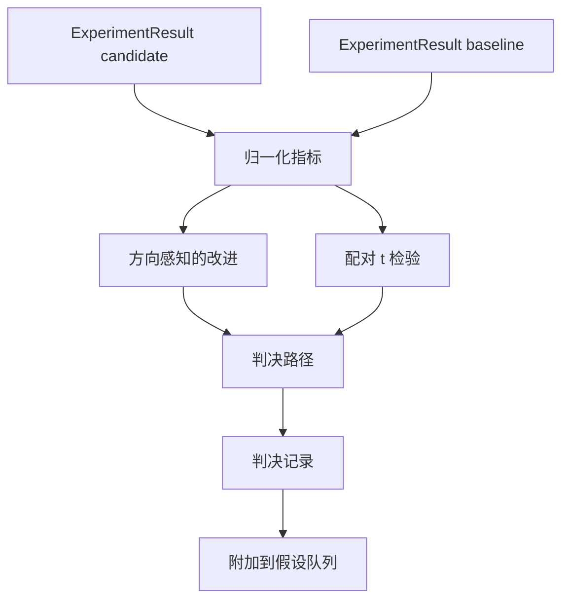

# Result Evaluator（结果评估器）

> runner（运行器）生成了数字。evaluator（评估器）决定这些数字是改进、回退，还是噪声。构建将指标转换为一行结论的判决路径。

**类型：** 实践项目  
**语言：** Python  
**先修要求：** 第19阶段 Track A 课程 20-29  
**时间：** ~90 分钟

## 学习目标
- 使用方向感知的改进和固定阈值，将候选运行与基线进行比较。
- 从头实现基于每个随机种子指标的配对 t 检验，并读取生成的 p 值。
- 对对数缩放（log scaled）的指标进行归一化，使下游报告可将其与线性指标混合展示。
- 输出每个假设的判决，方便协调器将其附加到第50课的队列中。
- 保持每一步纯函数，确保相同输入始终产生相同判决。

## 为什么要使用配对检验

runner 输出的单个数字不能说明变化是否真实。同一配置但使用不同随机种子时，perplexity（困惑度）会不同，这个变化可能是噪声。正确的比较方式是配对测试：使用相同的随机种子和数据，分别在候选和基线下运行一次。每个随机种子贡献一个差值，这些差值的平均值是效应，差值的标准误是噪声底线。

本课程从零实现该检验，没有使用 `scipy.stats`。数学部分足够简洁，可一屏阅读。

```text
diffs    = [a_i - b_i for i in seeds]
mean     = sum(diffs) / n
variance = sum((d - mean) ** 2 for d in diffs) / (n - 1)
t_stat   = mean / sqrt(variance / n)
df       = n - 1
p_value  = two_sided_p(t_stat, df)
```

双尾 p 值采用正则化不完全贝塔函数。课程提供了一个使用 Lentz 连分式法的小型实现，全部代码在60行标准库数学函数内完成。

## 方向感知的改进

部分指标指标越大越好（higher is better），如accuracy（准确率）、throughput（吞吐量）；有些则越小越好（lower is better），如loss（损失）、perplexity（困惑度）、wall time（实际时间）。评估器会给每个指标附加一个 `direction` 字段。

```text
if direction == "higher_is_better":
    improvement = (candidate - baseline) / abs(baseline)
elif direction == "lower_is_better":
    improvement = (baseline - candidate) / abs(baseline)
```

改进值是有符号的。对于“越高越好”的指标，负改进值意味着候选方案更差。判决路径会同时读取符号和幅度。

固定阈值（`improvement_threshold=0.02`，即2%）决定改动是否足够显著。低于阈值则判为“噪声”，无需关注用户无法测量的变动，无论 p 值如何。

## 架构



评估器并行运行三个独立计算，将结果汇聚到判决路径。每个计算均为无共享状态的纯函数。

## 对数归一化

Perplexity（困惑度）是 loss（损失）的指数函数。loss 降低0.1，对 perplexity 的影响非常大。直接比较两个配置的 perplexity 没问题，但若要与线性指标混合展示，则需归一化处理。

课程对 `scale` 字段为 `"log"` 的指标先取自然对数再计算改进。阈值也在对数空间应用。例如从32降到28的 perplexity （lower is better）对应改进为 `log(28) - log(32) = -0.133`，远超2%的阈值。

```text
if scale == "log":
    a = log(candidate)
    b = log(baseline)
else:
    a = candidate
    b = baseline
```

默认 `scale="linear"` 的指标跳过对数转换，同一路径处理两种情况。

## 每个随机种子的配对检验

第52课的 runner 只输出最终的一份指标。为配对检验，评估器需要候选和基线的每个随机种子单独的指标。协调器在一批种子上以候选和基线两种配置分别运行同一个实验，得到两组 `ExperimentResult` 记录列表传给评估器。

评估器根据随机种子（在 `result.metrics["seed"]`）配对，两列表必须种子对应一致，否则抛出 `PairingError` 异常。协调器需重新运行。

## Verdict 的结构

```text
Verdict
  hypothesis_id          : int
  metric                 : str
  direction              : "higher_is_better" | "lower_is_better"
  scale                  : "linear" | "log"
  candidate_mean         : float
  baseline_mean          : float
  improvement            : float       (带符号，比例；参见方向规则)
  p_value                : float | None  (n < 2 时为 None)
  significance_threshold : float
  improvement_threshold  : float
  verdict                : "improved" | "regressed" | "noise" | "failed"
  rationale              : str
```

判决路径是一个小的决策表：

```text
1. 如果任何候选结果 terminal != "ok"：verdict = "failed"
2. 否则如果 |improvement| < improvement_threshold： verdict = "noise"
3. 否则如果 p_value 为 None 或 p_value > significance_threshold： verdict = "noise"
4. 否则如果 improvement > 0： verdict = "improved"
5. 否则： verdict = "regressed"
```

rationale（理由）是一行人类可读的描述，供协调器根据假设 id 记录日志。

## 代码阅读指南

`code/main.py` 定义了 `MetricSpec`、`Verdict`、`Evaluator`，还包含 t 统计量、不完全贝塔函数辅助工具及一个确定性演示。t 检验完全用标准库数学函数实现；仅用 numpy 来读取指标列表和计算均值、方差。

`code/tests/test_evaluator.py` 覆盖了改进路径、回退路径、噪声路径（微小改进和样本量低）、失败终止路径、对数归一化路径、针对已知参考值的 t 检验，以及配对错误。

## 课程衔接

第50课生成了假设队列。第51课筛掉了文献已达成共识的假设。第52课分别以候选和基线配置及多随机种子运行实验。第53课读取这些运行结果并生成判决。协调器把这四个课件串联起来：

```text
for hypothesis in queue:
    literature = retrieval.search(hypothesis.text)
    if literature_settles(hypothesis, literature):
        attach(hypothesis, verdict="settled")
        continue
    candidates = runner.run_all(specs_for(hypothesis))
    baselines  = runner.run_all(baseline_specs_for(hypothesis))
    metric_spec = MetricSpec("perplexity", direction=LOWER, scale=LOG)
    verdict = evaluator.evaluate(hypothesis.id, metric_spec, candidates, baselines)
    attach(hypothesis, verdict)
```

该协调器不在本课中展示；这四课通过各自定义的 dataclasses 无需额外粘合即能组合使用。
