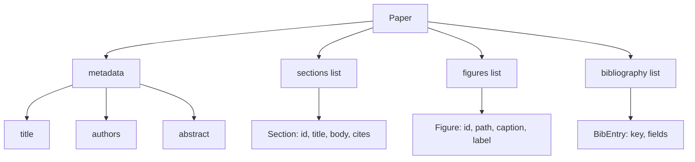
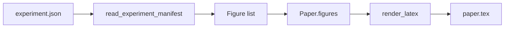
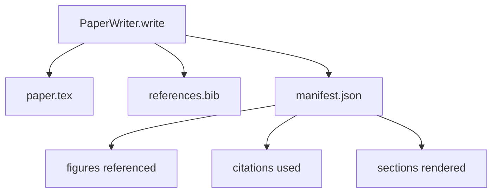

# Paper Writer（论文写作器）

> LaTeX skeleton（LaTeX 框架）是研究者与排版人员之间的契约。若契约被破坏，文档无法编译且失败会非常明显。先构建框架，再填写内容。

**类型：** 构建  
**语言：** Python  
**先决条件：** 第19阶段第50-53课  
**时间：** 约90分钟

## 学习目标

- 将研究论文视为具有已知章节结构图的结构化产物，而非自由形式文档。
- 生成一个 LaTeX 框架，先声明其摘要、章节、图表位槽和参考文献键，之后再填写正文。
- 通过确定性的位槽机制，将实验输出（路径和标题）的图表注入框架。
- 连接一个模拟的正文生成器，根据结构化提纲填充各章节，使得测试环境无需模型即可测试。
- 导出单个 `paper.tex`、`references.bib` 以及列出每个引用图表和引用文献的清单清单。

## 为什么先构建框架

以正文为起点的草稿会积累结构债务。引言中出现应该放在相关工作中的三段话。图表被引用时还未定义。参考文献中同一论文出现了三个键。当作者发现时，重写成本已高于写作成本。

框架正好相反。结构作为数据先行声明。章节作为带有名称和顺序的位槽。图作为带有 id 和标题的位槽。参考文献键及其对应条目在顶部声明。正文逐一生成到这些位槽中。测试环境可在写正文前验证：每个图都有位槽，每个引用有条目，每个章节都出现在目录中。

这与之前课程对计划、工具调用和追踪应用的纪律一致。结构即契约。

## 论文形状

每个字段都是纯 Python 数据。渲染器是从 `Paper` 到 LaTeX 字符串的纯函数。测试环境可在渲染前内省论文：计数章节、列举缺失图文件、检查每个 `\cite{key}` 是否有对应 `BibEntry`。

## 渲染契约

渲染器保证三点。第一，框架中的每个图位槽输出带有稳定标签 `fig:<id>` 的 `\begin{figure}` 块。第二，每个章节输出带有稳定标签 `sec:<id>` 的 `\section{}`，确保交叉引用可用。第三，参考文献输出 `\bibliography` 块，其 `references.bib` 精确包含论文声明的条目，既不多也不少。

违反任何一条都是渲染错误，而非警告。框架是契约；渲染静默丢弃图表即为契约破裂。

## 从实验注入图表

本轨道早期课程产生了 JSON 格式的实验输出清单。每个清单包含带路径和简短标题的多件工件。论文写作器读取清单并生成 `Figure` 记录。

注入过程是确定性的。图的 id 来源于实验名加单调计数器。标题来自清单。路径相对于论文输出目录标准化，即使实验输出位于磁盘其他地方，LaTeX 也能编译。

## 模拟正文生成器

课程中不调用模型。`MockProseGenerator` 读取提纲形状，确定性输出正文。提纲形状是每章节一个短字符串。生成器将该字符串扩展成两个织入章节标题的短段落。生成的正文在提纲声明的位置准确点名图表和引用。

这足以测试写作器的所有行为。真实实现会将生成器替换为模型调用。外围测试机制不变。这就是将正文生成器声明为可调用对象的价值：测试时替换为确定性生成器，生产时替换为模型，流水线的其余部分保持一致。

## 清单输出

写作器向输出目录导出三个文件。

清单供下游评估者或批评环节读取，不解析 LaTeX，解析清单。下一课——批评环节，采用此清单作为输入，生成反馈列表。因此清单是契约的一部分，LaTeX 不是。

## 验证门

写作器在写任何文件前运行四个验证门。

1. 论文内每个图 id 唯一。
2. 每章节的 `cites` 字段引用的参考文献键都在论文中声明。
3. 摘要非空。
4. 标题非空。

验证失败抛出带明确原因的 `PaperValidationError`。测试环境将此作为失败模式呈现。不允许部分写出：要么输出全部三个文件，要么全不输出。

## 如何阅读代码

`code/main.py` 定义了 `Paper`、`Section`、`Figure`、`BibEntry`、`PaperValidationError`、`MockProseGenerator`、`PaperWriter` 和渲染函数 `render_latex`。`write` 方法接收输出目录，输出 `paper.tex`、`references.bib` 和 `manifest.json`。辅助函数 `read_experiment_manifest` 把实验清单列表转换为 `Figure` 记录。

`code/tests/test_paper_writer.py` 涉及：无章节的框架渲染、两个章节两幅图的完整渲染、缺失引用验证门、重复图 id 验证门、清单内容和 LaTeX 字符串契约（每章节输出带 `\section{}`，每图输出 `\begin{figure}`）。

## 进阶

真实实现希望的两个扩展。第一，多格式渲染：相同的 `Paper` 形状编译为博客文章的 Markdown 和预览使用的 HTML。渲染器成为 `Paper` 上的一种策略。第二，引用增强：写作器依据本地 DOI 缓存根据引用键获取 BibTeX 条目。两者均增值，且可在不改动框架契约的前提下添加。

框架是下注。章节、图表、引用均作为数据声明，正文生成进入位槽，清单与 LaTeX 并出。其他改进均可叠加其上。
