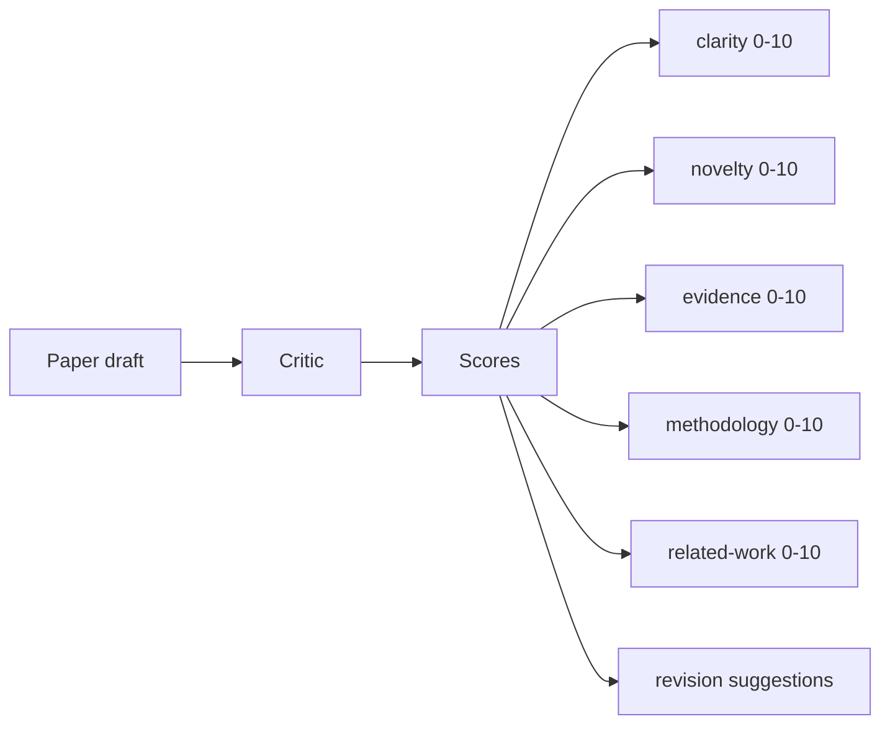
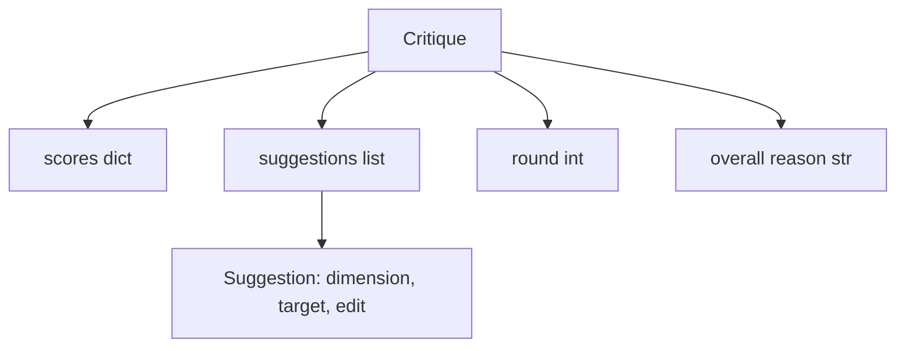
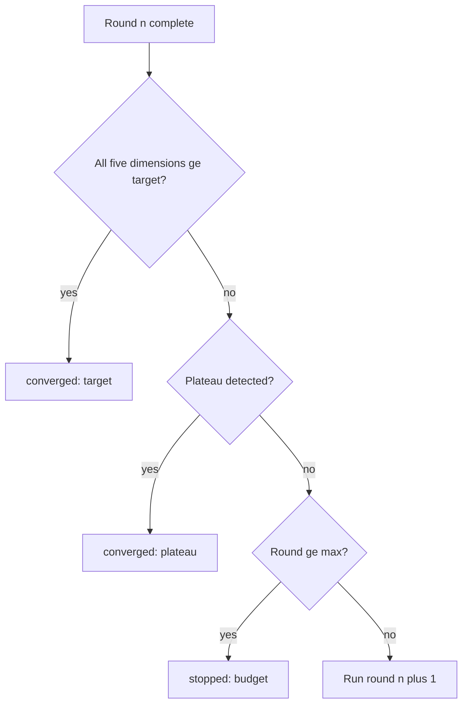
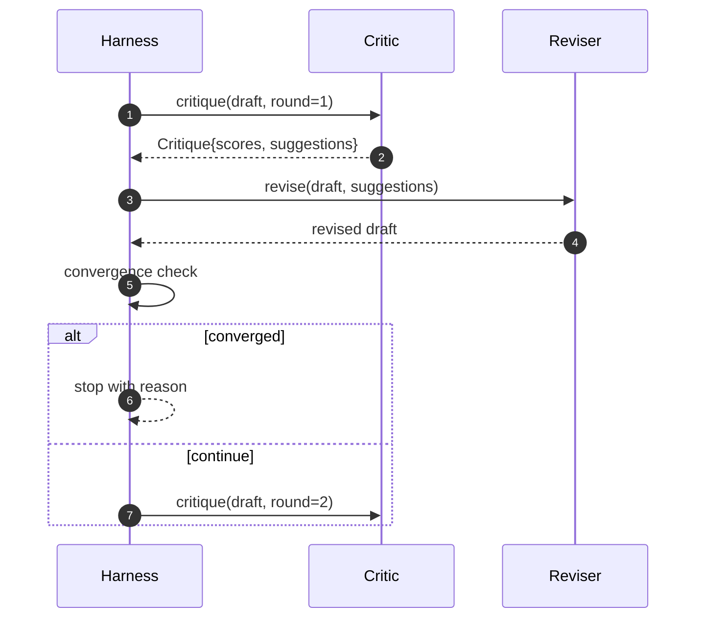

# Critic Loop（评论循环）

> 第一次返回“看起来不错”的评论器是坏掉的。总是返回“需要改进”的评论器也是坏掉的。有趣的评论器是那个能收敛的，而你必须工程化地实现收敛。

**类型：** Build（构建）  
**语言：** Python  
**先决条件：** Phase 19 课程 50-53  
**时间：** 约 90 分钟

## 学习目标

- 按五个固定维度对论文草稿评分：clarity（清晰度）、novelty（新颖性）、evidence（证据）、methodology（方法论）、related-work（相关工作）。
- 将每轮的批评应用为结构化的修订差异，而不是自由格式的重写。
- 通过比较各轮的分数检测收敛；在达到平台期、目标或预算耗尽时停止。
- 为轮次设置最大迭代预算，防止非收敛的评论器无限运行。
- 输出每轮的追踪信息，以便仪表盘或下一个阶段渲染分数轨迹。

## 为什么选定五个固定维度

自由格式评论器是返回一段建议的模型。下一轮的修订将这段文字视为环境上下文。因为批评没有结构，无法验证重写是否真正解决了批评。

五个维度为工具提供了契约。



分数是一个向量。工具观察各轮每个维度的变化。一个提高了 clarity（清晰度）但使 evidence（证据）下降的修订，在 evidence 维度上是退步，收敛检测会发现这一点。单纯模型驱动的评论器无法保证这一点。

## 批评（Critique）结构



每条建议包含所改进的维度、目标章节和 reviser（修订者）可应用的 `edit` 指令。reviser 也是一个可调用对象。本课程附带一个确定性 reviser，将 edit 指令解释为“追加到章节”操作。模型驱动的 reviser 会将同一字段解释为提示。契约不变。

## 收敛规则，按顺序

当以下任一条件满足时，评论循环终止。



target（目标）是最严格的情况：所有五个维度（clarity、novelty、evidence、methodology、related_work）必须达到 `>= target_score`（默认 `8.0`），循环才返回成功。即平均值很高但有一项弱是不够的。plateau（平台期）检测比较本轮和上一轮的平均值。如果两轮持续提升低于 `plateau_epsilon`（默认 `0.1`），则循环以 `plateau` 终止。budget（预算）是轮数上限（默认 5），超出以 `budget` 终止。

顺序很重要。target 优先于 plateau，plateau 优先于 budget。如果第3轮同时满足 target 和 plateau，结果为 `target`，而非 `plateau`。

## 为什么平台期检测需要两轮

单轮平台期可能是噪音。真实评论器即便对固定草稿也会因为应用建议的不同顺序而导致每次评分略有差异。要求连续两轮平台期过滤掉噪声。如果工具报告平台期，意味着草稿确实已停止改进。

## 本课中的确定性评论器

本课不调用模型。附带评论器是一个可调用对象，根据三个信号评分草稿：平均章节正文长度（clarity），图表数和引用数（evidence），以及论文元数据中的 `originality_tag` 字段（novelty）。reviser 知道如何提升各分数。

```text
clarity      随章节正文平均长度增加而提高
novelty      当 originality_tag 设为 "high" 时提升
evidence     当章节的 figure_refs 非空时提升
methodology  当存在标题为 "Method" 且有正文的章节时提升
related-work 当存在标题为 "Related Work" 且有正文的章节时提升
```

reviser 将每条建议解释为目标指向的追加操作。第一轮过后，工具可以观察到分数提升。测试用此属性断言循环缩小差距。

## 完整循环契约



工具拥有轮数计数、追踪和收敛检查。评论器拥有分数。reviser 拥有差异。三者互不干涉对方状态。

## 追踪输出

每轮输出一个追踪事件，包含轮数、分数向量、建议数量和收敛判决。完整追踪与最终草稿一并返回。下游仪表盘可渲染每轮分数图表。下一课迭代调度器读取追踪决定是否保留该分支。

## 防止错误评论器的预算

输出永远无法提升分数的建议的评论器会使循环卡在最大迭代上限。追踪能显现这一情况：五轮分数停滞，判决为 `budget`。用户理解为评论器缺陷，而非草稿问题。若只展示最终草稿，则隐藏了诊断信息。优先展示追踪有助于揭露错误。

## 阅读代码指南

`code/main.py` 定义了 `Critique`、`Suggestion`、`Critic` 协议、`Reviser` 协议、`CriticLoop`，以及返回确定性评论器和匹配 reviser 的工厂函数 `make_deterministic_critic_pair`。还包括最小 `Paper` 形状，使课程独立完整。

`code/tests/test_critic_loop.py` 覆盖了：第一轮后的单调提升，调优草稿的目标收敛，连续两轮平稳检测，建议无提升时的预算耗尽，reviser 应用建议，及追踪格式。

## 进一步拓展

真实实现会希望扩展两点。第一，维度权重：研讨会论文更重视 novely（新颖性）胜过 methodology（方法论）；期刊则相反。收敛检测变成加权平均。第二，成对评论器：一位评论器评分，另一位对建议进行裁定后再给 reviser。二者均增值，且在相同 `Critique` 结构上组合。

赌注在于分数向量。一旦批评结构化，其他所有改进、收敛规则、仪表盘、成对评论器，都能无缝集成，循环不变。
