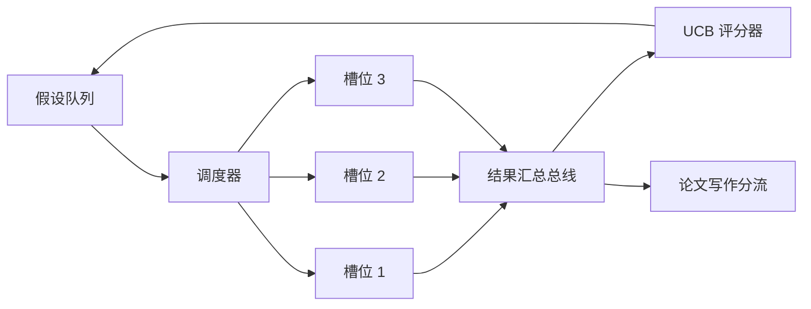
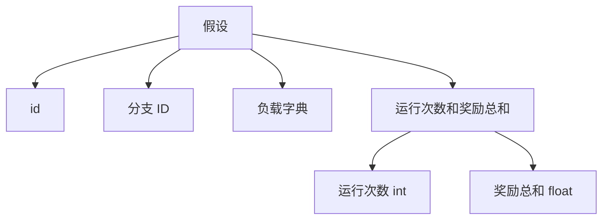
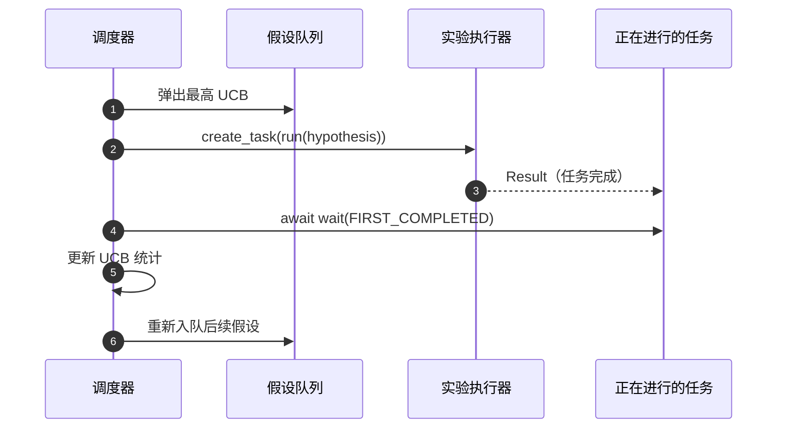

# 迭代调度器

> 没有调度器的研究循环不过是一列自欺的队列。调度器正是循环决定停止探索什么的地方，这个决策才是整个游戏的核心。

**类型：** 构建  
**语言：** Python  
**先修课程：** 第19阶段第50-53课  
**时间：** 约90分钟

## 学习目标

- 将研究工作流程建模为假设队列，输入并行实验槽，实验结果反馈回队列。
- 使用 asyncio 并发运行多个实验，使调度器能够保持所有槽位忙碌。
- 使用 UCB（上置信界）对每个假设分支评分，使调度器能够剪枝低产出的分支，而不放弃探索。
- 将完成的结果分流到论文写作阶段和重新入队阶段，使高产出分支孵化后续假设。
- 展示每次迭代的跟踪信息，包括分支分数、槽位占用和剪枝决策。

## 为什么需要调度器，而非工作列表

扁平化工作列表按提交顺序运行作业。当每个作业独立时，这没问题。但科研不是独立的：实验三的结果会改变实验四和五的优先级。一个读取结果反馈并重新排序队列的调度器，可以让单位计算完成更多有用工作。

有趣的设计选择是评分规则。贪婪的评分器总是选择当前最优者，永不探索。均匀评分器则不利用已有优势。UCB（上置信界）是折中方案：利用领导分支，同时保留对尝试较少分支的探索空间。

## 系统结构



队列保存假设。槽位空出时，调度器选择 UCB 最高的假设。每个槽位异步运行实验。完成的实验将结果发送到总线。总线更新来源分支的 UCB 统计数据，并在分支产出超过阈值时分流到论文写作阶段。

## 假设结构



`branch` 是 UCB 统计的键。多个假设可以共用一个分支（分支代表研究方向；假设是该方向上的一次试验）。`runs` 是该分支完成的实验次数，`reward_sum` 是累计奖励。UCB 用这两者计算分数。

## UCB 评分

本课采用经典的 UCB1 公式：

```text
ucb(branch) = mean_reward(branch) + c * sqrt( ln(total_runs) / runs(branch) )
```

`total_runs` 是所有分支完成的实验总数。`c` 是探索权重；本课默认 `sqrt(2)`。运行次数为零的分支得分为正无穷，因此未尝试过的分支总是优先调度。高平均奖励的分支得分保持高水平，直到其他分支追赶上；运行多次但奖励不佳的分支会被运行次数较少的分支超过。

剪枝门控与选择器分开。剪枝当某分支至少运行 `prune_after_runs`（默认3）次，且平均奖励低于绝对阈值（默认0.2）时，将其移除出调度队列，控制队列大小。

## asyncio 并行槽位

调度器通过 `asyncio.create_task` 启动实验。每个任务运行实验执行器（`async def` 可调用），返回 `Result`。主循环用 `asyncio.wait(..., return_when=asyncio.FIRST_COMPLETED)` 等待任务完成，并在每次完成时触发评分更新。



三个槽位同时运行。主循环不阻塞于单个实验，槽位一空即启动新任务，直到队列空且无任务进行。

## 结果分流：论文触发

当某分支的平均奖励超过 `paper_threshold`（默认 0.7）且尚未产出论文时，调度器将发送 `paper.trigger` 事件到输出列表。后续课程中的论文撰写模块会处理该事件。本课中此触发器被捕获为列表以便测试断言。

## 结果分流：后续假设

当获得高产出结果时，调度器调用用户提供的 `expander`，基于该结果生成一个或多个同一分支的后续假设。`expander` 是从 `Result` 到 `list[Hypothesis]` 的纯函数。本课提供一个确定性的扩展器，针对奖励超过论文阈值的结果产生两个后续假设。

## 预算限制

两个预算防止调度器进入无限循环：

```text
max_experiments    : 所有分支中运行的实验总数上限
max_seconds        : 墙钟时间上限（asyncio 计时）
```

任一预算触发时，调度器停止新任务调度，等待所有进行中任务完成，然后返回最终跟踪结果。跟踪包含 `stop_reason`。

## 跟踪及最终报告

每个调度操作（选取、派发、结果反馈、剪枝、分流）都会记录事件。最终报告总结各分支统计信息、总运行数、总墙钟时间及论文触发事件。下一课——端到端演示，将使用此报告驱动论文写作。

## 代码阅读指南

`code/main.py` 定义了 `Hypothesis`、`Result`、`BranchStats`、`IterationScheduler`，以及返回可预测奖励的 asyncio 实验执行器的工厂函数 `make_deterministic_runner`。执行器睡眠固定的 `delay_ms`（默认5毫秒），以便观察并发。

`code/tests/test_scheduler.py` 涵盖测试：UCB优先未尝试分支、并行槽位占用、触发论文事件、低产出后剪枝、后续假设分流，以及预算停止（实验数量和墙钟时间）。

## 拓展方向

真实实现会希望增加三方面扩展。第一，持久化 UCB 统计数据跨会话：当前统计存在内存中，真正的调度器会将其检查点保存，使重启后继续利用已用探索预算。第二，多目标评分：结果不再是标量奖励，而是向量，UCB 变成帕累托风格选择器。第三，上下文臂（contextual bandits）：选择器根据假设特征（长度、复杂度）调整策略，使相似假设共享探索。

调度器使研究超越简单工作列表。一旦 UCB 完成接入且槽位并行运行，其他所有改进都能叠加。
