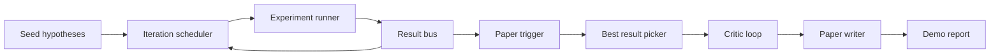
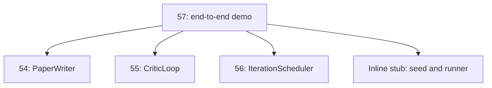
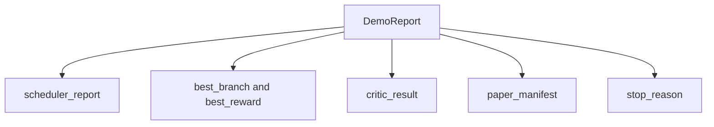

# 端到端研究演示

> 演示是你之前编写的每个合同必须组合的地方。如果其中任何一个有漏洞，演示就是捕捉它的教训。

**类型：** 构建  
**语言：** Python  
**先决条件：** 第19阶段第50-53课  
**时间：** ~90分钟

## 学习目标

- 端到端连接自动研究循环：假设种子、实验运行器、调度器、评审循环、论文撰写器。  
- 通过纯Python导入而非框架，组合之前四个Track D课的原语。  
- 运行循环至自动终止，并生成单个演示报告，列出每个阶段的输出。  
- 保持演示的确定性，以便测试套件断言最终形态。  
- 当任何阶段的合同破裂时，显现明确的失败模式，防止后续阶段使用损坏的输入运行。  

## 这里组合的内容



五个阶段。种子是一组三条假设。调度器在这三条假设上运行六个实验，拥有三个并行槽位。结果总线报告一个或多个论文触发器。最佳结果选择器选出单个最佳结果。评审循环基于该结果构建的草稿迭代。论文撰写器输出最终的LaTeX、BibTeX和清单。

## 为什么导入而非复制

每个之前的课程都包含一个带有公共数据类和函数的`main.py`。演示通过调整`sys.path`到每个课程的父目录来导入它们。这不是框架连接；它是之前课程测试文件已经使用的相同导入。



内联存根替代了第50到53课：一个小型假设种子生成器和一个同步奖励函数。用户可以通过调整两个导入，把内联存根替换成那些课程里的真实原语。

## 确定性保障

演示从设计上就是确定性的。实验运行器使用有种子的numpy。评审循环的修改器按固定维度和固定顺序迭代。论文撰写器的文本生成器是第54课中的模拟版本。调度器的UCB选择器在相同值时按迭代顺序断开平局，而非随机选择。

给定相同的种子，演示发出相同报告。测试通过运行两次演示并比对清单断言此属性。

## 演示报告结构



每个字段均直接来自上游阶段。演示不对任何输出进行转换；它们被组合。这就是演示的测试。

## 失败模式处理

每个阶段要么成功，要么抛出类型错误。

```text
Scheduler ........ 返回带有 stop_reason 的 SchedulerReport，stop_reason 为 {queue_empty, max_experiments, deadline} 中之一  
Best-result pick . 如果没有论文触发，抛出 NoTriggerError  
Critic loop ...... 返回带有状态 converged 或 stopped 的 LoopResult  
Paper writer ..... 在合同破裂时抛出 PaperValidationError  
```

任何阶段的失败都会以类型异常中断演示。测试锁定此合同：`test_no_triggers_raises_typed_error` 和 `test_best_picker_raises_when_no_triggers` 断言当无分支触发时选择器抛出 `NoTriggerError` / `BestResultError`，且撰写器从未被调用。

## 最佳结果选择器

调度器针对每个分支发出论文触发器。选择器选取所有触发器中平均奖励最高的分支。平局时按分支ID字母顺序断开，确保演示确定性。选择器是一个小型纯函数；测试基于固定调度器报告锁定其行为。

## 连接评审循环

第55课的评审循环作用于`MiniPaper`。演示通过填写分支ID摘要、种子化两个章节（引言和结果），以及根据分支平均奖励设置`originality_tag`（奖励≥0.8为高，≥0.6为中，其他为低），从选定分支构建`MiniPaper`。

修改器随后迭代草稿直至收敛。输出传给论文撰写器。

## 连接论文撰写器

第54课的论文撰写器处理完整的`Paper`结构，包括图表和参考文献。演示通过`mini_to_full_paper`升级收敛的`MiniPaper`，为选中的分支附加一张图表，以及基于评审建议的引用键集合构建一个小型合成参考文献。演示添加的每个引用也加入了参考文献列表，以通过验证。

## 如何阅读代码

`code/main.py`定义了`BestResultError`、`NoTriggerError`、`DemoReport`、`pick_best_branch`、`build_mini_paper`、`mini_to_full_paper`和`run_demo`。顶部的导入调整`sys.path`一次，并从对应课程导入了`PaperWriter`、`CriticLoop`和`IterationScheduler`。

`code/tests/test_e2e.py`覆盖：演示端到端运行并生成包含所有五个字段的报告；两次运行确定性；当无分支超过阈值时抛出 NoTriggerError；撰写器合同破裂时抛出 PaperValidationError；论文清单包含选中分支的图表；调度器停止原因是预期值之一。

## 进一步扩展

演示通过后值得连接的三个扩展。第一，持久状态：每个阶段结果写入小型JSON存储，重启时可继续，无需重新运行成本低的阶段。第二，仪表板：调度器和评审循环的跟踪事件渲染为单一时间线。第三，真实模型调用：用模型驱动替换模拟的文本生成器和确定性评审器；连接方式不变。

演示的职责是证明组合即架构。五个课程，四次导入，一份报告。下次添加阶段时，连接代码只增加一行。
