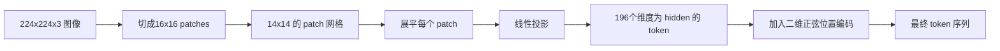

# 视觉编码器 Patches

> 读取像素的视觉模型需要像素的分词器（tokenizer）。Patch embedding（补丁嵌入）就是这样的分词器。将图像切成网格状小方块，展开每个小方块，通过一层线性层映射，再加上二维位置编码，让 Transformer（Transformer 架构）知道每个小方块在原始图像中的位置。

**类型：** 构建  
**语言：** Python  
**前提知识：** 第19阶段第30-37课（轨道B基础）  
**时间：** ~90分钟

## 学习目标

- 将图像分词为固定长度的 patch 嵌入序列。  
- 实现基于 `Conv2d` 的 patch 投影，使其数学等价于先 unfold 再线性映射。  
- 构建确定性二维正弦位置嵌入，使 token 顺序编码空间位置。  
- 在合成测试用例上验证 patch 数目、嵌入形状及 `Conv2d` 和 unfold 的等价性。

## 问题描述

Transformer（Transformer 架构）接受一个向量序列。图像是一个三通道的网格。将每个像素作为一个 token 会使序列长度爆炸：224x224 的 RGB 图像为 150,528 个 token，而一个12层 Transformer 没法处理这么长的注意力计算。把图像当做一个巨大的扁平向量，则会丢失空间局部性，注意力层也无法恢复。编码器前端的任务是将像素网格压缩成几百个 token，每个 token 汇总一个区域。

Patch embedding 用一个线性投影解决这个问题。将 224x224 图像切成 16x16 的 patch，得到一个 14x14 网格，共196个 patch。每个 patch 会被展开成 `(3,16,16)=768` 个像素值的一维向量，再通过线性层映射到模型的隐层维度。Transformer 得到的是一个包含196个维度为 `hidden`（通常是768）token的序列，加上一个 CLS token。这样其它网络层就可以处理这个序列了。

## 概念图



### 为什么用 patch 而不用像素

注意力计算是序列长度的平方。196个 token 的序列，单个多头每层计算代价是 `196 * 196 = 38,416`；而 150,528 个 token 序列则是 `150,528 * 150,528 = 226亿`。采用 patch 相比像素，注意力计算降低了约 590,000 倍，而一个16x16的区域携带足够的高阶视觉信息。代价是失去 patch 内部的细粒度空间细节，这也是为什么多模态模型中，当需要细粒度定位时，通常会增加一个高分辨率分支。

### 为什么线性投影足够

每个 patch 被看作一个独立向量。投影层学习一组基函数：边缘探测器、颜色滤波器、简单纹理。单层线性层参数规模小（ViT-Base 是 `768 * 768 = 589,824` 个参数），且训练快。也有更深的卷积干路（hybrid ViT），但标准做法是使用扁平线性投影，大多数现代公开模型权重即使用该形式。

### `Conv2d` 的小技巧

`Conv2d(in_channels=3, out_channels=hidden, kernel_size=patch_size, stride=patch_size)`，无填充时，其结果与 unfold 再 linear 完全等价，每个输出位置是一个 patch 与卷积核的点积。卷积就是 patch 投影，它在 GPU 上更快，且少了一个 reshape 操作，因此多数生产代码都采用卷积实现。

### 位置嵌入

投影后 token 没有顺序信息。二维正弦位置嵌入为每个 token 赋予一个固定信号，编码它的 `(行, 列)` 位置。嵌入维度的一半用不同频率的 sin/cos 编码行地址，另一半编码列地址。该编码是确定性的，因此可以在不重新训练的情况下替换分辨率，并且可以平滑插值到训练时未见的网格大小。

| 组件 | 形状 | 参数数量 |
|-----------|-------|------------|
| Patch 投影（`Conv2d`） | `(hidden, 3, patch, patch)` | `3 * P * P * hidden + hidden` |
| 位置嵌入（固定） | `(num_patches, hidden)` | 0（计算得出，无需学习） |
| CLS token（可学习） | `(1, hidden)` | `hidden` |

对于 224 分辨率的 ViT-Base/16，投影参数为 590,592，CLS token 参数为 768，正弦位置编码无参数。下一节课（59）将在该前端上叠加12层 Transformer。

### 等价性作为正确性检验

Patch 部分有两种实现方式：`Conv2d` 版本和 unfold 加 linear 版本。它们使用相同权重时输出必须一致。否则 unfold 数学有误，编码器其余部分也会出错。本课的测试代码中验证此等价性。

## 构建它

`code/main.py` 实现：

- `PatchEmbed`，封装 `Conv2d` 的 `nn.Module` 用于 patch 投影。  
- `sinusoidal_2d(grid_h, grid_w, dim)`，无状态函数构造二维位置表。  
- `VisionFrontEnd`，组合 patch 嵌入、CLS token前置及位置加入于一次前向传播。  
- `synthesize_image(seed)` 助手，基于 `numpy.random` 构建确定性224x224x3测试图像。  
- Demo：运行测试图像通过前端，打印输出形状、CLS token范数、位置嵌入其中一行。

运行示例：

```bash
python3 code/main.py
```

输出：224x224的测试图像被切分成 `(1, 197, 768)` 形状的 token 序列。第一个 token 是 CLS，其余196是 patch token。位置嵌入的范数在同一行内均匀分布，符合正弦编码特征。

## 使用它

这个 patch 前端出现在每个现代视觉语言模型中：CLIP ViT-L/14、SigLIP、DINOv2、Qwen-VL 系列、InternVL 等都是基于 `Conv2d` patch 投影加位置信号构建的。各个模型差异出现在后续结构（如有无 CLS 池化、register tokens、不同 patch 大小14或16、动态分辨率通过插值位置编码）。本课的前端即是所有这些模型的基础底层。

## 测试

`code/test_main.py` 包含测试：

- patch 数符合 `(image_size / patch_size)^2`。  
- 输出形状为 `(batch, num_patches + 1, hidden)`。  
- `Conv2d` 输出与人工 unfold + linear 等价（在小测试用例上）。  
- 二维正弦位置表在多次调用中确定性一致。  
- CLS token 在批次维度正确广播，无泄露。

运行测试：

```bash
python3 -m unittest code/test_main.py
```

## 练习

1. 用一个学习的 `nn.Parameter` 位置嵌入替换正弦编码，比较在一个小合成分类任务中的首个 epoch 损失。学习位置嵌入在固定分辨率下表现好，而正弦编码在训练后改变分辨率时有效。

2. 用显式的 `nn.Unfold` 加 `nn.Linear` 替换 `Conv2d`，验证输出在浮点容差内一致。相同数学，不同实现形式。

3. 支持非正方形 patch（如宽高比不同的32x16），并验证位置表正确处理非正方形网格。

4. 在批次大小为1、8、64时分析 patch 步骤性能。patch 投影通常不是瓶颈，下游注意力层占主导。

5. 将前端作为冻结特征提取器，在四分类合成形状数据集（圆形、方形、三角形、星形）上训练。CLS token 输出应该能线性区分类别。

## 关键术语

| 术语 | 含义 |
|------|--------------|
| Patch | 图像的正方形子区域，通常为14x14或16x16 |
| Patch embedding | 将展开的 patch 用线性层映射到隐层维度 |
| Sequence length | patch token化后序列长度，通常加上 CLS token |
| Sinusoidal position | 用 sin/cos 信号编码二维网格坐标的固定位置编码 |
| CLS token | 作为池化头可学习的序列前置向量 |

## 相关阅读

- [An Image is Worth 16x16 Words (ViT, 2021)](https://arxiv.org/abs/2010.11929) 原始 patch embedding 框架。  
- [Attention Is All You Need (2017)](https://arxiv.org/abs/1706.03762) 正弦位置编码公式，本课采用二维扩展版。  
- DINOv2 论文，介绍了 register tokens 机制，作为练习6可自行实现扩展。
