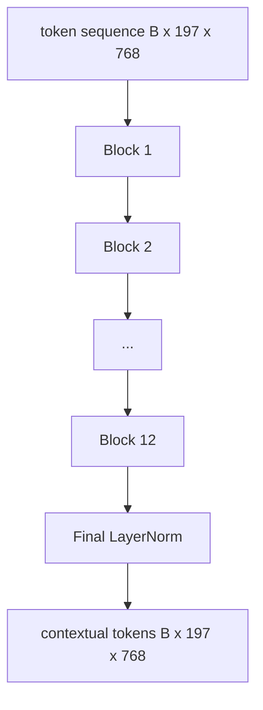

# Vision Transformer 编码器

> 仅靠 patch（图像片段）无法“看见”。一个拥有12层 pre-LN Transformer（预层归一化 Transformer）和12个注意力头的模型，将 patch token 序列转化成带有上下文的序列，CLS token（分类符令牌）在其最终隐藏状态中汇聚整幅图像的特征。本课是所有现代视觉-语言模型的动力引擎。

**类型：** 构建  
**语言：** Python  
**前置知识：** 第19阶段第30-37课（B轨基础）  
**时间：** ~90分钟

## 学习目标

- 实现一个 pre-LN Transformer 块，包含多头自注意力和前馈子层。  
- 将12个块层叠，配置12个头，构成 ViT-Base 编码器。  
- 将第58课中的 patch 前端接入编码器，并运行前向传播。  
- 验证 CLS token 是否聚合了来自所有 patch 的信息。  

## 问题

Patch embedding（片段嵌入）产生长度为197的 token 序列，每个向量互不感知。对于一张猫的图片，模型需要知道哪些 patch 包含胡须，哪些包含背景，哪些包含眼睛。Transformer 是构建这种感知机制的关键，一层注意力层一层地传递。如果没有 Transformer，patch 前端仅是一个聪明的分词器，无法理解图像。

标准配置是12层深，12个头宽，采用 pre-LayerNorm 放置、GELU 激活和4倍扩展的前馈网络。该配方是 CLIP ViT-L、SigLIP、DINOv2、Qwen-VL 系列、InternVL 以及2025-2026年所有开源视觉编码器的骨干结构。该配置足够稳定，你可以阅读任何相关论文，只要未明确说明，否则都默认该结构。

## 概念




### Pre-LN vs post-LN

最初的 Transformer 将 LayerNorm 放在跳跃连接之后。现代视觉-语言模型普遍使用的 pre-LN（每个子层前置 LayerNorm）版本不需要学习率预热 trick 即可稳定训练。两者差别仅在前向传播中一行代码，但12层及以上时的梯度流效果截然不同。

### 多头自注意力

每个头将 token 向量投影到自己的 `(query, key, value)` 三元组，维度 `head_dim = hidden / num_heads`。在 `hidden = 768` 和 `heads = 12` 下，每个头的维度是64。12个头并行计算注意力，然后将输出拼接回768维，经过输出线性层。多头的意义在于：一个头可以学习“关注猫眼”，另一个头学习“关注背景渐变”，互不干扰。

### 为什么前馈层扩展4倍

FFN是 `hidden -> 4 * hidden -> hidden`，中间加GELU激活。4倍扩展是经验值，自2017年以来语言与视觉Transformer均适用。扩展小（2倍）容易欠拟合；扩展大（8倍）在固定数据下容易过拟合。MLP 是模型存储学习知识的主体，越宽的中间层越好。

| 组件 | ViT-Base 规模参数量 |
|-----------|------------------------------|
| 每块 qkv 投影 | `3 * 768 * 768 = 1.77M` |
| 每块输出投影 | `768 * 768 = 590K` |
| 每块FFN（4倍扩展） | `2 * 768 * 4 * 768 = 4.72M` |
| 每块 LayerNorm | `4 * 768 = 3K` |
| 每块合计 | 约 7.1M |
| 12块 | 约 85M |
| 加前端 | 总计约 86M |

ViT-Base 是一个8600万参数的编码器。以2026年标准看它算小（SigLIP-So400M 是4亿，Qwen-VL ViT 是6.75亿），但架构在宽度和深度之外保持一致。

### 是否使用因果掩码？

视觉Transformer是编码器结构，且是双向的：token `i` 可以关注任何 token `j`。不使用掩码。第61课的解码器侧交叉注意力会使用因果掩码，而视觉编码器内部是全连接注意力。

### CLS token 学习了什么

CLS token 是一个学习到的参数，不包含任何 patch 内容，借助注意力在所有块中积累信息。最终层 CLS 行向量是对整张图像的向量总结；下游头部将此单向量投影为类别 logits、对比嵌入或文本解码器的交叉注意力键。

## 构建

`code/main.py` 实现了：

- `MultiHeadSelfAttention`，包括 `qkv` 和输出投影，缩放点积注意力数学计算和形状断言。  
- `FeedForward`，4倍扩展的 GELU MLP。  
- `Block`，包含注意力和前馈子层的 pre-LN 块，带残差连接。  
- `ViT`，12个块堆叠，最后一个 LayerNorm。  
- `VisionEncoder`，将第58课的 `VisionFrontEnd` 接入 `ViT` 堆栈，提供 `forward()` 返回上下文序列和池化的 CLS 向量。  
- 一个示例，将合成的224x224测试图片完整编码，打印输入形状、输出形状、参数量和每隔一层的 CLS 范数。  

运行：

```bash
python3 code/main.py
```

输出：测试图像被编码为 `(1, 197, 768)` 张量。随着层的叠加，CLS范数逐渐上升，最终在 LayerNorm 层稳定。总参数约8600万。

## 使用

本课定义的编码器在宽度和深度上可变，是2025-2026年所有开源视觉语言模型内部使用的相同块叠结构。区别在于：

- **宽度和深度。** ViT-Large：`hidden=1024, depth=24, heads=16`；SigLIP So400M：`hidden=1152, depth=27, heads=16`。同一块结构。  
- **池化头。** CLS 池化（本课） vs 平均池化（SigLIP） vs 注意力池化（后续VLM）。  
- **位置编码方式。** 固定正弦（第58课） vs 学习型一维 vs ALiBi vs 二维 RoPE。块的数学不变。  
- **注册 token。** DINOv2 附加4个额外的学习 token。仅需一行代码。  

本块堆叠是基础，后续课程（60-63 课）将在此基础上深入。

## 测试

`code/test_main.py` 涵盖：

- 单个块保持形状且对批大小不变性  
- 注意力得分沿 key 轴和为1（softmax校验）  
- 残差路径接通（零输入通过CLS token仍产生非零输出）  
- 4层堆叠前向传播形状正确  
- 梯度从 CLS 输出流向 patch 投影层  

运行测试：

```bash
python3 -m unittest code/test_main.py
```

## 练习

1. 添加注册 token（3个学习向量置于 CLS 后），重新运行。通过最后一层 softmax 分布熵比较注意力图的平滑度。  

2. 将 pre-LN 替换成 post-LN，训练合成形状分类器一轮。观察哪种配置无需 LR 预热即可稳定训练。  

3. 实现因果掩码作为 `attn_mask` 参数，使同一块能复用为解码器块。掩码形状为 `(seq, seq)`，下三角矩阵。  

4. 使用 `torch.profiler` 对批大小为1、8、64时的前向传播性能进行分析。MLP 层主导执行时间，而非注意力层。  

5. 替换一个注意力头的 q-k-v 投影为低秩 LoRA 适配器，冻结其余部分，验证梯度仅流经预期部分。  

## 关键词

| 术语 | 意思 |
|------|---------------|
| Pre-LN | LayerNorm 在每个子层之前应用，而非之后 |
| Self-attention | 每个 token 关注同序列中的其它所有 token |
| Multi-head | 隐藏维度分割为 H 个独立注意力头 |
| FFN expansion | 前馈层在收缩前扩展到 `4 * hidden` |
| CLS pooling | 使用第一个 token 的最终隐藏状态作为图像摘要 |

## 拓展阅读

- [An Image is Worth 16x16 Words (ViT, 2021)](https://arxiv.org/abs/2010.11929) — 编码器配方参考。  
- [DINOv2 (2023)](https://arxiv.org/abs/2304.07193) — 注册 token 与自监督预训练目标。  
- [SigLIP (2023)](https://arxiv.org/abs/2304.03239) — 平均池化变体与第62课使用的 sigmoid 对比损失。
