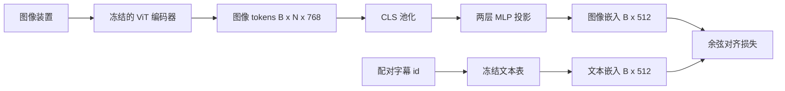

# 用于模态对齐的投影层

> 视觉编码器产生图像 tokens。文本解码器消费文本 tokens。两者位于不同的向量空间。一个小的两层 MLP 将图像 tokens 投影到文本嵌入空间，并通过与配对字幕的余弦对齐损失将两个空间拉近一致。这个投影是视觉-语言模型中最小的部分，也是迁移学习中最重要的部分。

**类型：** 构建  
**语言：** Python  
**先决条件：** 第19阶段第30-37课（Track B基础）  
**时间：** ~90分钟

## 学习目标

- 构建一个两层 MLP 投影，将图像特征映射到文本嵌入空间。  
- 构造一个模拟文本嵌入表（无预训练分词器，无真实语料）。  
- 计算投影后的图像 tokens 与配对字幕嵌入之间的余弦对齐损失。  
- 在冻结视觉编码器和冻结文本嵌入表的情况下，仅训练投影层。

## 问题描述

你有一个视觉编码器（第58-59课）产生维度为 `vision_hidden = 768` 的 tokens。你想在上面加一个文本解码器，其嵌入维度为 `text_hidden = 512`（其他数字也同样可行）。解码器期待文本形状的 tokens，而图像 tokens 不是文本形状的：它们处于视觉编码器在视觉单独预训练期间学到的基底，与解码器的词向量无关。

两层 MLP 投影（线性层、GELU、线性层）弥合这一差距。它小巧（约 `768 * 1024 + 1024 * 512 = 1.3M` 参数），可在单GPU上几分钟内训练完毕，并且是对齐阶段唯一需要学习的部分。视觉编码器保持冻结，文本嵌入表保持冻结，只有投影层在变化。这是2023年 LLaVA 使用的方案，BLIP-2 将其重新定义为 Q-Former，自此所有开源权重的视觉语言模型（VLM）都以某种形式采用了它。

## 概念示意



### 投影前的池化

视觉编码器输出197个 tokens。文本侧只有一个字幕级嵌入。要对齐它们，每个样本需要一个图像级向量。CLS 池化最简单：取编码器的第一个 token 并投影。对所有197个 tokens 平均池化也是一种选择，SigLIP 就使用这种方式。两者都将197个向量池化成一个。

### 为什么是两层而不是一层

单层线性投影可以进行旋转和平移，但无法修正两个空间若存在曲率差异的基底。两层线性之间加一个 GELU 激活，为投影引入一次非线性弯曲，经验上足以把 CLIP 风格的特征对齐到语言模型的嵌入空间。更深的投影（LLaVA-NeXT 使用 GLU；Qwen-VL 堆叠了多层注意力）是扩展；两层 MLP 是经典基线，也是 BLIP-2 Q-Former 投影头默认的形式。

| 层 | 形状 | 参数量 |
|-------|-------|------------|
| fc1 | `(vision_hidden, projection_hidden)` | `768 * 1024 + 1024` |
| 激活 | GELU | 0 |
| fc2 | `(projection_hidden, text_hidden)` | `1024 * 512 + 512` |

约1.3M参数，形状为 `768 -> 1024 -> 512`。

### 余弦对齐损失

对齐并不意味着 `image_emb == text_emb`。对齐意味着 `image_emb` 在联合空间中朝向与 `text_emb` 相同的方向。余弦损失是 `1 - cos_sim(image, text)`，范围从0（完全对齐）到2（相反）。训练将其推动接近零。第62课推广到对比批次（InfoNCE）场景，其中每个图像必须比批次中其他任何字幕都更靠近自己的字幕；本课使用的是每对配对版本，以便可观察动态。

### 冻结编码器是关键

视觉编码器有8600万个参数，文本嵌入表还有几百万。从模拟语料训练所有参数不可行。冻结两者意味着只有投影的1.3M参数会更新，几百步在合成配对上就能将损失大幅降低。这正是每个基于适配器的 VLM 的运行模式：重的部分保持冻结，轻量桥接层进行训练。

## 构建它

`code/main.py` 实现了：

- `MLPProjector(in_dim, hidden_dim, out_dim)`：两层线性 MLP，含 GELU 激活。  
- `MockTextEmbedding(vocab_size, dim)`：一个带有确定性初始化的冻结嵌入表。  
- `make_pair(seed, vocab_size)`：合成一个配对（图像，字幕）样本。字幕为短id序列；字幕嵌入为token嵌入的均值池化。  
- `cosine_alignment_loss(image_emb, text_emb)`：每对的 `1 - cos_sim` 目标。  
- 一个训练循环，冻结视觉编码器和文本表，在32个合成配对（循环迭代）上训练投影200步，每25步打印损失。

运行：

```bash
python3 code/main.py
```

输出：训练报告显示初始损失约1.07，200步内下降至约0.80，证明仅通过训练投影层即可将图像tokens拉向文本空间。每对的最终余弦相似度也会打印。

## 使用它

该模式在所有开源权重视觉语言模型中都出现：

- **LLaVA 1.5**。从 CLIP-ViT-L 隐藏维度到 LLaMA 嵌入维度的两层 GELU MLP 投影。冻结视觉编码器和 LLM，仅训练投影（阶段二解冻 LLM）。  
- **BLIP-2**。Q-Former 使用32个学习查询token通过交叉注意力处理图像tokens，再投影到LLM嵌入维度。Q-Former 最后的投影头即本课 MLP 的对应模块。  
- **MiniGPT-4**。单层线性投影，将 BLIP-2 Q-Former 输出映射到 Vicuna 嵌入维度。  
- **Qwen-VL**。带有多层交叉注意力适配器，最终依然是投影到语言模型嵌入维度。

形式不同，角色一致：池化图像tokens，投影到文本嵌入维度，单独训练。

## 测试

`code/test_main.py` 覆盖：

- 投影输出形状匹配配置的 `out_dim`  
- 冻结文本嵌入表参数`requires_grad`为False  
- 余弦损失对相同向量为零，对反向向量为2  
- 投影器梯度反向传播后存在梯度  
- 训练循环在0步到200步间损失下降

运行：

```bash
python3 -m unittest code/test_main.py
```

## 练习

1. 用全部196个patch tokens的均值池化替代 CLS 池化，比较200步后的最终损失。均值池化通常在合成数据上训练更快；CLS在自然图像上样本效率更高。

2. 在余弦损失中加入可学习的温度标量(`cos / tau`)，观察当 `tau` 太小（梯度噪音）或太大（损失停滞高位）时的表现。

3. 用单层线性替换两层 MLP，量化损失差距。非线性在自然图像特征上更重要，在合成特征上较少。

4. 给投影权重加一个小的L2正则化，观察它与余弦对齐的交互（余弦对齐对尺度不变，该正则主要压缩未用方向）。

5. 保存投影权重，重新加载并在推理时无视觉编码器反向传播，验证部署时只需投影层。

## 关键词

| 术语 | 含义 |
|------|---------------|
| Modality alignment（模态对齐） | 使图像和文本嵌入在一个共享空间中可比较的过程 |
| Projection head（投影头） | 将一个空间映射到另一个空间的小模块，通常是两层 MLP |
| Cosine similarity（余弦相似度） | 点积除以 L2 范数乘积 |
| Frozen encoder（冻结编码器） | 视觉（或文本）模型参数均为 `requires_grad=False` |
| Mock corpus（模拟语料） | 用于训练的合成配对，无需下载真实数据集 |

## 延伸阅读

- LLaVA 论文讲解两阶段训练（先训练投影，然后解冻LM）。  
- BLIP-2 论文介绍 Q-Former 作为可学习的投影替代。  
- Qwen-VL 技术报告论述多层交叉注意力适配器作为更深的投影头。
