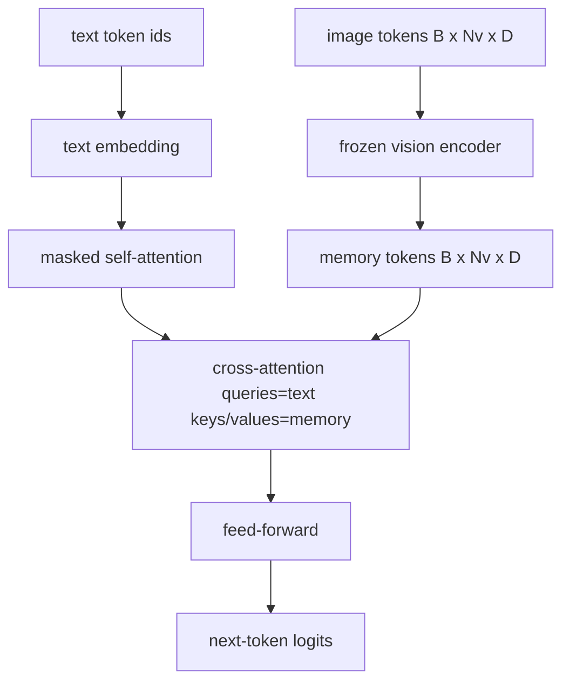
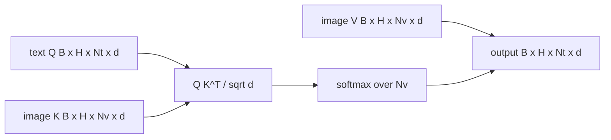

# Cross-Attention Fusion（交叉注意力融合）

> 投影层将一个图像向量与一个字幕向量对齐。真正的视觉-语言解码器需要每个文本标记关注每个图像块标记，这样模型才能将每个单词定位到一个区域。交叉注意力就是这种定位的实现方式。文本作为查询；视觉作为键和值来响应。此课构建了交叉注意力块、因果文本自注意力以及保持两者合法的掩码形状。

**类型：** 构建  
**语言：** Python  
**先决条件：** 第19阶段第30-37课（轨道B基础）  
**时间：** 约90分钟

## 学习目标

- 实现多头交叉注意力，其中查询流是文本，键/值流是视觉。  
- 组合一个解码器块：因果自注意力 + 交叉注意力 + 前馈网络。  
- 正确设置掩码形状：自注意力使用因果掩码，交叉注意力无掩码。  
- 用批量文本标记和固定图像标记池运行前向传递。  

## 问题背景

将图像标记和文本标记连接成一个序列是一种融合方式（早期融合，Chameleon 和 Emu3 采用的路径）。交叉注意力是另一种方式（后期融合，Flamingo 引入的路径，后续所有 Flamingo 形状的解码器均模仿此路径）。在后期融合中，文本解码器仅对文本标记运行，并通过每层的交叉注意力访问视觉流。

后期融合有两个优点。第一，文本流保持纯净，模型保留仅文本能力。第二，图像流每张图像仅计算一次，并用于每一解码步骤，因此即使字幕很长，生成仍然高效。代价是每个块多了一个注意力子层。

## 概念图





### 掩码形状

解码器块中两个注意力子层需要不同的掩码：

| 注意力类型    | 查询长度     | 键长度    | 掩码                | 原因                                 |
|---------------|--------------|-----------|---------------------|------------------------------------|
| 自注意力      | `Nt`（文本） | `Nt`（文本） | 因果：下三角矩阵 `(Nt, Nt)` | 文本标记在自回归时不能向前看             |
| 交叉注意力    | `Nt`（文本） | `Nv`（视觉） | 无掩码               | 每个文本位置都能看到整个图像              |

课程中包含一个形状校验函数，混用时会抛出 `ValueError`，避免损失曲线悄悄损坏。

### 为什么交叉注意力不需要掩码

图像在任何文本生成之前已被完整观察。字幕的第`t`个标记可以关注图像的任意块，图像块之间无时间顺序。有些 Flamingo 变体针对多个图像及文本段交织时，增加了按样本的掩码策略，但单图像加字幕时，交叉注意力可以看到全部内容。

### 键/值缓存

图像的键和值在解码一开始计算一次并缓存。每个新文本标记直接使用缓存，无需重算。这使得标注生成快速：重量级的 ViT 只运行一次；交叉注意力的键值对在每步复用。课程展示并测试了缓存的命中路径。

### 块结构

一个解码器块的执行流程是：预LayerNorm -> 自注意力 -> 残差 -> 预LayerNorm -> 交叉注意力 -> 残差 -> 预LayerNorm -> 前馈网络 -> 残差。三个子层分别有各自的 LayerNorm。Flamingo 论文在交叉注意力上增加了一个学习门控，使模型在训练稳定性成本下可选择不使用图像路径；本课程采用的基线模型没有门控。

```python
class DecoderBlock:
  def forward(self, text_tokens, image_tokens, text_mask, cross_mask):
      text_tokens = text_tokens + self.self_attn(self.ln1(text_tokens),
                                                 mask=text_mask)
      text_tokens = text_tokens + self.cross_attn(self.ln2(text_tokens),
                                                  image_tokens,
                                                  mask=cross_mask)
      text_tokens = text_tokens + self.ffn(self.ln3(text_tokens))
      return text_tokens
```

## 构建它

`code/main.py` 实现了：

- `CrossAttention(hidden, heads)`，带独立 `q` 和 `kv` 投影的多头交叉注意力。
- `CausalSelfAttention(hidden, heads)`，标准解码器中的掩码自注意力。
- `DecoderBlock`，组合三个子层并带预LayerNorm残差连接。
- `VisionLanguageDecoder`，四层解码器，输入模拟视觉编码器输出和小规模文本嵌入表。
- `causal_mask(length)`，返回形状为 `(length, length)` 的下三角布尔掩码。
- 演示批量输入两个长度为10的文本序列，图像记忆长度197，打印输出形状、自注意力掩码形状及每位置交叉注意力输出范数。

运行：

```bash
python3 code/main.py
```

输出：解码器生成形状为 `(2, 10, text_vocab)` 的 logits 张量。掩码形状为 `(10, 10)`。KV缓存重复利用验证命中路径和非缓存路径输出完全相同。

## 使用它

交叉注意力出现在两类生产系统中：

- **Flamingo 和 IDEFICS。** 每隔 K 个语言模型块插入一个交叉注意力子层，语言模型保持冻结。视觉语言适配器就是交叉注意力块加门控。
- **BLIP-2。** Q-Former 使用固定的 32 个查询标记对图像特征做交叉注意力，然后将查询投影到语言模型嵌入空间。

本课的块结构直接映射到上述两者。掩码规范（自注意力因果掩码，交叉注意力无掩码）相同。

## 测试

`code/test_main.py` 覆盖：

- 因果掩码为下三角且形状正确的布尔矩阵  
- 交叉注意力输出形状为 `(B, Nt, hidden)`，不受键长度影响  
- KV缓存路径与非缓存路径浮点误差内一致  
- 文本与图像流形状不匹配时抛出清晰的 `ValueError`  
- 完整解码器前向传递产生正确的批次和序列形状

运行测试：

```bash
python3 -m unittest code/test_main.py
```

## 练习

1. 为交叉注意力残差添加一个学习的 tanh 门控（Flamingo 技巧），验证训练从近零初始门控收敛。门控起始为0，模型先恢复纯文本行为，再混入图像流。

2. 实现交织注意力，使同一个解码器消费多张图像和多段文本。构建按样本的交叉注意力掩码，阻止文本段2关注图像1。

3. 统计 `Nt=64, Nv=576`（24×24 高分辨率网格）时交叉注意力与自注意力的性能。交叉注意力计算成本为 `Nt * Nv`，高分辨率时占主导。

4. 对交叉注意力映射的查询端添加 dropout，测量演示中字幕多样性（交叉映射中dropout增加字幕采样方差）。

5. 用 Q-Former 风格的注意力块替换交叉注意力层，其中固定32标记的查询池对图像特征每层做一次关注。

## 关键词

| 术语         | 含义                                             |
|--------------|--------------------------------------------------|
| Late fusion（后期融合） | 文本和视觉保持独立流；每块通过交叉注意力桥接           |
| Cross-attention（交叉注意力） | 查询来自一个流，键和值来自另一个流                        |
| Causal mask（因果掩码） | 防止自回归过程中向前看的下三角布尔掩码                       |
| KV cache（键值缓存）    | 图像键和值只存一次，并复用于每个解码步骤                    |
| Memory tokens（记忆标记）| 冻结的图像标记，解码器通过交叉注意力访问                    |

## 延伸阅读

- Flamingo（2022）关于带门控交叉注意力的典型后期融合设计。  
- BLIP-2（2023）介绍 Q-Former，即作为学习查询池的交叉注意力块。  
- IDEFICS（2023）开源权重复现 Flamingo 方法。
