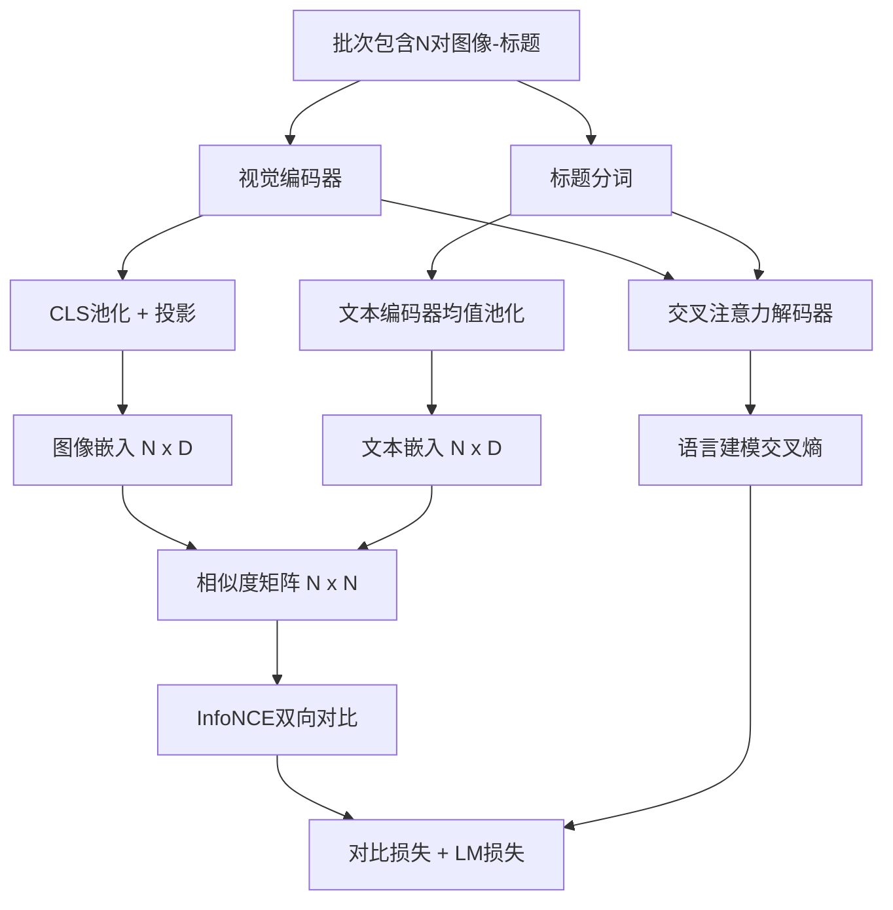

# 视觉-语言预训练（Vision-Language Pretraining）

> 编码器（encoder）、投影（projection）和解码器（decoder）已连接好。现在一起训练它们。训练由两个目标驱动：一种对比图文损失（InfoNCE），在联合嵌入空间中拉近匹配的图文对；另一种语言建模损失，要求解码器为每张图像生成标题。两者结合，教会网络既能找到匹配标题的正确图像，也能写出图像的标题。

**类型：** 构建  
**语言：** Python  
**先决条件：** 第19阶段，第30-37课（Track B基础）  
**时间：** ~90分钟

## 学习目标

- 实现跨批次图像-标题对的InfoNCE对比损失（contrastive loss）。
- 将对比损失与自回归语言建模损失结合。
- 合成200对模拟图像-标题语料，无需下载真实数据集。
- 运行50步示范训练循环，观察两种损失均下降。

## 问题描述

视觉-语言模型需要两种技能。它必须具备排序能力：给定标题，从众多图像中找到正确的图像；它还必须能生成：给定图像，写出描述标题。仅用单一技能预训练模型只得到半个系统。CLIP擅长排序却不能生成标题，GPT-4V能生成标题但使用独立的检索头进行排序。多目标预训练能一次性同时实现两者。

InfoNCE负责排序部分。对于一个包含N对的批次，模型将N个匹配对视为正样本，将`N^2 - N`个错配对视为负样本，基于得到的`(N, N)`相似度矩阵计算交叉熵损失。语言模型（LM）损失负责生成部分：标准的基于图像条件的下一个标记预测。两者均可微且可以共享编码器、投影和解码器权重。

## 概念说明



### 一句话说明InfoNCE

将N个图像嵌入作为行堆叠，将N个文本嵌入作为行堆叠，均进行L2归一化。计算`N x N`矩阵`S = I T^T / tau`，其中`tau`为可学习的温度参数。对角线元素为匹配对，非对角线元素为负样本。对行方向应用交叉熵，其中目标`argmax`沿对角线分布：第`i`行的最高值应在第`i`列。列方向同理，对两个方向计算结果求平均。这就是八行代码实现的CLIP损失。

### 温度参数的重要性

温度`tau`控制softmax的峰值程度。太小（如`tau=0.01`）时，梯度仅来自最难样本，训练噪声大；太大则softmax变平坦，梯度消失。CLIP将`tau`作为参数学习，示范代码中也如此实现。

### 语言建模损失

解码器通过交叉注意力使用图像记忆标记，预测每个位置的下一个文本标记。损失为标准交叉熵，对下一个位置的目标进行计算。填充（padding）位置在损失中被屏蔽（masked）。

### 损失组合

`total = contrastive + lm_weight * lm`，其中`lm_weight`是标量（通常为1.0）。两种损失的梯度共享编码器和投影；只有解码器接受LM损失的梯度。这是CoCa、BLIP和SigLIP等模型通用的多任务训练策略，权重可以有所不同。

| 组件 | 损失形式 | 影响范围 |
|-----------|--------------|---------|
| InfoNCE | 联合空间中的对偶排序 | 编码器 + 投影 + 文本头 |
| LM | 基于图像条件的下一个标记预测 | 编码器 + 投影 + 解码器 |
| 组合 | 多任务 | 整个模型堆栈 |

### 为什么50步演示足够

模拟语料是一个200对的合成集，图像和标题ID随机生成。经过50步SGD训练（批大小16），两个损失都会明显下降，虽数值仍高于真实数据模型。此演示旨在确认梯度连接端到端正常，且添加LM损失不会破坏对比目标的稳定性。

## 构建它

`code/main.py`实现：

- `MultimodalModel`，结合了小型ViT编码器、MLP投影器、非常小的文本侧编码器（嵌入ID均值池化）和第61课中的交叉注意力解码器。
- `info_nce_loss(image_emb, text_emb, temperature)`，双向CLIP风格对比损失。
- `lm_loss(logits, target_ids, padding_id)`，掩码的下一个标记交叉熵。
- `make_mock_corpus(seed, n_pairs)`，返回200对确定性的（图像，标题ID）对。
- 训练循环，运行50步，批量大小16，Adam优化器，带有可学习的对数温度参数。每5步打印两种损失。

运行命令：

```bash
python3 code/main.py
```

输出示例：对比损失从约`ln(16) = 2.77`降至2.4；LM损失从随机均匀基线`ln(512) ≈ 6.24`降至约4.7。两者下降证明梯度流正常。真实模型训练数百万步，动态机制一致。

## 使用它

该损失组合已用于：

- **CLIP (2021).** 仅图文对比，配独立冻结的编码器标题探测头。
- **CoCa (2022).** 图文对比加图像标题语言模型损失于一体。正是本课构建的模式。
- **BLIP (2022) 和 BLIP-2.** 对比 + 语言模型 + 图文匹配头，三重损失组合。
- **SigLIP (2023).** 用Sigmoid对进行替代InfoNCE，保持对比功能，函数形式不同。
- **LLaVA系列。** 两阶段训练，第一阶段基于冻结语言模型进行对齐（余弦相似）；第二阶段加入解冻语言模型的语言模型损失。本课对应第二阶段，第60课对应第一阶段。

## 测试

`code/test_main.py`覆盖：

- InfoNCE损失在图文行列间对称
- 当相似度矩阵为对角线上的大正值时，InfoNCE损失为0
- LM损失正确屏蔽填充位置
- 模型前向无误，生成两种损失
- 5步训练有效减少组合损失

运行测试：

```bash
python3 -m unittest code/test_main.py
```

## 练习

1. 用SigLIP式sigmoid对损失替换InfoNCE，比较在模拟语料上的收敛速度。

2. 添加难负样本挖掘：每隔一个批次，从上个批次选出最难的非对角对加入。训练并观察是否对比损失下降更快。

3. 在联合嵌入顶部加一图文匹配二分类头（真/假：是否匹配），实现BLIP三头设置。

4. 用基于图像哈希条件转移矩阵的马尔可夫链生成的标题ID序列替换模拟语料。标题损失应进一步下降，因为存在真实可学信号。

5. 训练同一模型，两次分别用`lm_weight = 0`和`lm_weight = 1`。比较对比损失；语言模型损失不应使排序目标退化。

## 关键词

| 词条 | 含义 |
|------|------|
| InfoNCE | 噪声对比估计：对相似度矩阵做交叉熵 |
| Temperature（温度） | 标量，控制对比softmax的峰度 |
| Hard negative（难负样本） | 模型认为混淆的非对角配对，便于采样 |
| LM loss（语言模型损失） | 标准下一个标记交叉熵 |
| Joint embedding space（联合嵌入空间） | 图像与文本向量经过投影后共享的空间 |

## 进一步阅读

- CLIP论文，了解原始对比损失方案。  
- CoCa论文，图文对比与标题生成一体化模型。  
- SigLIP论文，介绍sigmoid对损失及其更好的扩展性。
