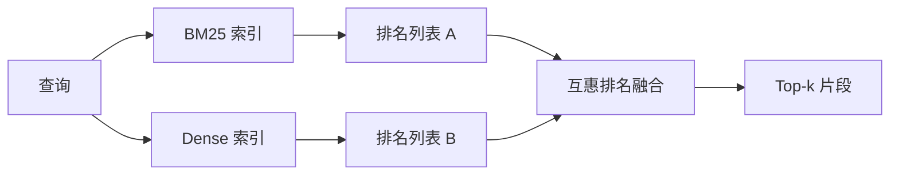

# 结合 BM25 和 Dense Embeddings 的混合检索

> 词汇检索（lexical retrieval）和语义检索（semantic retrieval）在不同的查询分布上表现失效。用互惠排名融合（reciprocal rank fusion, RRF）实现的混合检索不是插值操作，而是投票机制——每种查询类别都由投票决出胜者。

**类型：** 构建  
**语言：** Python  
**先决条件：** 第11阶段课程04（embeddings），06（RAG）；第19阶段B轨基础课程（20-29课）；第19阶段课程64（分块策略）  
**时长：** 约90分钟

## 学习目标
- 从 Robertson 和 Sparck Jones 的公式出发，实现 BM25，支持字段加权、文档长度归一化，以及可调节的 k1 和 b 参数。
- 在确定性的模拟嵌入（mock embedding）基础上构建密集检索器，实现脱机循环运行。
- 按照 Cormack、Clarke 和 Buettcher 2009 年发表的精确定义，实现互惠排名融合，并解释为何它胜过基于分数加权的插值。
- 调整 RRF 的 k 常数和每个检索模态的权重，并在小型测试语料库上观察权衡。

## 问题描述

当查询中携带语料库字面存在的标识符时，词汇检索胜出。比如查询 `AbortMultipartOnFail`，通过 BM25 能在数微秒内返回正确的 Go 函数。但同样的查询经嵌入后落在三个相似集群的边界，密集检索却将错误的文件排名第一。

当查询被释义，与语料库的字面词汇不匹配时，密集检索胜出。比如用户询问“how do we handle cancelled uploads？”，他从未输入 “abort” 或 “multipart” 这几个词。BM25 会返回包含“uploads”一词的“大文件上传”文档段，而密集检索则找到描述取消的 abort 函数。

两种方式的选择并非静态不变，查询分布是变量。生产环境的 RAG 系统要从同一端点兼顾这两类查询，检索必须同时满足两者，这就是混合检索。合并步骤必须设计得当。

## 概念



### BM25 简述

BM25 对查询-文档对打分方法是：对查询词汇逐一计算逆文档频率（IDF）因子乘以一个饱和型词频因子（包含文档长度归一化修正），并求和。两个旋钮可调：`k1` 控制词频饱和度，默认1.5是推荐值，不经基准测试不要轻易调整；`b` 控制文档长度的影响，默认0.75 表示对长文档有惩罚但并非线性。

IDF 公式采用平滑的 Robertson 和 Sparck Jones 定义：`log((N - df + 0.5) / (df + 0.5) + 1)`。对数内部加1可保持当词汇出现超过一半语料时 IDF 仍为正，这在小型语料库中对技术上罕见的停用词很重要。

字段加权让你可以告诉 BM25：符号名匹配比正文匹配更重要。实现是在索引时对词频计数做乘法，而非打分时，这样计算公式保持不变，避免了每个字段出现单独评分。

### Dense 检索简述

用嵌入模型将每个内容块（chunk）编码为固定维度向量。在查询时将查询映射成向量，按余弦相似度对所有块排序，返回前 k 个。模型质量决定了检索效果。检索算法本身只有两行代码：点积与排序。

本课用确定性哈希嵌入，避免网络调用，能便于你理解融合数学。哈希方法将基于词元（token）的偏移累加进一个96维向量，并归一化。余弦排序在多次运行间保持一致，符合测试套件需求。

### 互惠排名融合的公开公式

对两个排名列表中出现的每个候选项，累计其互惠排名分数贡献。2009 年论文用的公式是 `1 / (k + rank)`，默认 k=60。对总分排序。算法仅此而已。

常数 k=60 意义明确。k=60 时，第一名贡献是 1/61，排名第十贡献是 1/70，衰减缓慢以让较低排名的候选项依然具投票权。k 值更小，顶部结果更占主导；更大则贡献曲线更平坦。

本实现有两个旋钮：`k` 常数，以及每个模态的权重对，用于根据先验知识提升 BM25 或 dense 的权重。将排名贡献乘以权重是最简单的合理实现，保持了排名衰减形状且无单位量纲。

### 为什么融合胜过基于分数的线性插值

BM25 分数无界且依赖语料库，余弦相似度位于 -1 到 1。线性组合 `alpha * bm25 + (1 - alpha) * cosine` 需针对每个语料库调整 alpha，且每次重新索引都会失效。基于排名的融合没有此弊端。两个排名在不同模态中是可比的。自2010年以来，公开 TREC 追踪中发布的 RRF 基线均胜过基于分数的插值。

这与 Vespa 和 Weaviate 文档中关于 RankFusion 和 RRF 的论述相同：除非有强明显理由，否则优先使用基于排名的融合。

## 构建练习

`code/main.py` 实现：

- `tokenize(text)` - 快速的正则表达式分词器。
- `BM25Index` - 支持字段加权，含 `add` 和 `search`，k1 与 b 可调。
- `mock_embed`, `DenseIndex` - 与课程64中相同的确定性嵌入，保证块间可比较。
- `rrf(rankings, k, weights)` - 采用公开的多模态权重互惠排名融合。
- `HybridRetriever` - 结合 BM25 和 dense。
- 一个演示主函数 `main()`，加载小测试语料，运行三个针对两种检索方式优缺点的查询，打印每种模态产生的排名及融合排名。

运行命令：

```bash
python3 code/main.py
```

并排阅读演示输出。字面标识符查询 BM25 排名第1，dense 第4，RRF 第1。释义查询 BM25 第6，dense 第1，RRF 第1。模棱两可查询 BM25 第3，dense 第3，RRF 第1。融合非简单的决胜负，而是在所有查询类别中获胜。

## 调节旋钮说明

| 旋钮           | 默认值 | 适宜调大情况                                | 适宜调小情况                           |
| -------------- | ------ | ------------------------------------------ | ------------------------------------ |
| BM25 k1        | 1.5    | 词汇在文档中重复，且你希望词频影响更大       | 文档较短且词重复是噪音                  |
| BM25 b         | 0.75   | 长文档每词含义确实较少                       | 文档长度与主题无关                    |
| RRF k          | 60     | 希望排位较低的候选仍能贡献投票                | 希望第一名主导所有投票                 |
| BM25 权重      | 1.0    | 语料库含字面标识符且查询与之匹配              | 查询主要释义表达                      |
| Dense 权重    | 1.0    | 查询被释义表达                              | 查询是字面表达                        |

调节时通过重新运行第68课的评估工具，使用保留查询集，不建议凭直觉调整。

## 演示中隐藏的失败模式

**词汇表外（OOV）词元**。BM25 根据语料库计算 IDF，查询中只出现而语料外的词元贡献为零。Dense embeddings 会为该词构造“幻觉”向量。对语料外标识符，dense 检索返回貌似合理但错误的邻居。融合部分吸收了这一点，因为 BM25 不返回匹配，排名贡献为 0，但前提是要对文档级别去重，而非块级。

**停用词支配**。对“the”这样的词，BM25 排名在整个语料库中均匀分布。请在索引器里过滤停用词，或者接受高 IDF 词自然主导现象。

**模态间内容完全相同**。如果语料库很小，BM25 和 dense 的第一名相同，RRF 也会给出同一第一名和邻居。这是正常，非 bug，但会让融合看起来无效。请在评估中加入对抗性查询对，以验证融合确实生效。

## 使用建议

生产环境方案：

- BM25 在流程内索引，瓶颈在词频字典，不在向量。
- dense 向量单独存储（本课用的是平面列表，生产环境可用 HNSW）。
- 两个查询同时运行，融合步骤为统一结果的常数时间合并。
- 记录每条检索结果来源的模态，方便后续重排器根据投票模态调整排序。

## 交付说明

第66课使用本课融合的 top-k 结果，进行跨编码器重排；第68课评估全流程（精确率、召回率、MRR、nDCG）；本课的混合检索器是第69课端到端系统的第一阶段。

## 练习

1. 用你供应商的真实模型替换 `mock_embed`。重新运行演示，报告释义查询中密集检索的排名变化。
2. 新增第三模态：单独索引块的摘要，并作为第三个排名列表融合。衡量性能提升。
3. 在 10、30、60、100、200 取值下扫 RRF 的 k。绘制第68课的 recall@k 曲线。报告语料库中达到峰值的 k。
4. 正确实现 BM25F（基于字段长度归一，而非乘法技巧），在符号匹配重要的语料库上做比较。

## 关键词

| 术语          | 常见说法            | 实际含义                                      |
| ------------- | ------------------- | --------------------------------------------- |
| BM25          | “词汇检索”          | 概率排名，idf × 饱和词频 × 长度归一化           |
| RRF           | “排名融合”          | 任一排名中 1/(k+rank) 求和，k 默认60              |
| k1            | “词频饱和”          | 控制重复词条影响分数增长速度                      |
| b             | “长度惩罚”          | 0 忽略长度，1 完全归一化                         |
| 字段加权      | “符号提升”          | 索引时重复词条以提升该字段匹配的权重               |
| 基于排名与基于分数融合 | “RRF 胜过线性”    | 评级在模态间可比，分数不可比                         |

## 深入阅读

- Cormack, Clarke, Buettcher, “Reciprocal Rank Fusion outperforms Condorcet and individual rank learning methods”, SIGIR 2009
- Robertson, Walker, Beaulieu, Gatford, Payne, “Okapi at TREC-3”（原始 BM25 论文）
- [Vespa：结合 BM25 和嵌入的混合检索教程](https://docs.vespa.ai/en/tutorials/hybrid-search.html)
- [Weaviate：混合搜索](https://weaviate.io/developers/weaviate/search/hybrid)
- 第11阶段课程06 - RAG 基础
- 第19阶段课程64 - 本课索引使用的分块器
- 第19阶段课程66 - 使用融合结果的交叉编码器重排器
