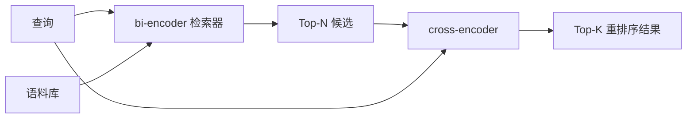

# Cross-Encoder 重排序器（Reranker）

> bi-encoder（双编码器）独立地对查询和文档进行嵌入。cross-encoder（交叉编码器）将它们拼接起来并同时读取两者。cross-encoder 是最智能的阅读器，但速度最慢。作为 bi-encoder 的 top-k 第二阶段使用，物有所值。

**类型：** 构建  
**语言：** Python  
**前置知识：** 第一阶段 11 课 06（RAG）、第一阶段 11 课 07（高级 RAG）；第一阶段 19 轨道 B 基础（第 20-29 课）；第一阶段 19 课 65（混合检索喂入此阶段）  
**时间：** 约 90 分钟

## 学习目标
- 通过输入形状、参数数量和每次查询的成本，区分 bi-encoder 检索器和 cross-encoder 重排序器。
- 从头实现一个小型 cross-encoder，作为一个 transformer（变换器）块，消费打包的（查询，文档）序列并输出一个相关性标量。
- 组合两阶段检索-再排序流水线：用廉价检索器检索 top-N，用 cross-encoder 重新排序 N 到 top-K，返回 K。
- 在一个小型测试语料库上测量延迟与质量的权衡，并根据延迟预算选择合适的 N。

## 问题

bi-encoder 将查询和文档映射到同一向量空间，并通过余弦相似度排序。两个编码互相看不到彼此。模型必须将文档中的所有有用信息压缩成单个向量，而对查询一无所知。这很快——索引时对每个文档嵌入一次，查询时对每个查询嵌入一次——也是在大规模语料中排名的唯一方法。

代价是精度。当两个文档主题相似时，即使只有一个回答查询，它们的嵌入向量也几乎相同。bi-encoder 无法区分它们。

cross-encoder 通过同时读取查询和文档解决了这个问题。模型接收 `[query] [SEP] [document]` 作为单条序列，运行跨连接的完整注意力机制，输出一个相关性标量。文档的每个标记都可以关注查询的每个标记。模型基于完整上下文决定分数。

代价是吞吐量。bi-encoder 只需嵌入一次即可反复查询，而 cross-encoder 针对每对（查询，文档）运行一次。对于一个一千万文档的语料库，每次查询需做一千万次前向传递。在请求预算内无法执行。

解决方案是分阶段。用 bi-encoder 检索 top-N。用 cross-encoder 重新排序 N 到 top-K。N 较小（50 到 200），cross-encoder 的质量提升集中在关键位置。总延迟保持在请求预算内。总质量是 cross-encoder 的质量，受 bi-encoder 在 N 内召回率限制。

## 概念



### cross-encoder 的输入形状

标准打包格式是 `[CLS] query_tokens [SEP] document_tokens [SEP]`。CLS 位置的输出被传入一个线性头，输出相关性标量。一些实现用均值池化代替 CLS，差异很小。关键是模型对每对生成一个数值。

一个 2200 万参数的 cross-encoder（公开的 `ms-marco-MiniLM-L-6-v2` 权重类）是典型的生产选择。更小模型的质量下降快于延迟节省。更大模型（如 5.68 亿参数的 `bge-reranker-v2-m3`）用于离线重排序或者首页小 K 重排序。

### 为什么本课训练一个小模型

真正的 cross-encoder 是微调的编码器 transformer。生产中你加载检查点并运行它。本课目标是展示模型形状和延迟-质量曲线形态，而非训练业界最优排序器。因此构建一个小型 `nn.Module`，含一个 transformer 块，多头注意力（默认 4 头），和一个回归头。它由随机种子确定性初始化，保证演示可复现，无需磁盘权重。

玩具模型从测试语料库学会正确形状：相关查询-文档对预测分高于无关对。端到端流水线重排序 bi-encoder 输出，top-k 与金标相关。

### 延迟与质量

两阶段流水线有一个调节参数：N。在保留查询集上 N 从 5 扫描到 100，得到曲线。

| N | 第二阶段 Recall@1 | 每查询 cross-encoder 前向传递次数 | 延迟 |
|---|-----------------|-----------------------------------|-------|
| 5 | 0.62 | 5 | 低 |
| 20 | 0.81 | 20 | 中 |
| 50 | 0.86 | 50 | 高 |
| 100 | 0.86 | 100 | 很高 |

上述数字只是形态示例，不是本测试的数据。形态真实存在。重排序提升饱和点常在 20 到 50 候选处。超过此点付出无效代价。

结合评估曲线与延迟预算选 N。cross-encoder 召回率不超过 bi-encoder 在 N 处的召回，低 N 限制质量，不只是延迟。

## 构建

`code/main.py` 实现：

- `CrossEncoder` - 一个小的 `torch.nn.Module`：词嵌入，含多头注意力和前馈的单 transformer 块，均值池化头输出一个标量。
- `tokenize_pair(query, document)` - 将两个字符串打包成单一 id 序列，带类型 id 标记边界，确定性且基于标准库。
- `train_tiny(pairs)` - 一次有监督训练，使用人工标注的（查询，文档，相关性）三元组列表，让模型对测试语料输出合理分数。
- `rerank(query, candidates, top_k)` - 生产接口。
- `pipeline(query, retriever, top_n, top_k)` - 两阶段流程。
- 演示 `main()`，从第 65 课的语料加载、检索 top-N、重排序到 top-K，打印两个列表并报告各阶段延迟。

运行：

```bash
python3 code/main.py
```

输出展示 bi-encoder 的 top-N 和 cross-encoder 的 top-K 及时间汇总。cross-encoder 单次调用耗时更长，但不针对全语料运行。两阶段总时延控制在请求预算内，同时选出 bi-encoder 排名第 2 或第 3 的答案。

## 演示隐藏的失败模式

**Cross-encoder 不对称。** `rerank(q, d)` 和 `rerank(d, q)` 得分不同。总是先传查询。如果不慎互换顺序，召回会坍塌。

**N 太小暴露不了缺陷。** 若 N = K，cross-encoder 仅能调整权重，无法真正重新排序。提升看似为零。选 N 至少为 K 的三倍。

**训练数据泄露到评估。** 若人工标注训练对含评估查询，重排序效果看似神奇。必须严格区分训练和测试，哪怕是一个小测试集。

**生产权重是密集的。** 2200 万参数 cross-encoder 权重浮点32位约 88MB。承诺低于 100ms p95 延时前须做好模型服务器内存规划。

**批处理重要。** 真实 cross-encoder 将 N 个候选一次性批处理。本课中 `_batch_encode` 用 `torch.tensor(...)` 生成批 id 和类型 id 张量，执行一次前向。若不批处理，延迟将乘以 N。

## 使用

生产模式：

- 固定 bi-encoder、cross-encoder 和 N。不变其中一项即作废评估。
- 缓存 reranker 输出，按 (query, document_id) 哈希。固定语料库同一查询重排序结果一致，缓存命中节省延迟。
- 记录 rank-1 cross-encoder 分数。若查询的 top-1 分低于语料特定阈值，视为领域外问题；向 LLM 表示“不确定”。

## 发布

第 68 课对这两阶段流水线进行端到端评估。第 69 课将此重排序器串接在第 65 课混合检索器之后和答案生成器之前，作为系统第二阶段。

## 练习

1. N 从 5 扫描到 50，绘制重排序输出的 recall@1 曲线。找出测试语料的转折点。
2. 将 cross-encoder 训练改为十个 epoch。测量每个 epoch 正负样本之间的分数差距。
3. 将均值池化头替换为 CLS token 头。比较在测试语料上的收敛效果。
4. 增加第二个 cross-encoder 头，预测二元“文档中是否包含答案”标签。推断时双头并用：一头排名，一头阈值判定。
5. 用第 65 课的真实 bi-encoder 替换模拟双编码器，串联两个阶段。比较 top-K 变化，与仅用 bi-encoder 比较。

## 关键词

| 术语 | 通俗说法 | 实际含义 |
|------|----------|-----------|
| Bi-encoder | “向量检索器” | 独立编码查询和文档；余弦排序 |
| Cross-encoder | “重排序器” | 联合编码（查询，文档）；输出单个相关性标量 |
| Two-stage pipeline | “检索然后重排” | 便宜检索器返回 N，昂贵重排序器保留 K |
| N（候选预算） | “重排序池” | cross-encoder 每查询评分的候选数量 |
| Mean-pooling head | “最后隐藏层均值” | 对编码器最后层输出取平均成一向量 |

## 拓展阅读

- Nogueira, Cho, “Passage Re-ranking with BERT”, 2019 - 标志性 cross-encoder 排序论文  
- Reimers, Gurevych, “Sentence-BERT: Sentence Embeddings using Siamese BERT-Networks”, 2019 - 关于 bi-encoder 与 cross-encoder  
- [SentenceTransformers Cross-Encoders 文档](https://www.sbert.net/examples/applications/cross-encoder/README.html)  
- [BGE Reranker v2 模型卡](https://huggingface.co/BAAI/bge-reranker-v2-m3)  
- 第 19 阶段 65 课 - 喂入此重排序阶段的混合检索器  
- 第 19 阶段 68 课 - 衡量此重排序提升的评估
