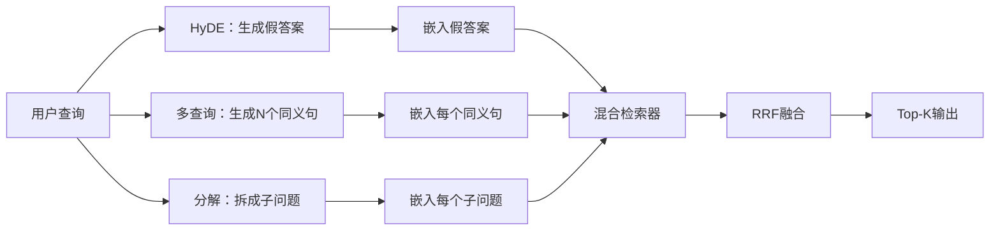

# 查询重写：HyDE、多查询和分解

> 用户输入的查询并不是检索器想要的查询。重写填补检索前的差距，使索引看到更接近答案的内容。

**类型：** 构建  
**语言：** Python  
**先决条件：** 第11阶段第04课（embeddings 嵌入）、06课（RAG）；第19阶段B轨基础课（20-29课）；第19阶段64和65课  
**时间：** 约90分钟

## 学习目标
- 实现假设文档嵌入（Hypothetical Document Embeddings，HyDE）：生成假答案，将其嵌入，使用该向量而不是查询向量进行检索。
- 实现多查询扩展：将单个查询重写成N个同义句，对每个执行检索，然后通过倒数排名融合（reciprocal rank fusion）合并结果。
- 实现查询分解：将复杂问题拆分成子问题，分别检索，合并结果。
- 在同一测试语料上横向比较三种重写方法，解释各自适用场景。
- 设计一个模拟大语言模型（LLM），产生确定性且定制的测试输出，使重写循环可离线运行。

## 问题描述

用户输入“当上传失败且预算用尽时，我们的团队怎么办？”。语料库包含一句话 “AbortMultipartOnFail 会在上传失败时终止正在进行的 S3 多部分上传，并减少每个桶的重试预算”。查询和文档间没有共享名词短语，BM25 方法匹配失败。双编码器（bi-encoder）则将文档排名第三或第四，因为查询向量落在偏好取消作业文档的嵌入空间区域，而不是终止上传的文档区域。第66课中的两阶段重排（rerank）能救回答案，只要答案在前N名，否则重排器未能见到该文档。

解决方案是检索前先重写查询。2023年论文《Precise Zero-Shot Dense Retrieval without Relevance Labels》（Gao 等）提出HyDE：让LLM生成回答查询的假文档，将该文档嵌入，使用其嵌入作为检索向量。假文档位于正确的嵌入空间区域，因为它以语料库的语言风格编写，而查询向量没做到这一点。

两种相关技术与HyDE配合使用。多查询扩展（微软 GraphRAG 术语）生成N个查询同义句，对每个执行检索，再合并结果。分解（2024年斯坦福 DSPy 工作中称为“子查询分解”）将“当上传失败且预算用尽时，我们的团队怎么办”拆成两个问题：“上传失败时发生什么？”和“重试预算用完时发生什么？”。两次检索，合并结果，覆盖答案的两个部分。

本课程实现上述三种方法，并在相同测试语料上运行。

## 概念示意



### HyDE细节

HyDE用LLM写的假文档向量替换用户查询向量。提示词简短：

```text
你是该领域专家。请写一段回答以下问题的一段话。请使用本领域文档常用的词汇和表达方式。不要拒绝，别说你不知道。

问题：{user_query}

段落：
```

LLM生成的答案作为事实可能不准确，因为LLM不了解你的语料库。这没关系，检索器关心的是令牌分布而非事实准确性。假文档包含“abort”，“multipart”，“bucket”，“budget”等词，因为这正是该主题文档会用的词。嵌入该段文档，向量会落在真实文段附近。

生产环境中，假文档控制为2-3句。太长会增加噪声，太短则丢失HyDE所需的词汇信号。

### 多查询扩展细节

生成N个用户查询的同义句。最简单的提示：

```text
请用{N}种不同的表达重写以下问题。每个重写都须保留原意。请按序号编号1至{N}，不要添加解释说明。
```

对每个同义句进行Top-k检索。使用RRF（第65课算法）合并N个排序列表。方法廉价、并行且确定性。

多查询扩展适用于用户表达存在多种等效问法时，任意改写都可能问得更好；当所有改写都因原查询不足而表现糟糕时，该方法失效。

### 分解细节

单次检索无法满足多面向问题。分解让LLM拆分成互相独立的子问题，系统分别检索。提示词：

```text
以下问题可能需要多个不同主题的信息。请将其分解成一组子问题，每个子问题可独立回答。如果问题已经是原子性的，请保持不变返回。

问题：{user_query}
```

分别检索子问题，合并结果。分解适合包含连词、多子句比较或无关主题的问题；不适合原子问题，分解器此时应返回单个问题，不应编造假子问题。

### 三者共存原因

三者相辅相成：HyDE填补查询与语料库词汇差距，多查询解决同义句多样性，分解处理多主题查询。生产往往同时运行三种策略，并根据查询自动选择（第69课末展示选择器）。

## 模拟LLM

本课离线运行。模拟LLM是一个小型查找表，以用户查询为键，未曾遇见查询有回退策略。查找表包含：

- 每个测试查询的假文档、三个同义句、分解结果。
- 未知查询：确定性转换，提取查询关键词，通过同义词映射扩展后返回。

模拟LLM的形状重要，数据内容无所谓。生产中替换为真实模型调用，检索器代码不变。

## 构建它

`code/main.py` 实现：

- `MockLLM` - 如上确定性替代模型。
- `HyDERewriter` - 调用LLM生成假文档，返回 `RewriteResult`，包含假文档文本和检索用查询。
- `MultiQueryRewriter` - 调用LLM生成N个同义句，返回查询列表。
- `DecomposeRewriter` - 调用LLM分解问题，返回子问题列表。
- `retrieve_with_rewriter` - 接受重写器和检索器，执行重写，融合结果。
- 演示程序，对固定测试数据运行三种重写器，打印哪个策略先返回黄金答案文档。

检索器形态重用第65课（BM25 + dense混合）。融合用相同RRF算法。新增仅为简洁的重写器接口。

运行：

```bash
python3 code/main.py
```

输出显示各策略排名及最终总结。HyDE赢得因表述不匹配的查询，多查询赢得同义句多样性查询，分解赢得多主题查询。无重写器（回退）则至少在三者之一落败。

## 演示隐藏的失败模式

**HyDE产生领域特定标识符幻觉。** 模型发明函数名，导致假文档在正确文档BM25评分崩溃，因为发明词在索引中无权重。限制假文档长度，降低BM25权重以缓解。

**多查询改写全收敛。** 模型弱生成三乎无差异同义句，三个检索结果Top-k相同，RRF融合集合不能超单次检索。增加多样性提示词，通过Jaccard检测重复。

**分解过度拆分。** 把原子问题拆成列表，检索都返回相同文档但排名降低，合并质量反而变差。增加“子问题足够不同吗”的检测环节避免过拆。

**延迟乘数增长。** HyDE需1次LLM调用，多查询需1次调用生成N改写+N次检索，分解需1次调用分解+M次检索。检索可并行，LLM调用是瓶颈。

## 实际应用

生产模式：

- 根据查询长度选择策略：简单短查询用多查询，复杂多子句用分解，术语多用HyDE。
- 按查询哈希缓存重写结果，因查询大量重复。
- 三者并行运行，用RRF融合结果。成本为三次LLM调用和一次融合，质量涵盖所有策略优势。

## 交付

第69课将本重写阶段接入第65课检索器和第66课重排器。第68课评估重写器提升的检索召回。

## 练习

1. 实现RAG-Fusion（2024年多查询变体），使改写多样，后续重排（第66课）选最优列表。
2. 增加第四策略：回退提示（step-back prompting，先问更通用问题、检索，再细化查询），在测试环境比较。
3. 训练分解模型识别原子查询，加入“问题是否原子”预测头，衡量前后过拆率。
4. 用真实模型替代模拟LLM，测量每策略延迟。
5. 每改写加入置信度分数，丢弃低于阈值的改写，测召回影响。

## 术语表

| 术语 | 通俗说法 | 实际含义 |
|-------|------------|--------------------------|
| HyDE  | “假文档检索” | LLM生成答案，嵌入用于检索代替查询向量 |
| Multi-query | “同义句扩展” | 查询的N个重写；分别检索；用RRF融合 |
| Decomposition | “子查询拆分” | 多主题查询拆成子查询，分别检索 |
| Atomic query | “单主题” | 无法拆分而不编造假子查询 |
| Step-back | “抽象查询” | 问更泛的查询，检索后再细化 |

## 延伸阅读

- Gao, Ma, Lin, Callan, "Precise Zero-Shot Dense Retrieval without Relevance Labels"（HyDE），2023  
- 微软研究院，《多查询扩展用于检索》  
- 斯坦福 DSPy，《多跳问答的子查询分解》  
- [LlamaIndex 查询转换文档](https://docs.llamaindex.ai/en/stable/optimizing/advanced_retrieval/query_transformations/)  
- 第11阶段07课 - 高级RAG模式  
- 第19阶段65课 - 本重写器输入的检索器  
- 第19阶段68课 - 衡量重写器提升的评估
