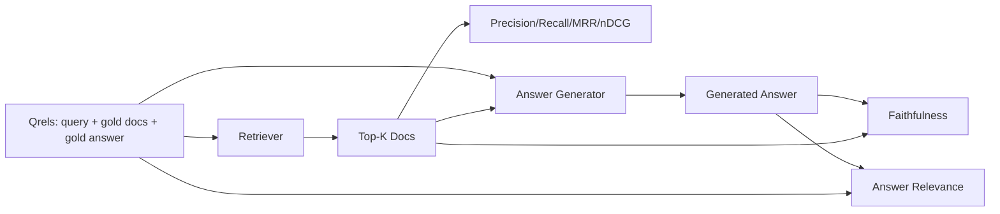

# RAG 评估：精确率（Precision）、召回率（Recall）、MRR、nDCG、忠实度（Faithfulness）、答案相关性

> 如果你不能同时评估检索和答案，就无法上线系统。这两个指标不相同，同一个提示在不同维度会失败。

**类型:** 实战  
**语言:** Python  
**先决条件:** 第11阶段课程06（RAG）、10（评估）；第19阶段B轨基础（课程20-29）；第19阶段课程64、65、66、67  
**时间:** 约90分钟

## 学习目标
- 计算四种检索指标（来自黄金相关性，即 gold qrels）：precision@k、recall@k、MRR（平均倒数排名）、nDCG@k。
- 计算两种答案评分指标：忠实度（生成的每条陈述都基于检索到的上下文）和答案相关性（答案是否回应了问题）。
- 构建一个夹具式的 qrels 文件（查询、黄金文档 id、黄金答案文本），允许评估端到端执行。
- 阅读指标值，诊断管道哪个环节出现故障：检索、排序、生成或依赖上下文。

## 问题说明

一个 RAG（Retrieval-Augmented Generation，检索增强生成）系统至少有四个关键部分：chunker（文本分块器）、retriever（检索器）、reranker（重排序器）、generator（生成器）。任何一个部件都可能导致错误答案。没有分阶段的指标，只能盲目排查。

用户报告答案错误，是 chunker 切断了答案片段？还是 retriever 没有将正确文档排在 top-k 内？reranker 把正确文档排在第一名之后？还是 generator 忽略了正确文档，自行编造？仅凭答案无法判定。你需要：

- 检索指标来评估 retriever 输出。
- 排序指标评估正确文档的排名位置。
- 忠实度评估生成器是否严格依据检索上下文。
- 答案相关性评估答案是否真正响应了问题。

本课通过夹具式 qrels 文件全部实现这六种指标。评估为离线确定性；生产环境中替换为真实 LLM 作为裁判。

## 概念说明



### Precision@k（精确率）

在检索器返回的 top-k 文档中，有多少比例属于黄金集合？  
比如黄金集有3篇文档，top-3 中返回了其中两篇且多了一篇错误文档，则 precision@3 = 2 / 3。  
当不相关文档代价高时（生成器浪费 token，或不相关文档污染答案），使用精确率。

### Recall@k（召回率）

黄金集合的文档中，有多少比例出现在 top-k 中？  
如黄金文档有3篇，top-5 包含全部3篇，则 recall@5 = 1.0。  
当漏检答案代价高时（宁愿多返回一些错误文档，也不想漏掉正确文档），使用召回率。

在生产 RAG 中，常引用的指标是 recall@k。生成器能丢弃不相关文档，但不能凭空制造没有检索到的答案。

### MRR（Mean Reciprocal Rank，平均倒数排名）

针对每个查询，找到排在列表中第一个相关文档的位置，倒数排名为 1 / 位置。对所有查询均值即 MRR。  
MRR 是检索器能否将最佳答案排在靠前位置的单变量总结。

MRR 强调第一名的权重。黄金文档在第一位时贡献 1.0，第二位贡献 0.5，排名第十贡献 0.1。该指标由列表前部主导。

### nDCG@k（归一化折扣累积增益）

Normalized Discounted Cumulative Gain（归一化折扣累积增益）。完整公式为对每个检索文档分配增益值（一般相关为1，不相关为0），按排名对数折扣，加总后除以理想 DCG（假如排名完美的DCG）。范围0~1。

nDCG 支持分级相关度：黄金文档可以标注为“文档 A 是 3，文档 B 是 2，文档 C 是 1”。而 MRR 和 recall@k 只支持二值相关。多部分相关文档的语料库用 nDCG 较合适。

### Faithfulness（忠实度）

对生成答案中的每条主张，检查主张是否依赖于检索上下文。标准实现采用基于 LLM 的裁判 prompt，输入（主张，context）返回 yes 或 no。指标为通过判断的主张比例。

忠实度捕获生成器“编造内容”的失败模式。即使检索返回了正确文档，生成器虚构内容也是错误。忠实度也称为 groundedness（以事实为依据）、support（支持度）、attribution（归因）。

本课使用确定性模拟裁判，基于主张和检索上下文的 token 重叠阈值判断。生产环境会替换成真实模型调用，指标形态相同。

### Answer relevance（答案相关性）

答案实际上回答了提问吗？忠实度关注“答案是否基于检索上下文？”，而答案相关性关注“答案是否回应了问题？”  
忠实但偏题的答案忠实度高但相关性低。简短且回应了问题但无视上下文的答案，则相关性高但忠实度低。

标准实现也用 LLM 裁判：输入（问题，答案），判断答案是否回应了问题。本课实现了 token 重叠加判定模拟。

## 夹具式 qrels

```python
{
  "qid": "q1",
  "query": "what is the abort threshold for multipart uploads",
  "gold_doc_ids": ["d1", "d3"],
  "gold_answer_substring": "three failed parts",
  "graded_relevance": {"d1": 3, "d3": 2},
}
```

每个查询包含：  
- 查询字符串  
- 一组黄金文档 id（用于精确率 / 召回率 / MRR）  
- 分级相关字典（用于 nDCG）  
- 黄金答案子串（作为每个 qrel 的参考元数据；忠实度通过判断主张与检索上下文，不是直接判断该子串）

生产环境中需要标注这些数据。本课提供手工构建夹具，评估即插即用。

## 构建实现

`code/main.py` 实现了：

- `precision_at_k(retrieved, gold, k)` - 精确定义  
- `recall_at_k(retrieved, gold, k)` - 精确定义  
- `mean_reciprocal_rank(retrieved_list_of_lists, gold_list)` - 查询均值  
- `ndcg_at_k(retrieved, graded_relevance, k)` - DCG / IDCG，二值或分级增益  
- `extract_claims(answer)` - 将答案拆分为句型主张  
- `faithfulness(claims, context_texts, judge)` - 被裁判判定支持的主张比例  
- `answer_relevance(question, answer, judge)` - 裁判判断答案是否回应问题  
- `MockJudge` - 确定性 token 重叠裁判，实现离线评估  
- `evaluate_pipeline(pipeline_fn, qrels, ks)` - 运行所有指标的协调器  
- 演示运行三种管道变体（chunker 基线，混合检索，混合+重排序）针对 qrels 并打印指标表

运行命令：

```bash
python3 code/main.py
```

输出展示每种变体的 precision@k、recall@k、MRR、nDCG@k、忠实度和答案相关性指标表。混合检索行在召回率上优于 chunker 基线，重排序行在 MRR 上优于混合。

## 读取指标诊断故障

| 症状                | 可能原因                    | 需修复内容                              |
|---------------------|-----------------------------|---------------------------------------|
| 召回率低，精确率低   | chunker 切断答案或检索器找不到 | chunker 边界（课程64）或检索器模态（课程65） |
| 召回率不错，MRR 低   | 正确 chunk 在 top-k 但非第一位 | 重排序器（课程66）                      |
| MRR 高，忠实度低    | 生成器无视上下文编造内容       | 生成提示；强制引用或拒绝生成            |
| 忠实度高，相关性低  | 答案基于上下文但偏题           | 查询改写器（课程67）或生成提示           |
| 四项都高，用户依然抱怨 | 评估集不具代表性               | 用真实用户查询扩充 qrels                |

## 演示中会隐藏的失败模式

**LLM 作为裁判的偏见。** 模型衡量自身输出的忠实度时往往偏高。使用与生成器不同的模型家族做裁判，或对样本人工打分。

**Qrels 失效。** 随着语料变化，黄金答案漂移。一份2024年1月的 qrels 文档，在2024年10月可能不再正确，因为团队重命名了函数。需每季度审查 qrels。

**忠实度微观检查漏掉宏观谬误。** 每句忠实度通过，但整体结构误导。需在自动指标之外做样本级别质检。

**召回率掩盖按查询失败。** 平均召回90%可能掩盖部分类别查询总是漏检。应按查询类别（字面、释义、多主题）分切片报告。

## 使用建议

生产模式：

- 每次检索器或生成器变更都运行评估。召回率下降视为测试失败。
- 持久化每个查询的指标轨迹。用户投诉时查找对应 qrels 条目，看是否能提前捕获。
- 分层 qrels：包含 20 个查询的快速冒烟集（CI 中运行）；200 个查询的回归集（夜间运行）；2000 个的深度集（周运行）。

## 上线方案

第69课将整个流水线（chunker、retriever、reranker、generator）连线，并使用本评估实现端到端打分。

## 练习

1. 添加第五个检索指标：hit-rate@k。对比 recall@k，解释差异场景。  
2. 实现分级忠实度：0（不支持）、1（部分支持）、2（完全支持），更新指标。  
3. 用真实模型调用替换模拟裁判。测量模拟与真实裁判在夹具上的分歧。  
4. 添加查询类别切片（“字面”、 “释义”、 “多主题”），分类别指标报告。  
5. 添加“答案长度”指标，分析与忠实度的关联，绘制曲线。  

## 关键词汇

| 术语          | 大众说法                  | 实际含义                               |
|---------------|----------------------------|--------------------------------------|
| Precision@k   | “检索的命中率”            | top-k 文档中属于黄金的比例             |
| Recall@k      | “黄金的命中率”            | 黄金文档中出现在 top-k 的比例          |
| MRR           | “第一次命中位置”          | 第一个相关文档排名位置的倒数平均        |
| nDCG@k        | “分级排序质量”            | top-k 的 DCG 除以理想 DCG              |
| Faithfulness  | “基于事实的程度”          | 答案陈述中被检索上下文支持的比例        |
| Answer relevance | “是否回应了问题？”     | 答案是否符合问题意图                    |
| Qrels         | “黄金标注”                | 查询和其对应的黄金文档与答案集           |

## 相关阅读

- Buckley, Voorhees, "Evaluating Evaluation Measure Stability", SIGIR 2000 - 排序指标经典论文  
- Jarvelin, Kekalainen, "Cumulated Gain-based Evaluation of IR Techniques" - nDCG 源论文  
- [Ragas: Automated Evaluation of RAG Pipelines](https://docs.ragas.io)  
- [Anthropic, Evaluating RAG](https://www.anthropic.com/news/evaluating-rag)  
- 第11阶段课程10 - 评估框架基础  
- 第19阶段课程64-67 - 本课所涉及组件评估  
- 第19阶段课程69 - 本评估覆盖的端到端流水线
