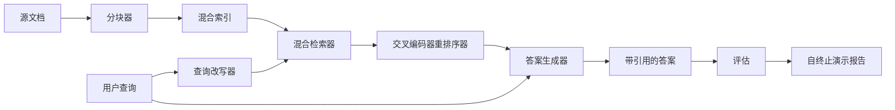

# 端到端 RAG 系统

> 六个组件的课程。一个管道。一轮评估。一个自终止演示。这就是你要交付的系统。

**类型：** 构建  
**语言：** Python  
**先修课程：** 第11阶段课程06（RAG）、10（评估）；第19阶段 Track B 基础（课程20-29）；第19阶段课程64、65、66、67、68  
**时间：** ~90 分钟

## 学习目标
- 将 chunker（分块器）、hybrid retriever（混合检索器）、query rewriter（查询改写器）、cross-encoder reranker（交叉编码器重排序器）和 answer generator（答案生成器）组合为单一的端到端流水线。
- 实现带有按 chunk 锚点引用其论据的答案生成器，并带有低置信度拒绝机制。
- 针对已组装的流水线运行第68课的评估，证明阶段构建在各项指标上均优于孤立组件。
- 构建一个自终止的命令行演示，加载示例语料库，运行固定查询集，并以汇总报告零退出。

## 问题

孤立的六个组件并不能证明什么。chunker 可以在 recall@5 上击败语料库，但系统的 recall@5 却可能败给，因为 retriever（检索器）无法给出 chunker 产生内容的正确排序。reranker（重排序器）可以提升合成候选池的 MRR，但在真实双编码器候选上失败，因为双编码器在重排序预算内的召回率过低。query rewriter 可以提高单个查询的黄金文档排名，但在下一个查询时会出错，因为 LLM 模拟返回了退化的假设。

集成测试是整个流水线针对相同的示例 qrels（查询相关性标签）、相同的指标从头到尾运行，由单个协调器文件将所有组件串联起来。这正是本课构建的内容。如果集成流水线的指标超过每个阶段孤立演示的指标，则证明系统有效。

## 概念



### 连接选择

流水线是一个小图。每个阶段是一个函数，具有明确的输入输出签名。

| 阶段 | 输入 | 输出 |
|-------|-------|--------|
| Chunker（分块器） | 文档文本 | Chunk 记录列表 |
| Retriever（检索器） | 查询字符串 | Top-N Chunk 记录 |
| Rewriter（改写器，可选） | 查询字符串 | 改写列表 + 假设 |
| Reranker（重排序器） | 查询 + 候选 | 带交叉评分的 Top-K Chunk 记录 |
| Generator（生成器） | 查询 + Top-K Chunk 记录 | 带引用的答案字符串 |

当每个签名稳定时，组合很直接。本课的 `Pipeline` 类包含五个阶段和一个按顺序运行它们的 `query` 方法。每个阶段可替换：传入不同的 chunker、retriever、rewriter、reranker 或 generator，流水线依然可运行。

### 带引用的答案生成器

生成器是最后阶段，也是最容易出错的。课程提供一个确定性的模拟生成器，工作流程：

1. 接收重排序后的 Top-K chunks。
2. 选择多达两个其文本与查询的内容标记重叠度最高的 chunk。
3. 输出一个答案，连接每个选中 chunk 中的一句话，每句话后跟 `[doc_id:chunk_index]` 锚点。
4. 如果没有 chunk 的重叠度达到拒绝阈值，输出 “I do not know”，无引用。

生产环境中，你将用一个真实 LLM 调用代替模拟器，使用提示模板：

```text
你仅使用以下文本片段回答问题。
每条论据后面请加括号中锚点引用。
如果片段无法回答问题，请回答 "I do not know"。

问题：{query}

片段：
{编号 chunk 带锚点}

答案：
```

低置信度拒绝路径正是记录交叉编码器排名第一分数的原因。如果该分数低于语料阈值，生成器拒绝回答。这是防止幻觉答案的安全阀。

### 自终止演示

演示端到端运行所有流程。打印单查询的每阶段拆解，针对四个示例 qrels 运行评估，打印指标表。如果所有第68课指标都达标，则以状态码 0 退出；如果有指标未达标，则非零退出并打印失败指标名。

这是 CI 冒烟测试的形态。流水线离线运行，快速且确定。阈值设得很严格，任何一个阶段回退都会导致演示失败。

## 构建它

`code/main.py` 实现：

- `Chunk` - 传递所有阶段的记录（在第64课的数据结构基础上扩展 chunk_index 和源 doc_id）。
- `Chunker` - 采用第64课中的策略（默认为递归拆分）。
- `HybridIndex` - 集成第65课的 BM25 + dense + RRF。
- `Rewriter`（可选）- 根据查询长度和连接词，选择 HyDE、多查询或分解策略，来自第67课。
- `Reranker` - 来自第66课的训练好的交叉编码器，用更小的示例集以秒级收敛。
- `Generator` - 带有引用和低置信度拒绝的确定性模拟生成器。
- `Pipeline` - 组合五个阶段，`query(question)` 方法返回 `Result(answer, top_k, latency_ms_per_stage)`。
- `run_demo()` - 加载语料库，运行三个示例查询，执行评估，打印结果，按阈值设置退出码。

运行：

```bash
python3 code/main.py
```

输出包含单次查询追踪、完整的评估表和最终通过/失败状态。示例数据返回退出码 0。

## 演示会隐藏的失败模式

**Chunker 边界漂移。** 如果你在评估 qrels 标注和演示之间切换 chunker 策略，黄金文档 ID 会不匹配。请在 qrels 文件中锁定 chunker 策略。演示会在头部显示所用的 chunker。

**Reranker 训练集泄漏到评估。** 第66课的 14 个训练三元组包括类似评估查询的样本。生产环境应严格隔离评估查询。演示的评估查询故意与训练集分离。

**模拟生成器掩盖了幻觉风险。** 模拟生成器不能幻觉，因为它只输出检索到的 chunk 文本。课程中提及这一点，并指向生产中替换真实模型的路径。

**不支持流式输出。** 流水线在每个阶段结束后返回完整答案。生产系统会流式输出生成器结果。流式不在本课范围内；最终字符串即可用于答案评分。

**延迟为离线。** 模拟 LLM 调用为恒定时间，真实 LLM 调用则时间占主导。请求级别应规划延迟预算，本课的逐阶段计时只测 CPU 计算。

## 使用它

生产模式：

- 将所有阶段文件置于单一协调器下，明确定义接口。避免跨仓库分散连线。
- 每次影响阶段的合并前运行评估。评估下降即禁止合并。
- 每次 CI 运行中持续保存指标轨迹，便于归因阶段回退。
- 添加 20 条冒烟查询集（回归集子集），运行在30秒内；完整回归集安排夜间运行。

## 交付它

本课的流水线文件就是第19阶段 Track F 余下课程依赖的形态。后续课程会增加数据摄取自动化、增量重建索引、遥测及服务层。本课覆盖了检索、重排序、改写和评估两大环节。

## 练习

1. 在改写器中添加每查询策略选择器：用第67课的启发式（长度、连接词、术语比率）选取 HyDE、多查询或分解。
2. 在环境变量标志下添加真实 LLM 调用作为生成器，默认使用模拟器。测量延迟差。
3. 扩展演示支持 `--corpus path` 标志，加载真实语料库。重新运行评估和阈值检测。
4. 给 chunker 添加 `--strategy` 标志。测量每种策略对端到端召回率的贡献。
5. 添加流式生成器接口，输入评估。确认忠实度是在最终字符串上计算，而非流式前缀。

## 关键术语

| 术语 | 常用说法 | 实际含义 |
|------|----------|----------|
| Pipeline（流水线） | “RAG pipeline” | 从摄取到带引用答案的组合阶段 |
| Citation anchor（引用锚点） | “Source link” | 附加在每条论据上的 (doc_id, chunk_index) 引用 |
| Refuse-on-low-confidence（低置信拒绝） | “I do not know” | 当 reranker 第一名得分低于阈值时，生成器不返回答案 |
| Smoke set（冒烟集） | “CI eval” | 每次 PR 检查都会运行的最小 qrels 子集 |
| Stage interface（阶段接口） | “Function signature” | 每个阶段的稳定输入输出类型 |

## 延伸阅读

- [Anthropic，构建搜索与检索](https://www.anthropic.com/news/contextual-retrieval)  
- [Pinterest，MCP 内部搜索](https://medium.com/pinterest-engineering) – 生产架构参考  
- [Ragas：RAG 流水线自动评估](https://docs.ragas.io)  
- 第11阶段课程06 - RAG 基础  
- 第19阶段课程64-68 - 本课程组件组合
