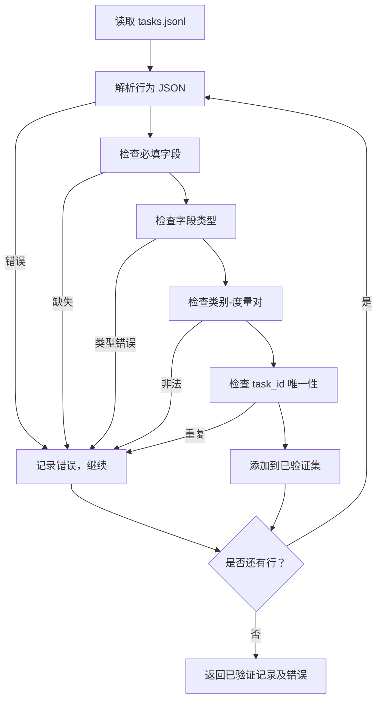

# Task Spec 格式

> 一个评估框架的好坏取决于其任务遵守的合约。在编写任何评分函数之前，先冻结 JSONL 结构和度量指标词汇表。

**类型：** 构建  
**语言：** Python  
**先决条件：** 阶段 19 轨道 B 基础  
**时间：** 约 90 分钟

## 学习目标

- 定义一个 JSONL 任务记录模式，该模式涵盖算术（arithmetic）、多项选择（multiple-choice）、代码执行（code execution）、分类（classification）及自由文本总结（free-text summarisation）等多种任务类型于一体。  
- 固定度量名称的封闭词汇表，以便后续课程（71-73）可通过单一字段分发指标。  
- 指定少样本示例（few-shot examples）和后处理规则作为任务的一部分，而非运行器部分，以确保相同提示在不同模型间生成一致目标。  
- 实现严格的验证器，在不良记录到达运行器之前拒绝它们。  
- 发布包含 10 个任务的示例集合，覆盖规范的所有分支，令验证器有真实样本可检验。

## 为什么要冻结规范

研究代码库中的评估脚本增长速度往往超过测试的增长。半年后，每个笔记本都有自己的 JSON 结构，每个度量重复实现两遍，且无法跨运行比较。解决方案很简单：选定一个模式，编写验证器，拒绝所有无法匹配的项。这正是本课的目标。

该结构借鉴自 BIG-bench、HELM 和 lm-eval 风格框架的理念，但字段名为我们自定义。每个字段都有唯一所有者。运行器读取任务，度量函数读取目标，后处理步骤规范生成内容。管线中间无字段可变。

## 记录结构

任务是单行 JSON 对象。框架读取 `tasks.jsonl` 并对每行独立验证。单行错误导致该记录终止，不影响整体运行。

```json
{
  "task_id": "arith_001",
  "category": "arithmetic",
  "prompt": "Compute the result. Question: 17 + 24\nAnswer:",
  "targets": ["41"],
  "metric_name": "exact_match",
  "few_shot_examples": [
    {"prompt": "Question: 2 + 2\nAnswer:", "completion": "4"}
  ],
  "post_process": "strip_whitespace",
  "metadata": {"difficulty": "easy"}
}
```

必填字段包括 `task_id`、`category`、`prompt`、`targets`、`metric_name` 和 `post_process`。`few_shot_examples` 和 `metadata` 为可选。未知顶层字段会导致验证失败。

## 字段规则

`task_id` 是不含空白的字符串，验证器保证其在文件中唯一。

`category` 必须是 `arithmetic`、`mcq`、`code_exec`、`classification` 或 `summary` 之一。类别决定可用的度量和后处理组合。`code_exec` 任务必须使用 `metric_name = code_exec`，`mcq` 任务必须使用 `metric_name = exact_match` 并且目标为单字母。

`prompt` 为非空字符串。验证器禁止尾随空白且拒绝包含少样本块的提示正文。少样本渲染由运行器完成，非作者。

`targets` 是非空字符串列表。对于 `exact_match`，任一元素匹配即算。`f1` 和 `rouge_l` 度量选分数最高目标。`mcq` 列表仅含一个元素。

`metric_name` 必须是 `exact_match`、`f1`、`bleu_4`、`rouge_l`、`accuracy` 或 `code_exec`，词汇表封闭。新增度量需新增课程及此处条目。

`few_shot_examples` 是 `{prompt, completion}` 对列表，验证器最多限制 8 条，保持提示简洁。

`post_process` 必须是 `none`、`strip_whitespace`、`lower`、`extract_letter`、`extract_code_block` 或 `extract_first_line` 之一。每条规则均行为确定。验证器禁止组合规则。

## 验证器行为



验证器返回两个列表：已验证记录和错误记录（包含出错行、违规规则及错误字段）。若错误列表非空且未设置显式 `--allow-bad-tasks` 标志，运行器将拒绝启动。

## 少样本渲染

运行器在提示前拼接少样本示例，示例间用空行分隔。相同代码路径支持所有模型，唯一变量是模型本身。作者只需写一次示例，不用针对每个供应商写。

```python
def render(task):
    parts = []
    for ex in task.get("few_shot_examples", []):
        parts.append(ex["prompt"] + " " + ex["completion"])
    parts.append(task["prompt"])
    return "\n\n".join(parts)
```

## 后处理规则

后处理步骤在生成后、度量前执行，行为确定且无状态。

- `none` 返回字符串不变。  
- `strip_whitespace` 去除首尾空白。  
- `lower` 全部转为小写。  
- `extract_letter` 返回匹配 `[A-E]` 的第一个字符，用于多选题。  
- `extract_code_block` 返回第一个三反引号代码块主体，用于代码执行。  
- `extract_first_line` 返回首个非空行，用于总结分类。  

需要该列表外规则的任务应放在新课程中。

## 该课程不涉及的内容

本课程不涉及打分、不调用模型、不执行代码。这些内容在 71、72 和 75 课中涉及。本课程冻结所有这些课程必须遵守的合约。

10 任务示例包含两个算术任务、两个多选题、两个代码执行、两个分类和两个总结任务。验证器对所有 10 条均通过。另有一份演示性不良样例文件（`tasks_bad.jsonl`），触发每条规则，验证器对应报告所有错误。

## 如何阅读代码

`main.py` 定义了 `TaskSpec`、`validate_task`、`validate_file` 和命令行入口。示例加载器是 `load_fixtures`。渲染和后处理辅助函数与验证共处一模块，便于 75 课的运行器单模块导入。

按顺序阅读 `main.py`，再看 `code/tests/test_spec.py`。测试覆盖所有验证规则及后处理行为。`main.py` 底部的演示针对捆绑示例进行验证并打印汇总。

## 进一步扩展

真实评估套件的分类增长应像数据库列一样有序扩展。明智策略是拒绝添加仅类不配套新度量、新后处理规则及至少一个示例任务的类别。将规范视为数据库迁移，每次更改都需审查、版本控制并伴随测试。本课的验证器即为门槛。
