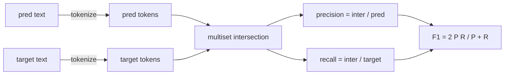

# 经典指标

> BLEU、ROUGE-L、F1、exact-match（精确匹配）、accuracy（准确率）。五个指标仍然占据大多数已发布大型语言模型（LLM）评测数据的比例。从头实现每个指标，这样你才知道分数的含义。

**类型：** 编写  
**语言：** Python  
**先修条件：** 第19阶段 B 跟踪基础，第70课  
**时间：** ~90分钟

## 学习目标

- 使用明确的分词规则实现基于token的exact-match、F1和准确率。
- 从零开始实现BLEU-4：修改的n-gram精度，n从1到4的几何平均，简洁惩罚（brevity penalty）。
- 使用最长公共子序列（LCS）实现ROUGE-L，用F-beta结合精确率和召回率。
- 根据第70课中的metric_name字段调度，使运行器(metric runner)保持指标无关。
- 通过参考示例中的基准向量确定行为，而非依赖第三方库。

## 为什么要重新实现

你会看到论文里有的BLEU是28.3，有的写作0.283。你会发现不同库给出的ROUGE-L相差十个百分点，因为一个库会截断转小写，另一个不做。最快杜绝混淆的方法是自己写这些指标，然后明确指出执行分词的位置和应用平滑的位置。之后跨论文比较指标数值就变成了读指标设置的事情，不是争论库的事情。

标准库加numpy就足够了。BLEU就是计数加边界限制。ROUGE-L是动态规划。F1是token集合交集运算。最难部分是选分词器并坚持用它。

## 分词

分词器是 `re.findall(r"\w+", text.lower())`。转小写，匹配字母数字，丢弃标点。本课所有指标都用这一个分词器。运行器不能更改。如果你换了分词器，你就是在跑不同的基准。

```python
TOKEN_RE = re.compile(r"\w+", re.UNICODE)
def tokenize(text):
    return TOKEN_RE.findall(text.lower())
```

这是有意简化的。生产环境会考虑中日韩文本（CJK）、缩写和代码标识符等。这里强调，分词器是一种契约，而不是参数调节旋钮。

## 精确匹配（Exact match）

```python
def exact_match(pred, targets):
    return float(any(pred.strip() == t.strip() for t in targets))
```

每个任务返回1.0或0.0。整个数据集上的汇总是平均值。该指标是算术题、选择题和短文本分类的主力。

## 基于token的F1

分别构建预测和目标的token多重集合。精确率是多重集合交集大小除以预测多重集合大小。召回率是交集大小除以目标多重集合大小。F1是调和平均。实现中处理了预测为空和目标为空的边界情况。



多目标任务中，对目标列表取最佳F1值。这与文献中广泛引用的SQuAD风格一致。

## BLEU-4

BLEU是机器翻译的经典指标，在摘要生成中也仍被使用。我们采用的是语料级BLEU-4，结合标准的简洁惩罚和对修改n-gram计数的加一平滑，避免缺失单个4-gram导致分数为零。

对每个候选-参考对，计算n=1,2,3,4的修改n-gram精确率。修改精确率通过将候选的n-gram计数限制不超过所有参考中该n-gram的最大计数，避免候选通过重复短语人为抬高分数。四个精确率的几何平均乘以简洁惩罚。

```mermaid
flowchart TD
    A[candidate tokens] --> B[count n-grams n=1..4]
    R[reference tokens] --> C[max count per n-gram]
    B --> D[clipped n-gram count]
    C --> D
    D --> E[modified precision p_n]
    A --> F[candidate length c]
    R --> G[reference length r]
    F --> BP[BP = 1 if c>=r else exp(1 - r/c)]
    G --> BP
    E --> M[geometric mean of p_n]
    M --> S[BLEU = BP * geometric mean]
    BP --> S
```

平滑规则是Lin和Och称为方法1的：对每个n-gram精确率的分子和分母都加一，再取对数。这样避免了当参考中没有匹配4-gram时出现`log 0`，且在较长候选上值接近未平滑值。

## ROUGE-L

ROUGE-L比较候选和参考的token序列的最长公共子序列（LCS）。LCS体现了词序但不要求连续，这也是其作为默认摘要指标的原因。我们用动态规划表计算LCS长度，然后计算召回率`lcs / 参考长度`，精确率`lcs / 候选长度`，再用F-beta（β=1即F1）结合。

```python
def lcs_length(a, b):
    n, m = len(a), len(b)
    dp = numpy.zeros((n + 1, m + 1), dtype=int)
    for i in range(n):
        for j in range(m):
            if a[i] == b[j]:
                dp[i+1, j+1] = dp[i, j] + 1
            else:
                dp[i+1, j+1] = max(dp[i+1, j], dp[i, j+1])
    return int(dp[n, m])
```

用numpy表格使实现更清晰；纯Python列表也可行。选择ROUGE-L的任务每个任务付出O(n m)时间。典型摘要长度下耗时低于一毫秒。

## 准确率（Accuracy）

多目标分类任务的准确率化简为对单一标准化目标的精确匹配。我们单独暴露该函数，方便dispatcher直接根据`metric_name`调度，无需跑内部字符串比较。

## 调度契约

唯一入口是 `score(metric_name, prediction, targets)`，返回区间`[0, 1]`内的float。运行器不分支指标名，直接调用并写分数。第75课会将此与第70课的任务规范结合。

```python
def score(metric_name, pred, targets):
    if metric_name == "exact_match":
        return exact_match(pred, targets)
    if metric_name == "f1":
        return max(f1_score(pred, t) for t in targets)
    if metric_name == "bleu_4":
        return max(bleu4(pred, t) for t in targets)
    if metric_name == "rouge_l":
        return max(rouge_l(pred, t) for t in targets)
    if metric_name == "accuracy":
        return accuracy(pred, targets)
    raise ValueError(f"unknown metric_name: {metric_name}")
```

`code_exec`在第72课处理，并集成调度器中。

## 本课不做什么

不调用模型。不对生成结果做第70课后处理规则以外的归一化。不计算置信区间。不做BLEURT或BERTScore（它们需要模型，属于其他课程）。本课重点是基础：五个指标，一个分词器，一张调度表。

## 如何阅读代码

`main.py`中定义各指标为独立函数及调度器。参考示例向量位于文件底部的`_reference_examples`块。演示运行调度器测试8个示例，打印每个指标得分。`code/tests/test_metrics.py`测试固定参考向量，覆盖所有边界情况（预测为空、参考为空、无共享token、精确匹配、短语重复截断）。

从头到尾读`main.py`，函数按复杂度排序。exact_match和accuracy各一行。F1六行。BLEU和ROUGE-L为复杂部分，含详细注释说明平滑规则和LCS递推。

## 拓展方向

经典指标是必要条件，但不充分。它们奖励表面重叠，忽视语义。解决方案是在信任经典指标基础上，叠加模型驱动的指标（比如BLEURT、BERTScore、GEval）。那是后面课程内容。现在先让这五个指标跑通，并用测试锁定，实现一个可审计、快速、可复现的指标栈。
