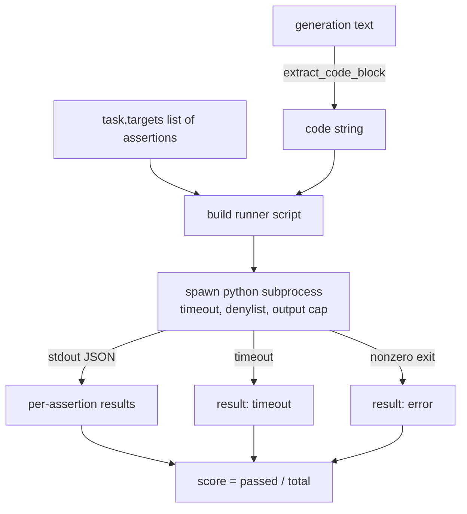
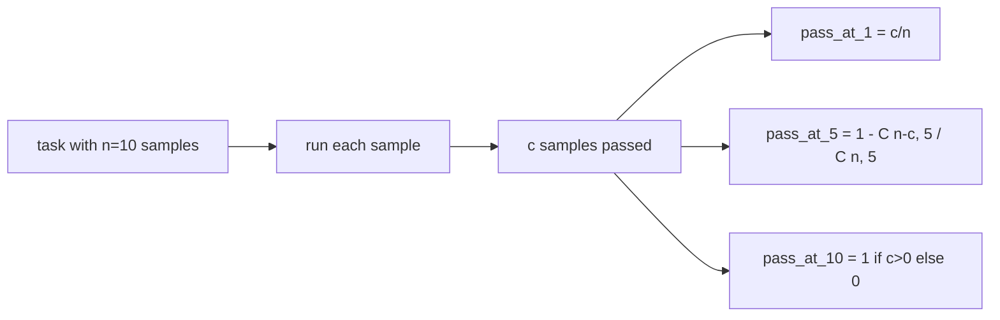

# Code Exec Metric

> 当生成的代码通过测试时即视为正确。评估框架必须提取代码，在不崩溃宿主环境的情况下运行它，并公平地统计通过率。本课将构建这样的接口。

**类型：** 构建  
**语言：** Python  
**先决条件：** 第19阶段轨道B基础，第70和71课  
**时间：** ~90分钟

## 学习目标

- 从自由形式生成的内容中提取代码块，方式要符合第70课的后处理规则。  
- 在隔离子进程中执行候选代码，设置墙钟超时、输出限制和导入黑名单。  
- 将任务得分定义为通过的断言字符串比例。  
- 计算从同一模型抽样多次生成的任务的 pass-at-k。  
- 将沙盒崩溃、语法错误和超时作为一等失败模式，使用运行器可记录的不同退出码。

## 为什么使用隔离子进程

内联 `exec` 存在安全性和稳定性风险。生成的 `while True: pass` 会无限阻塞评估。生成的 `import shutil; shutil.rmtree('/')` 会带来灾难性后果。解决办法是为每个候选开启一个新的 Python 解释器，通过 stdin 传入代码，将断言结果写入 stdout，若超时则杀死进程。宿主评估进程继续运行。

真正的评估框架比如 HumanEval、MBPP、BigCodeBench 和 LiveCodeBench 都使用子进程沙盒。有些会在此基础上使用 Docker。我们停留在子进程层是有意为之：它可移植、属于标准库，并且能捕获教育评估中关键的失败模式。生产环境部署会额外使用 seccomp、网络隔离和只读文件系统。强化安全的相关课程不在本轨道内。

## code-exec 任务的结构

一个 `code_exec` 任务在 `targets` 中携带断言字符串。运行器从生成内容中提取带代码围栏的代码块，构建测试框架，并运行结果。



得分为 `[0, 1]` 区间的分数。一个有三个断言且两个通过的任务得分为 0.667。无论哪种失败，运行器返回的结构相同：子进程崩溃映射为规范错误码，而非 Python traceback 冒泡至框架。

## 导入黑名单（denylist）

黑名单基于导入模块。运行候选代码前，运行器脚本会重写危险模块的导入，替换为抛出 `ImportError("denied")` 的存根。列表故意保守：`os.system`、`subprocess`、`socket`、`requests`、`urllib`、`urllib.request`、`urllib.error`、`urllib.parse`、`ctypes`、`shutil`、`http.client`、`asyncio.subprocess`。

我们不假装这万无一失。下定决心的对抗性代码可以逃逸任何 Python 进程内沙盒。黑名单只是最后防线。墙钟超时和输出限制是主要的防护措施。

```python
DENIED = {
    "os.system": True,
    "subprocess": True,
    "socket": True,
    "shutil": True,
    "requests": True,
    "urllib": True,
    "ctypes": True,
}
```

我们通过添加 `import sys` 和给 `os.system` 安装一个抛错的 monkey patch 来包装候选代码。完整模板见 `main.py`。

## 墙钟超时

每个子进程默认分配三秒墙钟时间预算。运行器使用 `subprocess.run(..., timeout=t)`。若超时触发，运行器捕获 `TimeoutExpired`，杀死进程并记录任务结果为 `timeout`。该任务得分为零。运行器继续处理。

超时可通过 `task.metadata.timeout_s` 配置。长时间运行的单元测试可请求更多时间；70课验证器将数值限制为最多30秒，保持测试套件有界。

## 输出限制

子进程可能会大量输出，耗尽宿主内存。运行器将 stdout 流式读取到缓冲区，只要总大小超过 256 KB 立即杀死子进程。结果记录为 `exit_code = error`，并带有细节 `"output overflow"`。这常见于生成代码意外生成无限循环打印。

## Pass-at-k

Pass-at-k 是 HumanEval 等使用的无偏估计器。给定每个任务独立抽样数量 `n`，其中通过数量为 `c`，大小为 `k` 的子样本包含至少一个通过解的概率为：

```text
pass_at_k(n, c, k) = 1 - C(n - c, k) / C(n, k)
```

当 `n - c < k` 时分子无定义，结果为1。实现中直接处理该边界情况。我们将在第74课的排行榜层暴露 `pass_at_k(n, c, k)`。



## 退出码

运行器对每个任务返回五种结果：

- `pass` 当所有断言均通过。  
- `assertion_fail` 当代码能运行但至少有一个断言失败。  
- `syntax_error` 当代码无法导入或存在语法错误。  
- `timeout` 当墙钟计时超时。  
- `error` 其他任何崩溃，包括黑名单触发和输出溢出（output overflow 时细节字段为 `"output overflow"`）。

得分仍为分数，退出码为元数据。后续课程可决定超时是计算为零还是当作缺失数据。

## 本课不涵盖内容

本课不提供真正的沙盒环境。不运行来自网络的不信任代码。不处理有状态任务如文件I/O或网络调用。此类需求需要容器或微虚拟机。本课核心是契约：隔离子进程、导入黑名单、超时、输出限制、清晰的退出码体系和 pass-at-k 数学。

## 如何阅读代码

`main.py` 定义了 `extract_code`、`run_candidate`、`score_code_exec` 和 `pass_at_k`。子进程运行脚本作为字符串构建，传给新 Python 解释器的 `-c` 参数。`code/tests/test_exec.py` 通过 HumanEval 风格的示例测试四种退出码和 pass-at-k。

自上而下阅读 `main.py`。运行器模板是关键部分。仔细观察断言循环，直到你能预测它写回给父进程的 JSON 包结构。

## 进一步探索

子进程框架稳定后，下一步关注移植性。不同 Python 版本在 Windows 上处理 SIGKILL 不同。最干净的解决方案是将运行器打包成 Docker 镜像。接下来是用真实单元测试文件替换断言字符串，使评估与生产 CI 一致。那时候别把断言字符串称作测试；它们只是玩具测试，有着玩具失败模式。
