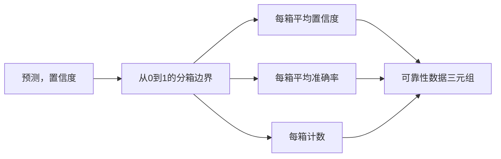

# Perplexity 和 Calibration（校准）

> 如果你的模型对一千个答案都声称有 90% 的置信度，但只答对六百个，那么它的校准不好。校准是可信评估（trustworthy eval）的一半。另一半是 perplexity，它告诉你模型是否认为保留文本（held-out text）本身是合理的。

**类型：** 构建  
**语言：** Python  
**前置知识：** 第19阶段B轨道基础，第70和71课  
**时间：** ~90 分钟

## 学习目标

- 计算从模型适配器（model adapter）提供的token负对数概率中，对保留语料库的token级perplexity。
- 从分箱预测概率中计算分类器或多选评测的期望校准误差（Expected Calibration Error，ECE）。
- 计算Brier分数（基于正确性的均方误差），并解释在何种情况下它比ECE更有用。
- 构建绘制置信度与准确率曲线所需的可靠性图（reliability diagram）数据。
- 将以上三者连线进评测工具链，使跑步器（runner）能将 `perplexity`、`ece` 和 `brier` 数值附加到模型报告。

## perplexity 告诉你的是什么

perplexity 是对每个token的平均负对数似然（negative log-likelihood）做指数运算的结果。数值越低越好。perplexity为 1 意味着模型对每个真实token的概率都是1。perplexity等于词汇表大小意味着模型均匀分布，没有学习到任何东西。真实情况介于两者之间：一个强大的2026年基础模型在WikiText-103数据集上大约是8到12；一个表现差的模型同样数据下超过50。

评测工具链本身不计算对数概率，这来自模型适配器。它负责聚合：接受每个token的对数概率列表和每个序列的token计数列表，返回语料库的perplexity。

```python
def perplexity(neg_log_probs, token_counts):
    total_nll = sum(neg_log_probs)
    total_tokens = sum(token_counts)
    return math.exp(total_nll / total_tokens)
```

实现会处理零token边缘情况，并断言负对数概率非负。一个常见错误是忘记了负号：适配器返回 `log p` 而非 `-log p`，将产生低于1的perplexity，这是不可能的。函数会将此视为契约违约并捕获。

## ECE 测量的内容

期望校准误差（ECE）将预测按置信度分组到固定数量的箱子，然后测量置信度和准确率之间的平均差距，按箱子大小加权。

```mermaid
flowchart TD
    A[N 个预测，带置信度 p 和正确性 y] --> B[按 p 分入 M 个箱子]
    B --> C[计算每个箱子平均置信度和平均准确率]
    C --> D[差值 = 绝对值(平均置信度 - 平均准确率)]
    D --> E[按箱子大小 / N 加权]
    E --> F[ECE = 加权差值之和]
```

标准定义使用十个在 `[0, 1]` 区间的等宽箱子。实现支持任何正整数箱数。我们暴露了 `bins` 参数，方便跑步器在公布规范（10箱）和对比规范（15箱）间选择。

ECE 存在对箱数和样本量的偏差。十个箱和一百个预测样本下，无法区分0.02的ECE和随机噪声。实现返回填充箱数和ECE，以便跑步器在样本不足时拒绝单一数值报告。

## Brier 分数的特点及其优于 ECE 的地方

ECE 只关心平均差距。一个在一半箱子过度自信，另一半不足自信的模型，可能有低ECE，但本地校准差。Brier分数测量预测与真实结果的平方误差，直接惩罚误差分散。

对于二元结果，Brier分数是 `mean((p_i - y_i)^2)`。它分解为可靠性（reliability）、分辨率（resolution）和不确定性（uncertainty）。我们计算分数及其分解，跑步器报告标量，同时将分解日志记录供仪表盘使用。

```python
def brier(p, y):
    return float(np.mean((p - y) ** 2))
```

## 可靠性图数据

可靠性图绘制每个置信区间的预测置信度与经验准确率。对角线表示完美校准。函数返回三组数组：每箱的平均置信度、每箱的平均准确率、每箱的计数。绘图代码在后续步骤；本课停留于数据形态。



返回的元组是调用层绘制图形或计算自定义ECE变体（比如自适应ECE、扫描ECE等）的所需。我们返回numpy数组，方便下游代码不需转换。

## 置信度来源

评测工具链不假设置信度来自softmax，只接受 `[0, 1]` 内任意数值。多选任务自然置信度是 option log-likelihood 的softmax。自由文本任务自然置信度是模型报告的概率或平均对数似然的指数值。评测仅消费数值来源，来自适配器职责。

## 边缘情况

- 全错预测：ECE是平均置信度，Brier高，perplexity则由模型对文本的估计决定。
- 全对且置信度高：ECE接近零，Brier也接近零。
- 完全不确定（p=0.5）的预测器：ECE是0.5减去准确率，Brier是0.25减去修正项。
- 空输入：ECE、Brier和可靠性返回`0.0`（或全零数组），perplexity返回零token情况的`NaN`。这些路径均无警告；跑步器根据值决定是否报告或跳过。

这些情况都包含在测试中。真实模型和真实基准不会遇到，但有bug的适配器或小样本会，跑步器不应因此崩溃。

## 调度（Dispatch）

校准不是F1那样的单任务指标，而是单模型报告指标。跑步器聚合整场评测的 `(confidence, correct)` 对，一次性计算 ECE、Brier 和可靠性数据。perplexity 则在保留的语料集上计算，独立于任务级评分。

接口如下：

```python
report = CalibrationReport.from_predictions(confidences, correct)
report.ece          # float类型
report.brier        # float类型
report.reliability  # 由三个numpy数组组成的元组
report.populated_bins  # int类型
```

`PerplexityResult.from_token_nll(neg_log_probs, token_counts)` 返回 perplexity 和每token平均负对数似然。

## 本课未涉及内容

本课不调用模型，不实现softmax，不从输出token估计置信度；这些职责由适配器承担。不做温度缩放或Platt缩放调节；那些是后置修正，见另课。本课旨在确保三个数值（perplexity、ECE、Brier）可信且可复现。

## 如何阅读代码

`main.py` 定义了 `perplexity`、`expected_calibration_error`、`brier_score`、`reliability_diagram` 及 `CalibrationReport` / `PerplexityResult` 数据类。演示在已知真值的合成预测上运行：一个校准良好模型，一个过度自信模型，一个不足自信模型。`code/tests/test_calibration.py` 中的测试涵盖所有边缘情况和合成预测的参考值。

自顶向下阅读 `main.py`。函数顺序由标量到向量再到报告。每个函数有简短的文档字符串包含公式和契约说明。

## 深入了解

校准是公开评测中最被忽视的维度。多数排行榜只报一个准确率数字即结束。准确率最高但Brier高的模型，实际上比准确率稍差但可靠报告不确定性的模型差。建立校准框架后，在保留的验证集上做温度缩放，重新计算ECE，可见差距缩小。这是另一课内容，本课奠定了基础。
