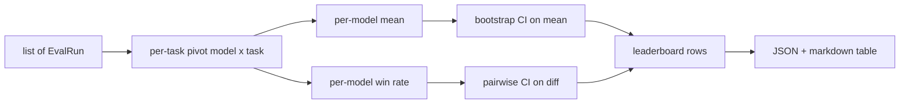
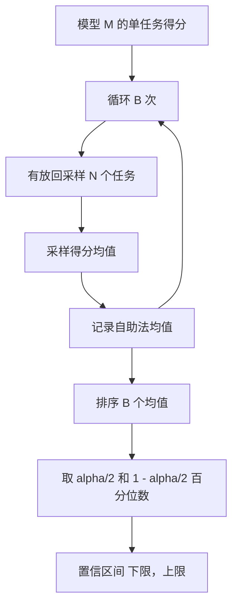

# 排行榜汇总

> 单个任务得分很简单。在异构任务间，对模型排名更难。对拥有千条预测的排行榜做统计显著性检验是大家常跳过的部分。这节课不跳过。

**类型：** 实践  
**语言：** Python  
**先决条件：** 第19阶段B轨基础，课程70、71、73  
**时长：** ~90分钟

## 学习目标

- 将多模型多任务的单任务得分汇总成整洁的单模型一行。
- 归一化异构得分，避免通过率和BLEU值对汇总结果过度影响。
- 按均值和胜率对模型排名，并解释何时使用哪种汇总方式合适。
- 计算模型均值分数及其成对差异的自助法置信区间。
- 以JSON报告和Markdown表格输出排行榜，供第75课的运行器复制到CI评论中。

## 输入数据形状

聚合器接收一个`EvalRun`记录列表：

```python
@dataclass
class EvalRun:
    model_id: str
    task_id: str
    metric_name: str
    score: float          # 范围 [0, 1]
    category: str
```

第75课的运行器针对每个 `(model, task)` 对生成一条记录。聚合器不关心得分的具体生成方式，期望归一化已经完成：每个得分都在 `[0, 1]`区间内。

## 输出内容

输出3张表：



排行榜行包含字段：`model_id`、`mean_score`、`mean_ci_lo`、`mean_ci_hi`、`win_rate`、`tasks_completed`，还有可选用于分类别均值的`categories`映射。

## 归一化

如果一个任务得分范围是 `[0, 1]`，另一个是 `[0, 100]`，那么第二个任务会无声无息地主宰均值。聚合器会验证所有输入得分都在 `[0, 1]`范围内，否则拒绝该运行。归一化问题应由上游解决：指标应已返回分数分数。课程71到73规范了这个契约。

## 均值和胜率

这两种排名方式服务于不同目标。

均值分数是某模型各任务得分的平均值，是排行榜的核心体现数字。它对异常值和任务不平衡敏感。

胜率计算模型在每个任务上击败所有其他模型的次数。每个任务得分最高的模型获胜（平局均分胜利）。胜率是获胜次数除以模型有得分的任务数。它对异常值和量纲差异不那么敏感，但信息有所丢失。

```python
def win_rate(model_id, runs_by_task, all_models):
    wins, total = 0, 0
    for task_id, runs in runs_by_task.items():
        scores = {r.model_id: r.score for r in runs if r.model_id in all_models}
        if model_id not in scores:
            continue
        total += 1
        best = max(scores.values())
        if scores[model_id] >= best:
            wins += 1
    return wins / total if total else 0.0
```

评测框架同时报告两者。第75课运行器默认按均值排名；胜率作为Markdown列可供用户选择查看。

## 自助法置信区间

模型均值带有通过自助法（bootstrap）重新抽样任务计算的置信区间。我们重复采样任务ID（有放回），计算采样集合上的均值，重复`B`次，取`alpha`水平的百分位区间。



对成对比较，我们自助法计算每任务差分`score_A - score_B`，取百分位区间并报告。用户只需判断该区间是否包含零。若不包含，差异在`alpha`水平显著；否则视为平分。

底层辅助函数（`bootstrap_mean_ci`，`bootstrap_pairwise_diff`）默认`B=1000`，公开聚合器（`aggregate`，`pairwise_diffs`）默认`b=500`，以保持演示和测试速度。默认置信水平`alpha=0.05`。本课的自助法实现纯numpy，无需scipy。

## 类别

如果`EvalRun.category`设置了，聚合器还会报告分类别均值。这是排行榜上的列，如`math`（数学）、`reasoning`（推理）、`code`（代码）、`safety`（安全）。它帮助运行器分辨模型整体表现好但在代码任务较弱之类情况，此信息主均值隐藏。

## Markdown渲染

排行榜以Markdown表格形式呈现：

```text
| Rank | Model | Mean | 95% CI | Win rate | Tasks |
|------|-------|------|--------|----------|-------|
| 1    | gpt   | 0.78 | 0.74-0.82 | 0.62 | 50 |
| 2    | claude| 0.75 | 0.71-0.79 | 0.34 | 50 |
| 3    | random| 0.10 | 0.07-0.13 | 0.04 | 50 |
```

表格按均值分数排序。置信区间保留两位小数。较长模型ID截断至20字符。

## 本课不涵盖的内容

不会调用模型，也不会调用指标层。不会实现自适应ECE或其它校准变体；那些章节在73课。不会实现任务权重，每项任务权重均等。生产排行榜会加权，这里的聚合器保留`weight`字段接口但忽略处理。有需要的话可在后续课程添加。

## 如何阅读代码

`main.py`定义了`EvalRun`、`LeaderboardRow`、`aggregate`、`bootstrap_mean_ci`、`bootstrap_pairwise_diff`和`render_markdown`。演示创建三个模型十二任务的合成套件，汇总并打印排行榜及成对差异表。测试代码位于`code/tests/test_leaderboard.py`，固定自助法随机性，覆盖Markdown渲染、胜率极值场景和空输入行为。

请从`main.py`自上而下阅读。数据结构（EvalRun，LeaderboardRow）首先定义，接着是聚合器，再是自助法，最后是渲染。每个函数设计契约明确。

## 进阶方向

下一个自然环节是使用配对任务显著性检验替代非配对自助法。如果模型A和B都运行了相同100个任务，适用的是配对自助法测试任务差异。我们已实现。更进一步希望做层次化自助法，考虑任务家族相关性（数学题之间非独立，某种计算错误会影响十个任务）。这是后续课程的内容。本课目的在于打好基础，保证评测返回可靠且可辩护的数字。
