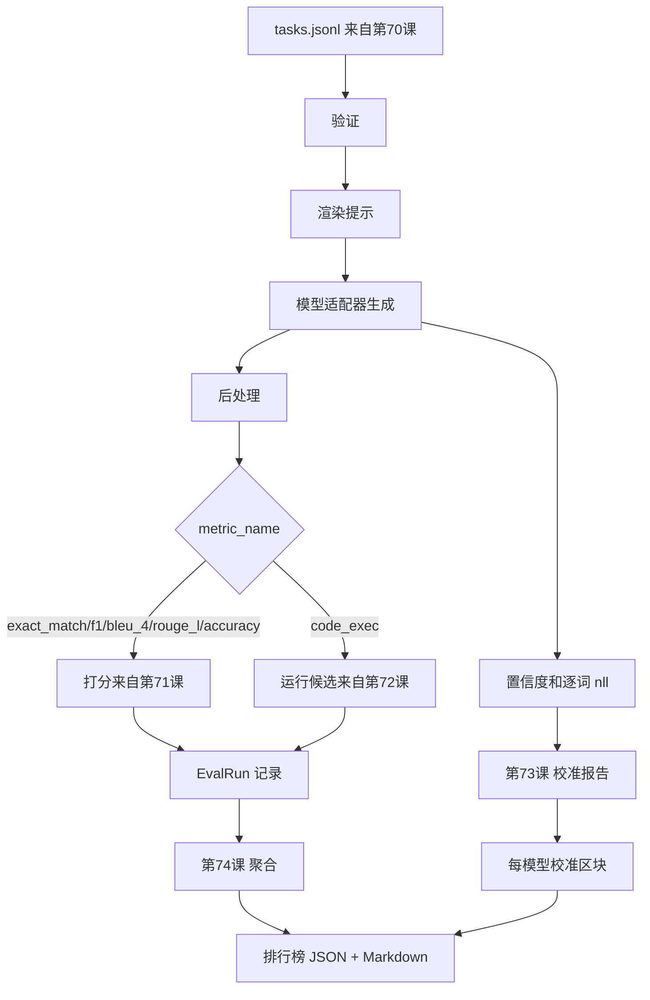

# 端到端评估执行器（End-to-End Eval Runner）

> 五课管道实现，一课胶合它们。执行器从第70课读取任务规范，通过适配器调用模型，用第71和72课打分，附加第73课的校准报告，并输出第74课的排行榜。演示会自动终止。

**类型：** 构建  
**语言：** Python  
**先决条件：** 第19阶段 B轨基础，第70到74课  
**时间：** 约90分钟

## 学习目标

- 定义一个 `ModelAdapter` 接口，任何模型（模拟、本地、API）都可以通过少量方法满足该接口。
- 针对一个固定的 JSONL 任务文件并行运行任务，使用工作线程池。
- 在一次遍历中组合度量层（exact_match，F1，BLEU-4，ROUGE-L，code_exec）和校准层。
- 输出每个模型的 `EvalRun` 记录，并直接将它们输入到排行榜聚合器。
- 输出 JSON 报告和 Markdown 表格；运行正常时以零状态码自我终止，校验或运行失败时返回非零状态码。

## 流水线



执行器是集成点。第70到74课各自拥有一个模块供执行器组合。执行器不会复写这些模块的逻辑，只是导入它们。

## 适配器接口

适配器是执行器和任何模型之间的接口。接口设计故意简洁。

```python
class ModelAdapter:
    model_id: str

    def generate(self, prompt: str, task: TaskSpec) -> Generation: ...
```

`Generation` 是一个数据类，包含：

- `text`：模型的自由格式输出
- `confidence`：`[0, 1]` 范围内的浮点数，表示模型自报的答案概率
- `token_nll`：生成词的负对数似然总和（可选）
- `token_count`：生成的词数（可选）

执行器中的模拟适配器提供三种类型：`RuleBasedAdapter`（确定性，近乎完美）、`NoisyAdapter`（过度自信，经常错误）、`BiasedAdapter`（某类别表现好，另一些类别差）。演示会针对第70课的测试任务使用所有三种适配器。

## 并行执行

执行器使用 `concurrent.futures.ThreadPoolExecutor` 按模型并行运行任务。工作线程默认取任务数和8的较小值。线程足够，因为实际调用模型的瓶颈在网络 I/O。code-exec 路径在任务内部自行生成子进程，执行器只负责调度等待。

为方便确定性测试，执行器暴露函数 `run_eval(adapters, tasks, parallel=False)`，允许测试固定执行顺序。

## 单轮评分循环

针对每个任务：

1. 渲染提示（few-shot 前缀加提示主体）。
2. 调用适配器并计时。
3. 根据任务规则后处理生成结果。
4. 分派到度量层计算得分。
5. 使用得分和度量元数据构建 `EvalRun` 记录。
6. 将 `(confidence, correct)` 对追加到校准缓冲区。

`correct` 信号对于 exact_match 类型度量（`exact_match`、`accuracy`、`code_exec`）为 `score >= 1.0`，对于分级度量为 `score >= 0.5`。阈值定义于 `_correct_from_score`，执行器不暴露公共覆盖。

## 聚合

所有任务结果生成后，执行器调用第74课的 `aggregate` 和 `pairwise_diffs`，以及第73课的 `CalibrationReport.from_predictions`。输出是一个 JSON 封装：

```json
{
  "leaderboard": [...],
  "pairwise": [...],
  "calibration": {
    "model_id_a": {"ece": 0.04, "brier": 0.10, "populated_bins": 8, ...},
    ...
  },
  "summary": {
    "tasks": 10,
    "models": 3,
    "wall_seconds": 1.2
  }
}
```

执行器还会将 Markdown 表格写入标准输出，方便用户粘贴到 PR 评审中。

## 自动终止演示

演示会用三个模拟适配器对第70课的十个测试任务运行，耗时应少于十秒。运行正常时返回零退出码。

正常运行条件：

- 所有任务通过第70课验证。
- 所有任务通过第71和72课打分。
- 第73课校准报告聚合无错误。
- 列表中规则基适配器比分配随机适配器排名严格靠前。

若这些条件中有任何不满足，执行器会非零退出，并在 JSON 封装中返回结构化错误。

## 本课未涵盖内容

不调用真实模型。不实现 API 密钥流或限速处理。不支持流式或部分生成；适配器每次调用返回一个生成结果。不做重试和缓存。此类功能应由适配器层实现；执行器对度量和提供者一视同仁。

## 如何阅读代码

`main.py` 是集成入口。通过一个小的 `_load_sibling` 辅助函数按相对路径导入其他五个课模块。数据类 `Generation`、`EvalReport` 和 `ModelAdapter` 在本地定义。模拟适配器代码在文件底部。

从上到下阅读 `main.py`。先略读导入语句，再看 `run_eval`，接着 `_score_one`，最后看适配器。结尾的演示是入口点。

`code/tests/test_runner.py` 中的测试锁定了适配器接口、单轮循环、并行与顺序执行结果等价、校准缓冲区和 JSON 封装结构。

## 进一步阅读

此执行器是基础。生产环境的评估系统会添加：以 `(task_id, model_id, model_version)` 为键的结果缓存，跟踪费用和令牌的成本账本，针对限速的退避重试层，pass-at-k 任务的采样策略，以及针对长测试集的流式输出格式。每项都是单一职责，包裹执行器且不改变度量和聚合层。契约约定正是为了实现这种分离。

当模拟适配器工作正常后，添加真实提供商适配器。选择免费层，写三十行胶合代码，观察排行榜点亮。随后添加第二个提供商，由测试框架自动管理。
