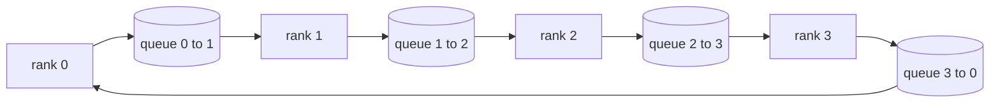

# 从零构建集体操作（Collective Ops）

> 支撑分布式训练的四个集体操作是 allreduce、broadcast、allgather 和 reduce_scatter。训练框架提供的其它所有原语都是它们的封装。基于 `multiprocessing.Queue` 网格构建一次，确保与参考实现一致，其余的轨迹变成管道工程。

**类型：** 构建  
**语言：** Python  
**先决条件：** Phase 19 Track C 第 42-49 课  
**时间：** 约 90 分钟

## 学习目标

- 实现两遍环形 allreduce（先 reduce-scatter 然后 allgather），并证明每个 rank 的通信量是每元素 2(N-1)/N 字节。
- 基于 `multiprocessing.Queue` 的点对点发送构建 broadcast、allgather 和 reduce_scatter。
- 每个原语都通过 `torch.distributed` gloo 参考实现同输入进行验证。
- 针对集群形状、延迟下限和带宽上限，阐述选择环形（ring）还是树形（tree）的理由。

## 问题描述

一个简单的 N rank allreduce 会将张量发送 N 次到根节点，然后广播 N 次回去。带宽是每个 rank 的 O(N)，根节点成为瓶颈，全程壁钟时间受最慢链路乘以 N 影响。环形 allreduce 把张量切成 T/N 的 2(N-1) 块，因此每 rank 传输字节变成 2T(N-1)/N，与集群规模无关。树形 allreduce 适合较小 N 或高延迟链路，因为深度是 log2(N) 跳，而不是 2(N-1)。选错了拓扑，最慢 GPU 决定训练步时长。

你在本轨迹会学习的每个分布式训练框架都依赖这四个原语。PyTorch DDP 通过对每个参数桶执行一次 allreduce 同步梯度。ZeRO 通过 reduce_scatter 分片优化器状态，allgather 广播更新参数。FSDP 将完整的前向过程分解为 allgather 加 reduce_scatter。流水线并行通过 broadcast 在阶段组间发送激活。如果你不会实现这四个集体操作，就无法分析训练为什么卡住、rank 3 处梯度不匹配来源，或切换拓扑为何使流水线气泡加倍。

## 概念介绍



### 两遍环形 allreduce

将张量拆分为 N 个相等块，编号为 0..N-1。每个 rank 拥有编号等于自己 rank 的块。第一遍 reduce-scatter 进行 N-1 步。在第 s 步中，rank r 发送块 (r - s) mod N 给 rank (r + 1) mod N，接收块 (r - s - 1) mod N 自 rank (r - 1) mod N，接收的数据累加到本地。N-1 步后，rank r 拥有编号 r 的块的完整和。第二遍 allgather 再进行 N-1 步，将完整的块依次传遍环中，直至所有 rank 拥有所有块的完整和。

| 原语         | 每 rank 字节数        | 步数      | 适用场景                |
|--------------|----------------------|-----------|-------------------------|
| 环形 allreduce | 2T(N-1)/N            | 2(N-1)    | 大张量，脂宽带同质集群    |
| 树形 allreduce | T log2(N)             | 2 log2(N)  | 小张量或高延迟链路       |
| Broadcast    | T                    | log2(N) 树  | 参数初始化，标量配置       |
| Allgather    | T(N-1)/N             | N-1       | 前向分片，ZeRO 复原        |
| Reduce_scatter | T(N-1)/N             | N-1       | ZeRO 梯度分片            |

### 用队列网格模拟 NCCL

NCCL 基于 PCIe 和 NVLink，支持硬件加速的归约。CPU 上没有这些。用每个环边一个 `multiprocessing.Queue` 实现单生产者单消费者点对点有序传输。归约在用户空间执行，会有 Python 开销，但线性交换模式与 NCCL 环形 allreduce 相同。先对队列版本推理正确性，集群行为即可推导。

### 与 gloo 对齐验证

每个原语伴随单元测试，将其输出与基于相同张量和相同 world_size 的 `torch.distributed` gloo 实现作对比。如果环形 allreduce 与 gloo 的差异超过 float32 精度，测试失败。与参考实现的验证不可妥协；不验证时，原语看起来正确，但训练跑到第 10000 步才露馅。

## 构建实现

`code/main.py` 包含：

- `Mesh` 类，将 N 个 `multiprocessing.Queue` 组网成环，提供每个 rank 的 `send(dst, tensor)` 和 `recv(src)`。
- `ring_allreduce(mesh, rank, world_size, tensor)` 实现两遍算法。
- `broadcast(mesh, rank, world_size, tensor, src)` 实现基于对数树。
- `allgather(mesh, rank, world_size, tensor)` 利用 N-1 轮环形转动。
- `reduce_scatter(mesh, rank, world_size, tensor)` 实现 allreduce 的上半部分。
- `_gloo_reference(op, world_size, tensor)` 通过 gloo 后端执行相同输入，用以字节等价比对。

运行：

```bash
python3 code/main.py
```

输出：每个原语的验证表，比较队列网格与 gloo 的结果，接着展示每 rank 字节计数，证明了 2T(N-1)/N 的计量公式。

## 生产环境实践

三大实践将原语打磨成可交付形态。

**先对梯度进行桶式合并再 allreduce。** 1B 参数模型拥有成千上万梯度张量，单张量 allreduce 会支付 N 倍延迟下限。DDP 将梯度桶分为约 25 MB 大小，每桶发起一次 allreduce，极大减少小张量延迟代价。无桶合并时，延迟开销就主导步时。

**通信与计算重叠。** 反向计算梯度自后向前逐层产生。最后一层梯度准备好即立刻启动 allreduce，下一层反向继续计算。PyTorch DDP 用桶就绪钩子实现此机制。网络不饱和时，此重叠可将通信时间减半。

**依据消息大小选择环形或树形，而非教条。** NCCL 自带拓扑检测器，消息超过 ~1 MB 选环形，小于选树形。交叉点是带宽与延迟的权衡：>1 MB 时，带宽项 2T(N-1)/N 更大，环形胜；<1 MB 时，跳数 log2(N) 更优，树形胜。硬编码一种拓扑，在错误消息尺寸会损失吞吐。

## 应用示例

生产实践：

- **PyTorch DDP。** 反向后对桶梯度调用 `dist.all_reduce`，默认桶大小 25 MB，适合 100G 以太网。
- **DeepSpeed ZeRO。** 通过 reduce_scatter 分片梯度，前向前通过 allgather 复原参数。课上实现与 ZeRO 精确对应。
- **FSDP。** 正向开始时 allgather 解分片，计算完成后用 reduce_scatter 归约并丢弃分片。相同原语不同调度。

## 交付部署

在第 77-81 课使用队列网格集体操作原语。第 77 课在 DDP 中接入 allreduce。第 78 课在 ZeRO 中接入 reduce_scatter。第 79 课在流水线激活中用 broadcast。第 81 课将四种原语合成交付端到端示范。

## 练习题

1. 添加树形 allreduce 变体，依据消息大小切换环形与树形。测量交叉点。
2. 增加 `recv_timeout_ms`，卡住的 rank 抛出期限错误而非永远阻塞。
3. 替换 `multiprocessing.Queue` 为 TCP socket 实现四个原语，相同测试，真实网络。
4. 添加带宽监测钩子，将每 rank 字节统计日志写入 JSONL。
5. 对 4 个 rank，分别测试 1KB、1MB、16MB 张量环形与树形壁钟时间，并用实测数据说明交叉点。

## 关键词

| 术语           | 常见说法         | 真实含义                           |
|----------------|------------------|----------------------------------|
| Allreduce      | 「跨 rank 求和」  | 调用后每个 rank 拥有相同的归约张量     |
| Ring           | 「快速拓扑」     | 长度为 N-1、大小为 T/N 的块沿环流转两次  |
| Tree           | 「对数拓扑」     | 归约遵循二叉树，深度为 log2(N) 跳       |
| Allgather      | 「拼接分片」     | 每个 rank 最终拥有所有其他 rank 片段       |
| Reduce_scatter | 「拆分求和」     | 每个 rank 只拥有一个块的求和           |
| Bucket         | 「合并小张量」   | 将多个小 allreduce 合成一个大型操作        |

## 拓展阅读

- [PyTorch Distributed: NCCL collectives](https://pytorch.org/docs/stable/distributed.html#collective-functions)  
- [Horovod 环形 allreduce 论文](https://arxiv.org/abs/1802.05799)  
- [NCCL 拓扑和算法选择](https://docs.nvidia.com/deeplearning/nccl/user-guide/docs/index.html)  
- [Patarasuk 和 Yuan，带宽最优 allreduce 算法](https://www.cs.fsu.edu/~xyuan/paper/09jpdc.pdf)  
- Phase 10 Lesson 05 - 分布式训练概览  
- Phase 19 Lesson 77 - 基于这些原语的 DDP 接入
