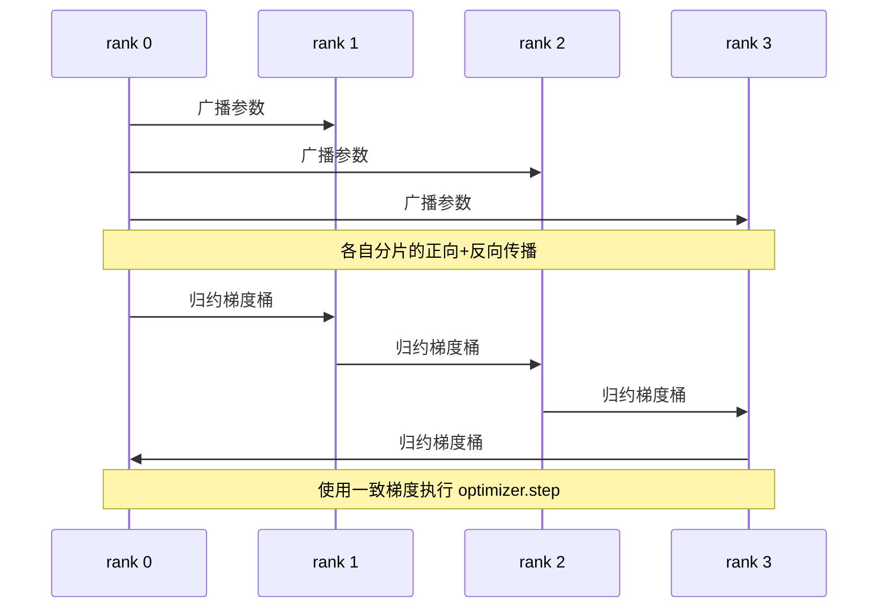

# Data Parallel DDP 从零实现

> DistributedDataParallel（分布式数据并行）是基于 allreduce（全归约）的封装。封装一个模型，从 rank 0 广播初始参数，使得每个 rank 的初始状态相同，在每个参数上安装一个 backward hook，在反向传播时触发梯度的 allreduce，剩下的就是梯度下降。整个模式约 200 行代码。

**类型：** 构建  
**语言：** Python  
**前置知识：** 第19阶段 C轨道 第42-49课  
**时间：** 约90分钟

## 学习目标

- 实现一个 `DistributedDataParallel` 形状的包装器，在构造时广播初始参数，并在反向传播后 allreduce 梯度。
- 使用 `torch.multiprocessing.spawn`，基于 gloo 后端和基于文件的 rendezvous（会合），启动 N 个 CPU 进程。
- 通过在相同数据上顺序训练同一个模型，证明梯度同步的正确性，展示每步参数的等价性。
- 说明 bucket（梯度融合）和 overlap（反向传播时通信重叠）作为两个改进点，将工作中的 DDP 转变为生产级 DDP。

## 问题描述

一个拥有 10 亿参数且激活值占用 12 GB 的模型无法放入单一消费级 GPU。即使能放进去，训练依然需要数周。数据并行将批次拆分给 N 个 rank，每个 rank 在自己的分片上执行正向和反向传播，每步都将所有 rank 的梯度求和，使 N 个副本保持一致。求和后的梯度才被优化器更新。

如果没有梯度同步，到第二步 N 个复制模型就会发散。模型不再是“一个模型在更多数据上训练”，而是 N 个仅共享参数初始值的独立模型。若梯度同步方式不当（每个参数调用一次 allreduce，无重叠，无分桶），网络带宽成为瓶颈，GPU 空转等待通信。DDP 的技术核心是使梯度同步相对于计算成本近似免费。官方 PyTorch DDP 通过梯度分桶、与下一层反向传播通信重叠，以及使用基于 NVLink 的 NCCL 实现这一点。我们在 CPU 上用 gloo 实现这三点，同样能学到这些经验。

## 概念示意



### DDP 需要的三种操作

| 阶段 | 集体操作 | 作用 |
|-------|-----------|-----|
| 初始化 | 从 rank 0 广播 | 保证每个 rank 的参数相同 |
| 反向传播后 | 对每个梯度执行 allreduce | 优化器采用梯度平均 |
| 有时 | 广播 buffers | 保持 BatchNorm 运行统计一致 |

### 为什么是均值而非总和

allreduce 求和后除以 world_size（全局进程数）得到均值梯度。均值梯度对 world_size 不变：某个 rank 调整好的学习率，在四个 rank 上也能正常工作，因为每步梯度幅度保持不变。如果只用 allreduce 求和，则每变更集群规模都要重调学习率。DDP 内部封装了求和后除以 world_size，教案中请实现同理。

### 为什么分桶梯度

Transformer 有成千上万个参数张量。对每个张量执行一次 allreduce 会导致 gloo 延迟开销被放大数千倍。DDP 将梯度分成约 25 MB 的桶，针对每个桶执行一次 allreduce。总传输字节数相同，但延迟因桶而被摊薄。教案模型很小，我们将所有梯度归为一个桶，结构上的理念是一致的。

### 为什么要固定随机数种子

每个 rank 对于数据 shuffle 调用 `torch.manual_seed(seed + rank)`，而参数初始化调用 `torch.manual_seed(seed)`。共享同一随机种子会导致每个 rank 看到相同的批次顺序，失去数据并行效果；使用依赖 rank 的种子进行参数初始化会使得初始参数在浮点极小误差上不同，梯度同步将无法保证参数完全一致。正确的随机种子方案是参数等价性测试成功的关键。

## 实现

`code/main.py` 实现了：

- `MiniMLP`：一个 3 层的 MLP，足够小迅速收敛，也足够大暴露接线细节。
- `DistributedDataParallel(model, world_size)`：构造时广播参数，返回一个包装对象，其 `sync_grads` 方法将所有同步求和的梯度除以 world_size。
- `worker(rank, world_size, ...)`：使用 gloo 初始化 `torch.distributed`，执行完整训练循环：前向、反向、同步、优化。
- `_reference_single_process_loop(...)`：同样的模型和数据，在单进程顺序训练，用于每步参数等价性测试。

运行：

```bash
python3 code/main.py
```

输出：对比单进程训练和 4 rank DDP 训练的每步损失和参数校验和，两者在 float 级别误差范围内完全一致，证明梯度同步正确。

## 生产环境中的常用模式

让 DDP 足够稳健的三种常见模式：

**查找未使用参数。** 有些路径会条件性跳过参数（早停，Mixture-of-Experts 路由器），跳过的参数无梯度，但 DDP 的桶 hook 仍等待它们导致 allreduce 死锁。`find_unused_parameters=True` 告诉 DDP 先检测哪些参数有梯度再执行通信。该方法每步需遍历计算图，除非有分支，不建议开启。

**静态图优化。** 当正向计算在步骤间不变时，设置 `static_graph=True` 使 DDP 预先计算桶调度。此优化对大规模场景显著，每步节省几毫秒，累计数万步效果明显。

**梯度累积需注意。** 对 K 个小批次累积梯度而不每个小批次同步，可带来 10 倍提速。DDP 提供 `no_sync()` 上下文管理器来暂停反向传播后的 allreduce。未使用该管理器会导致无谓的 K 次通信，吞吐量大幅降低。

## 使用方法

生产模式：

- **PyTorch DDP。** 官方标准实现。`torch.nn.parallel.DistributedDataParallel(model)` 内置分桶、重叠和 `no_sync`。
- **HuggingFace Accelerate。** 增加启动器，管理 `torchrun` 环境变量和模型包装。底层仍是相同的 DDP。
- **Megatron-LM 数据并行。** 结合 DDP 和张量并行以支持超大模型，其中数据并行部分即反向传播后 allreduce 模式。

## 部署阶段

第 78 课（ZeRO 分片）用 reduce_scatter 替换了基于参数的 allreduce，每个 rank 只存储优化器状态的分片。第 81 课将 DDP 与 ZeRO 结合完成端到端演示。

## 练习

1. 实现可配置大小的梯度桶，对比更深模型上一参数一次 allreduce 与分桶后的速度差异。  
2. 实现 `no_sync()` 作为上下文管理器，验证 K 个微批次累积梯度与单进程基线一致。  
3. 添加 `find_unused_parameters` 模式，使正向传播有时跳过 MLP 某层，无该标记时应死锁。  
4. 用只调用 `torch.distributed.barrier()` 的同步方式代替 allreduce，感受两种同步机制差异。  
5. 测量 batch size 为 1、16、256 时，梯度同步开销占训练步时长的比例，并解释尺度效应。

## 关键词

| 术语 | 通俗说法 | 实际含义 |
|------|----------------|------------------------|
| DDP | “数据并行” | 包装器，广播参数并每步 allreduce 梯度 |
| Bucket | “梯度融合” | 将多个小的 allreduce 合并为较大的一次 |
| Overlap | “隐藏通信” | 在后层反向传播执行时发起 allreduce |
| no_sync | “累积梯度” | 跳过后向传播后的 allreduce 用于梯度累积 |
| find_unused | “分支正向” | 减少通讯前检测无梯度参数 |

## 拓展阅读

- [PyTorch DistributedDataParallel 文档](https://pytorch.org/docs/stable/generated/torch.nn.parallel.DistributedDataParallel.html)  
- [PyTorch DDP 内部机制教程](https://pytorch.org/tutorials/intermediate/ddp_tutorial.html)  
- [Li 等人，PyTorch Distributed: 加速数据并行训练的经验分享](https://arxiv.org/abs/2006.15704)  
- 第19阶段第76课——DDP 所依赖的集体通信  
- 第19阶段第78课——ZeRO 分片替代了 per-param allreduce
