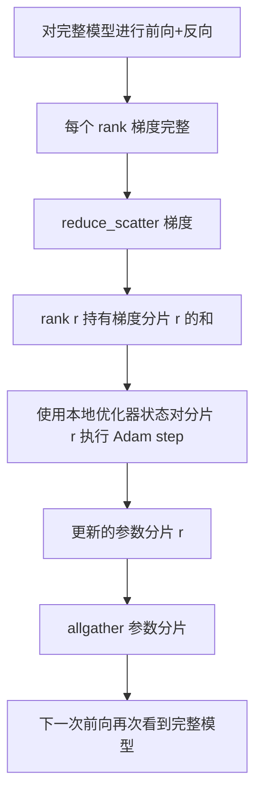

# ZeRO 优化器状态分片

> Adam 为每个参数存储两个矩估计值，均为 float32。一个 7B 参数模型携带 56 GB 的优化器状态。ZeRO 阶段 1 将其分片到 N 个 rank；每个 rank 拥有优化器的 1/N。局部步骤后，更新的参数分片广播回去，每个 rank 重建完整模型，开始下一步。优势是训练堆栈中最大单一分配内存的线性下降。

**类型：** 构建  
**语言：** Python  
**前置条件：** Phase 19 Track C 课程 42-49  
**时间：** ~90 分钟

## 学习目标

- 将优化器状态（第一矩估计、第二矩估计、fp32 主控副本）在 N 个 rank 间分片，使每个 rank 拥有 1/N。
- 利用 reduce_scatter 分发每个 rank 仅其分片的梯度和，随后用 allgather 广播更新的参数分片。
- 计算阶段 1、阶段 2、阶段 3 相对于 vanilla DDP 的内存节省表。
- 根据模型大小和带宽预算，辩护选择阶段 1、阶段 2 或阶段 3。

## 问题所在

Vanilla DDP 完全复制：参数、梯度和优化器状态在每个 rank 上全部存在。对于一个 7B 参数的 fp16 模型，这意味着每个 rank 有 14 GB 参数，14 GB 梯度，28 GB 优化器状态。优化器状态占最大，是最容易分片的，因为它仅在 step 时使用，前向和反向时不触碰。

ZeRO 阶段 1 对优化器状态进行分片。每个 rank 持有 Adam 矩估计的 1/N。反向后，不是对完整梯度做 allreduce 并本地更新 step，ZeRO 使用 reduce_scatter，让每个 rank 仅接收其分片的梯度和。该 rank 对其主控参数分片进行优化器 step。随后所有更新的参数分片做 allgather，确保每个 rank 都有完整模型用于下一次前向。优化器内存降低 N 倍。每步的线缆流量与 DDP 相同：一次 reduce_scatter 加一次 allgather，带宽上等同一次 allreduce。内存降低，吞吐保持。

## 概念示意



### ZeRO 阶段简介

| 阶段 | 分片内容 | 每个 rank 内存 | 每步通信 |
|-------|-----------|----------------|----------------------------|
| DDP | 无 | 参数 + 梯度 + 优化器 | 1 次 allreduce |
| ZeRO-1 | 优化器状态 | 参数 + 梯度 + 优化器/N | 1 次 reduce_scatter + 1 次 allgather |
| ZeRO-2 | 优化器状态 + 梯度 | 参数 + 梯度/N + 优化器/N | 1 次 reduce_scatter + 1 次 allgather |
| ZeRO-3 | 优化器状态 + 梯度 + 参数 | 参数/N + 梯度/N + 优化器/N | 每层 1 次 allgather + 每层 1 次 reduce_scatter |

阶段 1 成本最低且收益最大，因为优化器状态占比最高。阶段 2 需要梯度分片累积逻辑，但带宽一致。阶段 3（FSDP）每层正反向通信，获得参数分片内存降低。课程全实现阶段 1。

### 内存计算，具体数据

对一个带 P 个参数、用 Adam 混合精度训练的模型：

| 术语 | Vanilla | ZeRO-1 | 说明 |
|------|---------|---------|-------|
| fp16 参数 | 2P 字节 | 2P 字节 | 前向需要 |
| fp16 梯度 | 2P 字节 | 2P 字节 | 反向需要 |
| fp32 主控副本 | 4P 字节 | 4P/N 字节 | 仅优化器使用 |
| fp32 第一矩估计 | 4P 字节 | 4P/N 字节 | 仅优化器使用 |
| fp32 第二矩估计 | 4P 字节 | 4P/N 字节 | 仅优化器使用 |
| 总计 | 16P 字节 | 4P + 12P/N 字节 |    |

当 N=8 时：vanilla 为 16P，ZeRO-1 为 5.5P，减少 65%。当 N=64 时：vanilla 16P，ZeRO-1 4.19P，减少 74%。

### 为什么 reduce_scatter 优于先 allreduce 再分片

Allreduce 给每个 rank 返回完整的梯度和。如果只需分片 r，rank r 上都浪费了 (N-1)/N 份梯度。Reduce_scatter 仅传送每个 rank 自己持有的分片；每个 rank 的字节数与 allreduce 相同（allreduce = reduce_scatter + allgather），但后半部分由后续的参数分片 allgather 替代。网络线缆流量与 DDP 相同，内存实现分割。

## 构建它

`code/main.py` 实现：

- `flatten_params(module)` 和 `unflatten_into(module, flat)`，将模型参数打包成一块连续张量并拆包。打平布局简化了依 rank 分片切片操作。
- `ZeroOptimizer(model, world_size, rank, lr)`，管理 rank 的主控副本分片及 Adam 矩估计。
- `step()`，对平坦梯度运行 reduce_scatter，应用 Adam 步骤到 rank 分片，并 allgather 更新参数返回。
- 一个演示训练 3 层 MLP 20 步，每步打印内存预算及 vanilla DDP 基线对比。

运行它：

```bash
python3 code/main.py
```

输出：每步损失及内存表，显示 ZeRO-1 在每个 rank 仅保存优化器状态的 1/N，远低于 DDP 全拷贝。

## 生产模式应用

三个模式强化 ZeRO 使其可部署。

**分片检查点至关重要。** ZeRO-1 的优化器状态跨 rank 分片；检查点需记录每个 rank 拥有的部分。课程 80 构建了分片检查点清单，支持同规则 world size 恢复 ZeRO 运行。否则保存状态读取失败。

**混合精度是关键。** ZeRO 是混合精度技术，分片的是 fp32 主控副本。无混合精度运行 ZeRO 要承受 fp32 主控内存成本，却无对应 fp16 前向收益。生产环境总配合 autocast 或 bf16 权重使用 ZeRO。

**阶段 1 近乎免费获益。** 通信带宽等同 DDP。内存节省线性随 N。唯一费用是管理优化器分片。生产堆栈除参数分片也有问题外，默认阶段 1，否则阶段 2 或 3 会用通信换内存。

## 使用它

生产层面：

- **DeepSpeed ZeRO。** 参考实现。`deepspeed_config.json` 选择阶段 1/2/3 和分片大小。
- **PyTorch FSDP。** PyTorch 原生的等效。`ShardingStrategy.SHARD_GRAD_OP` 是 ZeRO-2；`FULL_SHARD` 是 ZeRO-3。
- **HuggingFace Accelerate。** 统一封装 DeepSpeed 和 FSDP 的配置。

## 发布它

课程 79（流水线并行）是另一分片维度：非对同一模型优化器状态分片，而是流水线按层分片。课程 81 组合 DDP + ZeRO 在端到端演示。

## 练习

1. 扩展为 ZeRO-2，通过分片梯度实现：每个 rank 仅存储自己分片的梯度，通过反向后零掉非分片部分实现。
2. 添加内存分析器，打印 rank 0 上的实际 fp32 字节使用量，和公式预测对比。
3. 测量 vanilla DDP 和 ZeRO-1 每步的实际耗时，拆分为前向、反向、通信时间。
4. 在 ZeRO-1 下实现梯度裁剪：L2 范数需通过所有分片通过全归约计算局部范数平方和。
5. 实现“朴素 ZeRO”，使用 allreduce 代替 reduce_scatter，测量线缆时间差异，并用数字论证 reduce_scatter 的优越。

## 关键词

| 词汇 | 大众说法 | 实际含义 |
|--------|-------------|----------------------------|
| ZeRO-1 | “分片优化器” | 每个 rank 持有 fp32 主控和 Adam 矩估计的 1/N |
| ZeRO-2 | “也分片梯度” | 每个 rank 在 reduce_scatter 后丢弃非分片梯度 |
| ZeRO-3 | “分片参数” | 每个 rank 持有 fp16 参数的 1/N；前向每层 allgather |
| 主控副本 | “fp32 权重” | 优化器更新的高精度参数副本 |
| Reduce_scatter | “拆分求和” | 传送每个 rank 仅持有的梯度分片和 |

## 拓展阅读

- [Rajbhandari 等, ZeRO: Memory Optimizations Toward Training Trillion Parameter Models](https://arxiv.org/abs/1910.02054)
- [DeepSpeed ZeRO 文档](https://www.deepspeed.ai/tutorials/zero/)
- [PyTorch FSDP 文档](https://pytorch.org/docs/stable/fsdp.html)
- Phase 19 课程 76 - 本课所在的 reduce_scatter 和 allgather 原理
- Phase 19 课程 80 - ZeRO 状态分片检查点必须使用
