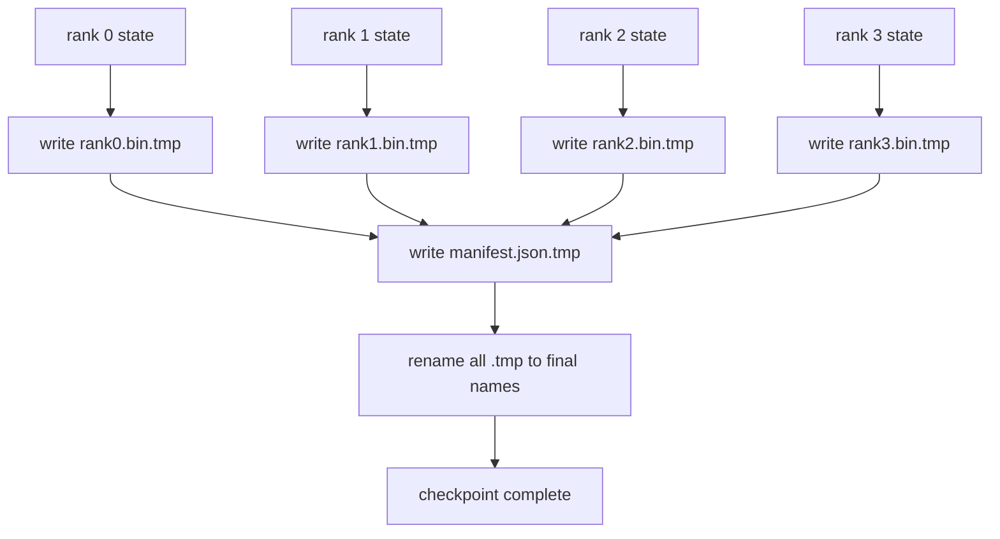

# 分片检查点与原子恢复

> 一个 700 亿参数（70B-parameter）的训练任务每隔几小时因节点故障暂停一次。检查点格式决定了你是损失 30 分钟还是 30 小时。分片检查点（sharded checkpoint）并行地写入每个 rank 的分片，并在 manifest 中记录归属。恢复时从各自的文件加载每个 rank 的分片，在相同的 world size 上重构状态，优化器步进仿佛什么都没发生。原子写（atomic write）避免半成品检查点污染下一次恢复。

**类型：** 构建  
**语言：** Python  
**先决条件：** 第19阶段C轨第42-49课  
**时间：** ~90分钟

## 学习目标

- 将多 rank 检查点保存为每个 rank 的分片文件，并附带记录各 rank 拥有分片的 manifest。  
- 使用原子写模式（写入临时路径后重命名），避免写入过程中崩溃导致半成品检查点。  
- 从 manifest 恢复，验证每个 rank 上 fp16 参数和 ZeRO 优化器状态的字节级一致性。  
- 设计 manifest schema 防御三种故障模式：world-size 变化、分片数不匹配、部分写入。  

## 问题描述

普通检查点会把所有参数和优化器状态读入 rank 0，收集（gather）后写入单个文件。对于 700 亿模型，这是 1.1 TB 的状态通过一个 rank 的网络口。写入时其他 rank 阻塞因为它们在等待收集。I/O 带宽等同于最慢的单个 GPU 网络链路而非聚合。真实集群上，收集-写入步骤可能比前面一小时训练还长，导致每天训练产生不到一个检查点。

分片检查点则反向操作：每个 rank 并行写自己的分片到独立文件。manifest 记录哪个 rank 拥有什么分片，使恢复时各分片能准确放回相应位置。整体写带宽随集群规模扩展。一个 1 TB 检查点通过一个 rank 需 4 小时，通过 64 个 rank 只需 4 分钟。更重要的是，manifest 约定了不兼容恢复的检测方法：world-size 变化可检测，部分写入可检测，加载路径可以明显失败而非静默使用陈旧数据。

## 概念示意



### Manifest schema

```json
{
  "world_size": 4,
  "step": 1234,
  "wall_clock_seconds": 4521,
  "shards": [
    {"rank": 0, "path": "rank0.bin", "sha256": "...", "param_shard_offset": 0, "param_shard_numel": 65536},
    {"rank": 1, "path": "rank1.bin", "sha256": "...", "param_shard_offset": 65536, "param_shard_numel": 65536}
  ],
  "schema_version": 1
}
```

三个字段承载关键负载。`world_size` 使在不同规模恢复时能明显失败而非静默损坏。每个分片的 `sha256` 检测部分写入或损坏。每个分片的 `param_shard_offset` 和 `param_shard_numel` 使加载器能在正确位置重构平铺参数张量。

### 原子写

标准流程：每个分片写到 `<name>.tmp`，manifest 写到 `manifest.json.tmp`，调用 fsync 确保持久化，然后重命名（rename）。POSIX 文件系统上重命名是原子操作；新文件要么完全生效，要么旧文件保持不变。崩溃发生在最终重命名之前，前一个检查点仍是活跃的。没有原子写，崩溃可能留下部分分片和指向它的 manifest，导致加载时优化器状态损坏。

### schema 必须防御的三种故障模式

| 故障类型 | 症状 | 防护措施 |
|---------|---------|---------|
| World-size 变更 | 使用 N=4 的 manifest 在 N=8 上恢复失败 | manifest 中 world_size 不匹配，明显报错 |
| 分片数不匹配 | 恢复时 rank\*.bin 文件数量少于 manifest 中分片数 | 遍历分片，逐一验证文件存在 |
| 部分写入 | 分片文件被截断 | 加载时校验 sha256 |

每种防护措施都会尽早拒绝错误加载；否则可能导致 100 步之后 loss 变 NaN 的静默损坏。

### 为什么采用每 rank 文件而非一个大文件

通过 `O_APPEND` 对单文件的并发写入在 POSIX 对字节对齐写有效，但分片内部的偏移跨 MB 级别，锁竞争严重。每 rank 文件无争用，且当底层文件系统支持并行（如 Lustre，GPFS）时可受益于条带（striping）。生产环境堆栈（DeepSpeed、FSDP、NeMo）均采用每 rank 文件方案。

## 构建实现

`code/main.py` 实现：

- `ShardManifest` dataclass，含上文 schema，支持 `to_json` 和 `from_json`。  
- `save_sharded(state_dict_per_rank, dir, step)`，使用原子写的临时文件-重命名模式，将每个 rank 的二进制状态保存为单独文件，再写入 manifest。  
- `load_sharded(dir, expected_world_size)`，读取 manifest，校验每个分片的 sha256，返回每个 rank 的状态字典。  
- 一个往返测试：构建每 rank 状态，保存，加载，断言字节一致。

运行示例：

```bash
python3 code/main.py
```

输出：写入 4 个分片和 manifest 文件，再次加载并验证字节一致。

## 生产实践模式

三种模式使检查点足够稳健可部署：

**异步写。** 生产堆栈在单独线程或进程写入检查点，训练继续。下一个检查点写入前必须保证上一个完成。DeepSpeed 的 `async_io` 标志即实现该功能。本课保持同步写入，方便直观理解步骤。

**先本地快速磁盘，再异步上传。** 写入本地 NVMe（快速），后异步上传到 S3 或 GCS。两层策略保证集群内恢复快速，同时提供可靠的离群存档。manifest 记录本地路径，上传 manifest 记录远端路径。

**轮换机制重要。** 生产任务保留最近 K 个检查点（通常 3-5 个），按序轮换最旧。无轮换会导致运行中磁盘填满，导致下一次检查点失败。轮换时保存前先删除最旧文件，释放空间。

## 使用示例

生产环境典型用法：

- **DeepSpeed 检查点。** `deepspeed.save_checkpoint(tag=step)` 写入每 rank 文件，并生成指向活动 tag 的 `latest` 文件。  
- **PyTorch FSDP 检查点。** `torch.distributed.checkpoint` 使用 `Planner` 决定每 rank 布局，并保存分片状态。  
- **NeMo。** 封装 DeepSpeed 和 FSDP，提供统一的 `save_to_checkpoint` API，添加元数据支持。  

## 实战演练

第81课保存并重新加载端到端 DDP+ZeRO 分片检查点，验证恢复协议正确。

## 练习

1. 添加异步写：在独立线程启动保存，训练继续。确保上一次保存完成后才开始下一次。  
2. 添加 `last_5_steps` 轮换：只保留最近 5 个检查点，保存新点前删除最旧的。  
3. 添加仅 CRC 快速校验路径，用于内循环重载（轮换时将某检查点变为活跃时无需全 sha256 校验）。  
4. 添加跨 world-size 恢复：从 N=4 拓展到 N=8，读取 manifest，拼接后重新分片。  
5. 添加上传到模拟 S3（二级目录），写入上传 manifest，保障双层存储策略。  

## 关键词

| 术语 | 俗称 | 实际含义 |
|------|------|----------|
| Sharded checkpoint | "Per-rank save"（每 rank 保存） | 每个 rank 并行写入自己的分片文件 |
| Manifest | "Index"（索引） | 记录分片路径、偏移、sha256 的 JSON 文件 |
| Atomic write | "tmp then rename"（先写临时后重命名） | 写入 `.tmp` 文件，再 POSIX 原子重命名，防止崩溃残留半成品 |
| Partial write | "Truncated shard"（分片截断） | 写入过程中崩溃导致分片文件损坏，sha256 可检测 |
| Rotation | "Keep last K"（保留最近 K 个） | 保存新检查点前删除最旧的以控制磁盘使用 |

## 进一步阅读

- [DeepSpeed checkpointing](https://www.deepspeed.ai/tutorials/checkpointing/)  
- [PyTorch torch.distributed.checkpoint](https://pytorch.org/docs/stable/distributed.checkpoint.html)  
- [POSIX rename atomicity](https://pubs.opengroup.org/onlinepubs/9699919799/functions/rename.html)  
- 第19阶段第78课 - 本检查点针对的 ZeRO 状态  
- 第19阶段第81课 - 端到端示例的保存与恢复往返验证
