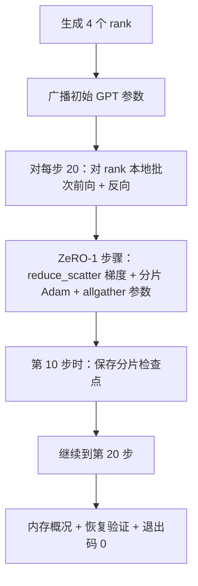

# 端到端分布式训练

> 第 76 至 80 课分别实现了一个部分。这就是组装：一个微型 GPT 在 4 个模拟 rank 上训练，使用 DDP（分布式数据并行）进行梯度同步，ZeRO-1 用于优化器状态分片，半程处保存分片检查点。演示运行 20 步，自动结束，打印损失曲线和内存概况，并写入可恢复的检查点。

**类型：** 构建  
**语言：** Python  
**先决条件：** 第 19 阶段 C 路径 第 42-49 课  
**时间：** 约 90 分钟

## 学习目标

- 将 DDP（第 77 课）、ZeRO-1（第 78 课）和分片检查点（第 80 课）组合成一个训练循环。
- 在一个小型合成语料库上，跨 4 个模拟 rank 训练一个 2 层 transformer（Transformer 架构）语言模型，训练 20 步。
- 打印每步损失表、每 rank 内存概况，以及一个在相同全局规模下字节相等可恢复的检查点清单。
- 证明组合的正确性：每个部分在之前的课中单独可测试，本课证明它们能够组合起来。

## 问题描述

一个总结项目是验证各部分能否匹配拼合。第 76 课实现了集合操作（collectives）。第 77 课将它们封装到 DDP 中。第 78 课用 reduce_scatter 对优化器状态做了分片。第 79 课分析了流水线。第 80 课保存了分片检查点。每课独立且有自己的测试。实际训练会同时用到全部原语；如果组合出错，损失会发散，检查点无法恢复，或者每 rank 内存不降反升。

本课运行端到端演示，验证四个不变量：（a）损失在 20 步内单调下降（浮点噪声范围内），（b）每个 rank 在每步的参数范数相同，（c）每 rank 优化器内存等于 ZeRO-1 公式 12P/N 字节，（d）第 10 步的检查点重新加载时字节相等。演示自动结束：20 步，单条命令，退出码 0。

## 概念图



### 微型 GPT

模型刻意保持小型：2 个 transformer 块，嵌入维度 32，4 个注意力头，词表大小 64，序列长度 16，批大小 4。几千个参数。足够驱动所有连接决策（多头注意力走标准掩码路径；LayerNorm 有权重同步；LM 头是独立的线性投影到词表）。又足够小，4 个 CPU rank 上 20 步几秒完成。

### 组合规则

| 课程部分           | 它负责的事情              | 留给循环处理的事情         |
|------------------|-------------------------|------------------------|
| DDP 广播          | 初始参数同步             | 构造时调用一次             |
| ZeRO-1 步骤       | 梯度同步、主副本更新、参数广播 | 每步调用替代 optimizer.step |
| 分片检查点         | 持久化每 rank 状态，带 sha256 清单 | 用 allgather 汇集状态后，在 rank 0 调用 |
| 训练循环          | 前向、反向、损失记录       | 按顺序调用以上三个模块       |

循环不关心 reduce_scatter 或会合文件。ZeRO 和检查点模块暴露窄接口，循环负责组合。

### 为什么选微型 GPT 而不是单纯 MLP

第 77 课的 MLP 足以验证梯度同步。微型 GPT 增加了三个内容：词表上的独立 LM 头（本课为清晰起见不绑定；全 GPT 通常绑定头与词嵌入），softmax+交叉熵损失（较 MSE 具有更多数值边缘情况），以及非对称的前向流程（每层先嵌入层再注意力再 MLP）。用 MLP 做总结项目会隐藏是否正确处理了 LayerNorm 或嵌入层梯度形状。

### 自动终止即退出码 0

循环运行固定 20 步后退出。无 `while True`，无人工干预，无从外部恢复。一个能无人值守运行并完成记录的总结项目即证明系统布局正确。若有死锁演示永不返回，测试环境可捕获。

## 构建步骤

`code/main.py` 实现：

- `MiniGPT`：2 层 transformer，带掩码的自注意力和独立 LM 头。
- `make_corpus(seed, total_tokens)`：确定性的下一词预测数据。
- `_train_worker`：为每个 rank 生成；广播初始参数，运行训练循环，调用 ZeRO 步骤，步 10 写入分片检查点。
- `verify_resume`：主运行后，在进程内重新加载第 10 步检查点，并断言保存的主副本分片与内存快照完全字节匹配。
- `main`：协调整个演示，打印损失表、内存概况和校验结果。

运行：

```bash
python3 code/main.py
```

输出：20 行损失表、4 行每 rank 内存概况、检查点清单，成功时显示 "RESUME VERIFIED"。

## 生产环境中的模式

三个模式完成了实际运行的组成。

**按实际时间周期检查点，而非按步数。** 每步耗时随序列长和微批次数变化。10 分钟一次的检查点频率，无论模型大小均捕获相似计算。课程为简便用步数，生产用真实时钟。

**提前检测发散。** 生产环境在反向后加上 NaN 保护，和损失剧增检测器；若单步损失跳涨超过一倍，回滚到前一检查点，避免优化器进入退化状态。课程损失曲线平滑，保护无触发但保留接口。

**聚合各 rank 内存概况。** 实际运行中各 rank 内存不同（流水线最大阶段 rank 存储更多激活）。生产环境记录最大值和平均，课程打印每个 rank 方便验证公式。

## 使用方式

生产模式：

- **DeepSpeed。** 配置下集成 DDP + ZeRO + 流水线 + 激活检查点。课程组合是 DeepSpeed 简化版。
- **PyTorch FSDP。** 原生对应。`FullyShardedDataParallel` 搭配 `ShardingStrategy.SHARD_GRAD_OP` 是 ZeRO-2。
- **NeMo 和 Megatron-LM。** 为超大模型附加张量并行；否则组合结构相同。

## 交付

本路径至此结束。六课共同构成了一个真实团队在采用 DeepSpeed 前会构建的分布式训练子系统；抽象已在 gloo 上验证，故障模式也测试过。第 17 阶段（基础设施与生产）是将组合迁移到真实集群的合适地点。

## 练习

1. 给注意力头添加张量并行切分，验证损失匹配单 rank 基线。两个 rank：每个 rank 半头，attention 输出 allreduce。
2. 添加跨 4 个微批次的梯度累积，证明累积梯度与一个大批次梯度相同。
3. 添加从第 10 步恢复的路径，继续训练至第 20 步，产生与原运行相同的最终损失。
4. 导出指标（损失、梯度范数、步时）为 JSONL，方便事后可视化。
5. 加入 NaN 保护，在损失异常跳增时回滚至上一检查点，并用一跳步长乘子强制跳增以测试回滚。

## 关键词

| 术语        | 人们说                     | 实际含义                     |
|------------|--------------------------|----------------------------|
| 端到端      | “全部接起来”                | 一次运行组合所有部分，而非对每部分单元测试 |
| 内存概况    | “每 rank 的 GB 数”           | 每 rank 持有的参数、梯度、优化器状态字节 |
| 恢复契约    | “存和载”                   | 检查点前后每 rank 状态字节完全匹配         |
| 自动终止    | “有限运行”                 | 固定步数，完成退出码 0，无需人工介入       |

## 深入阅读

- [DeepSpeed 端到端训练教程](https://www.deepspeed.ai/getting-started/)
- [PyTorch FSDP 高级教程](https://pytorch.org/tutorials/intermediate/FSDP_advanced_tutorial.html)
- [Megatron-LM 训练脚本参考](https://github.com/NVIDIA/Megatron-LM)
- 第 19 阶段 第 76-80 课 — 本课组合的各个部分
- 第 17 阶段 — 将组合迁移到真实集群
