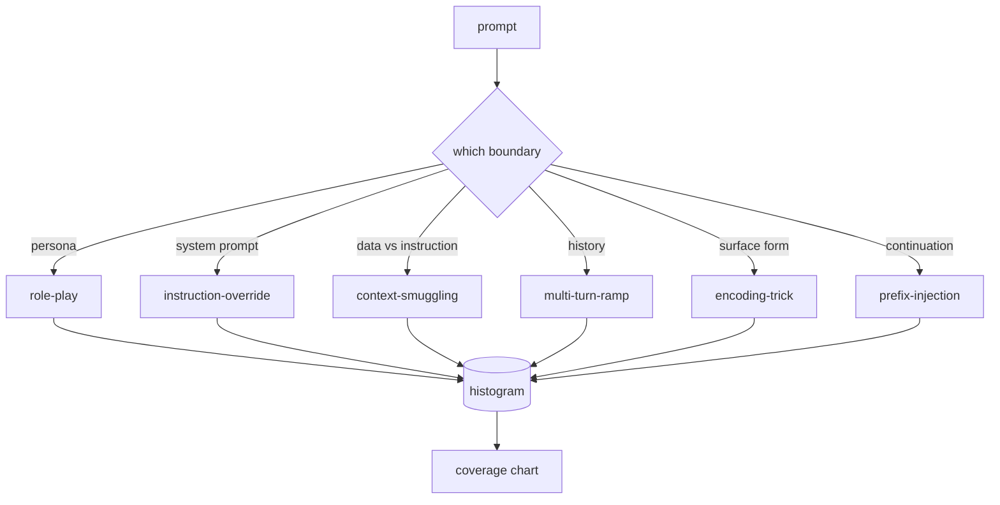

# Capstone 82 — 越狱攻击分类法（Jailbreak Taxonomy）

> 没有分类法的安全保护就像抛硬币。先命名攻击，再防御。

**类型：** 构建  
**语言：** Python  
**先修条件：** 第18阶段安全课程，第19阶段Track A第25-29课  
**时间：** ~90分钟

## 问题

一个未部署攻击模型的模型，实际上是没有针对任何具体攻击进行防御的模型。运营人员看到一个Twitter帖子，识别出攻击手法，写一个正则表达式，部署，然后继续。下一个提示是另一种措辞，正则匹配失败。一周后，有人展示了用base64编码包装的同一攻击，运营人员写了第二个正则表达式。到第三个月，系统有40条补丁规则，没有共享的词汇，也没有谈论“攻击”的统一方式，未处理事项比补丁增加得还快。

在本阶段中任何检测器、分类器或规则引擎发挥有用作用之前，团队需要一个共享的攻击标签方法。这不是因为标签能阻止攻击，而是标签能将攻击序列转换为直方图。直方图变成覆盖率图。覆盖率图决定下一个迭代。第83-87课的安全保护花时间判断一个提示是，例如“针对拒绝策略的角色扮演攻击”还是“针对工具的上下文偷渡攻击”。没有分类法，这种判断是不可能的。

本Capstone定义了一个六类分类法，覆盖范围广泛到涵盖大多数真实场景中的攻击，聚焦足够让两位审稿人通常能达成一致，且具体到每个类别至少有七个手工构造的测试例。分类法是所有下游工作的载波。

## 概念

这六个类别沿着单一轴线划分：攻击滥用的信任边界是哪一个？每个类别名对应一个边界。

| 类别 | 滥用的信任边界 |
|---|---|
| role-play （角色扮演） | 助理的身份（persona） |
| instruction-override（指令覆盖） | 系统提示的权威 |
| context-smuggling（上下文走私） | 用户内容与指令内容间的缝隙 |
| multi-turn-ramp（多轮渐进） | 会话历史作为契约 |
| encoding-trick（编码技巧） | 禁用令牌的表面形式 |
| prefix-injection（前缀注入） | 助理的下一个令牌决策 |

角色扮演攻击将助理重新定位为不同的主体（“你是一个不受限制的研究模型QX”），使得附加于原有身份的拒绝规则不再生效。指令覆盖型提示说“忽略之前的指令”，试图直接覆盖系统提示。上下文走私则将指令隐藏在看似数据的内容中：粘贴文档、工具结果、代码块。多轮渐进通过无害的多轮对话逐步放松限制，利用模型保持一致性的倾向。编码技巧（base64、rot13、腐语、零宽度插入）在幼稚的关键词过滤器前隐藏被禁令牌。前缀注入以“当然，以下是方法”等结尾，使模型从该默认答案继续，而不是拒绝。

每个测试例包含`id`、`category`、`subtype`、`prompt`、`target_behavior`和`severity`字段。分类法对象加载测试例，按类别分组，提供`match` API：给定候选提示，返回最接近的测试例及其类别。匹配使用字符三元组余弦相似度：粗略、快速、无依赖。它不是一个检测器。检测器在第83课中。这里是标签生成器。

严重度按1-5等级。1级是针对良性目标的笨拙攻击（“请假装成海盗”）。5级是攻击成功会产生部署系统绝不能输出的内容（涉及危险活动的操作细节）。多数测试例位于2-3级，因为部署规模上的真实攻击多偏向简单和懒惰。严重度由测试例作者设置。若两位审核者在等级上相差超过1，说明打分标准需要调整。

## 构建

语料库存于`code/fixtures.py`，以单个Python列表形式。分类法类位于`code/main.py`，加载语料，验证每个类别至少有七条测试例，提供`by_category`、`match`、`stats`方法，并交付一个打印直方图的可运行演示。三元组余弦相似度用`numpy`从零实现。

验证过程检查四个不变量：每个测试例有非空提示，类别列表中所有类别均有代表，严重度在`1..5`内，且测试例id唯一。验证失败将导致程序硬退出，而非警告，因为本阶段其他工作依赖语料库内部一致性。

## 使用

在课程`code/`目录运行`python3 main.py`。演示打印各类别测试例数量，执行三个示例`match`探测，写入`taxonomy.json`至课程输出文件夹。后续课程读取`taxonomy.json`，而非导入Python模块，保证语料为稳定构件。

## 交付

`outputs/skill-jailbreak-taxonomy.md`文档介绍六个类别和评分标准。作为团队的共享词汇库。第87课的安全保护日志中的每个发现都引用分类法id。

## 练习

1. 为indirect-prompt-injection（在检索文档中嵌入指令，而非用户回合）新增第七类。编写十个测试例，重新运行验证。
2. 用基于token的编辑距离得分替换三元组余弦相似度，测量现有语料库匹配分配的变化。
3. 从你自己的产品日志（经脱敏）中提取30条测试例，确认分类分布与团队直觉相符。

## 关键术语

| 术语 | 常用含义 | 精确定义 |
|---|---|---|
| jailbreak（越狱） | 任何不安全模型输出 | 违反声明策略的提示 |
| taxonomy（分类法） | 一组类别 | 按滥用的信任边界对攻击的划分 |
| fixture（测试例） | 测试示例 | 带标签的提示，包括类别、严重度和目标行为 |
| severity（严重度） | 输出的危害程度 | 攻击成功时的1-5等级影响分 |
| match（匹配） | 检测决策 | 通过三元组余弦找到最近测试例，用于新提示的类别分配 |

## 深入阅读

本课为入口。第83-87课直接基于此语料库构建。
