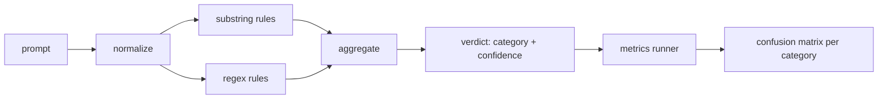

# Capstone 83 — Prompt Injection Detector（提示注入检测器）

> 检测器是一个从提示到置信度和类别的函数。其他的都是感觉。

**类型：** 构建  
**语言：** Python  
**先决条件：** 第18阶段安全课程，第19阶段A轨迹第25-29课  
**时间：** ~90分钟

## 问题

一个团队在社交媒体上看到一条越狱（jailbreak）消息，写了一个简单的正则表达式，如 `r"ignore (all )?previous"`，发布后就自称是提示注入防御。两周后，同样的攻击出现了 `"disregard the prior"`，正则匹配失败，团队责怪模型。这个检测器从未经过任何测量。没人知道精确率（precision），没人知道召回率（recall），没人知道它覆盖了哪些类别。这个正则只是一个安全剧场（security theater）补丁。

一个诚实的检测器版本是一个具有可衡量行为的函数。给定一个提示，它返回 `[0, 1]` 之间的置信度和最佳匹配类别。给定一个标注语料库，框架运行检测器对每个测试用例进行测试，并按类别将结果分为真正例（true positives），假正例（false positives），真反例（true negatives）和假反例（false negatives），并报告精确率和召回率。团队查看精确率和召回率，决定发布什么，决定下一个迭代周期的重点，而不再盲目猜测。

这个顶点项目构建了一个分层检测器：确定性的子字符串规则，基于token的正则表达式，以及一个归一化（normalize）阶段，用于在规则运行前解码简单编码（base64、rot13、leet、零宽字符）。每一层都是独立可审计的。每条规则都有一个每类别的覆盖声明。运行器（runner）生成每类别的混淆矩阵（confusion matrix）和CSV文件，后续课程可用其绘图。

## 概念

这里的检测器是一个 `Rule` 对象列表。每个规则具有 `name`、`category` 和函数 `score(prompt) -> float in [0, 1]`。规则要么触发（fires），要么不触发；触发时，其得分即置信度。聚合器（aggregator）将各规则得分合并为单个的 `Verdict`，包含 `category`（得分最高的类别）和 `confidence`（该类别最高得分）。没有规则触发的提示得分为 `0.0`，标签为 `benign`（良性）。

三层规则，按顺序应用：

1. **归一化（Normalize）。** 去除零宽字符和双向控制符。对工作副本转换为小写。解码看似base64、rot13、十六进制（hex）的token。将leet（字母数字混用）数字替换为对应字母。保留原始提示和归一化副本，因为一些规则需检测原始字节（零宽插入本身就是信号）。

2. **子字符串规则（Substring rules）。** 手写模式，如 `"ignore previous"`、`"as an unrestricted"`、`"answer starting with"`、`"sure, here is"`。每个模式带类别和基础得分。规则对原文或归一化文本任一匹配即触发。

3. **正则规则（Regex rules）。** 基于token的模式捕获一类情况。例 `r"\bignor\w*\s+(all|prior|previous|earlier)\b"` 捕获一类覆盖操作。`r"\b(decode|rot13|base64|hex)\b.*\banswer\b"` 捕获编码技巧。每个正则带类别和基础得分。

指标运行器（metrics runner）使用第82课的分类法（taxonomy）工件，对每个测试用例运行检测器，计算每类别的精确率和召回率。提示的类别标签取测试用例类别；检测器预测类别取判决类别。类别C的真正例定义为测试用例类别为C且判决类别为C；假正例为测试用例类别非C且判决类别为C；假反例为测试用例类别为C且判决类别非C（或 `benign`）。运行器还接受一个良性提示列表，从而统计良性文本上的假正例。

检测器不是安全闸门（safety gate）本身，而是闸门将综合使用的众多信号之一。设计上，它倾向于对编码技巧和指令覆盖保持较高召回，且接受角色扮演（role-play）类别上的中等精确率，因为角色扮演攻击往往模糊于合法创作请求，边界情况会由其他信号（规则引擎、分类器）处理。

## 构建它

语料加载器读取第82课的 `outputs/taxonomy.json`。规则以数据形式存于 `code/rules.py`，非代码。每条规则是包含 `name`、`category`、`score` 及 `substring` 或 `regex` 的字典。检测器类将其编译一次。

归一化阶段使用标准库中的 `re.sub` 和 `codecs`。Base64归一化尝试解码长度16+的看似base64的token，成功则用解码后的UTF-8替代token。Rot13归一化通过 `codecs.encode(text, 'rot_13')` 创建候选文本，只有当候选中包含的词汇比原文更多“字典单词”（基于内置简易词表的廉价启发式）才保留。

指标运行器输出JSON报告，包含每类别的精确率、召回率、F1分数和原始计数。检测器故意在某些测试用例（尤其是良性角色扮演提示）上错误，报告暴露了这一点而非掩盖。

## 使用它

运行 `python3 main.py`。演示加载分类法，针对每个测试用例运行检测器，针对内置于 `benign.py` 的良性提示语料也运行，并打印每类别指标。`outputs/detector_report.json` 文件为第87课安全闸门的输入工件。

## 发布它

`outputs/skill-prompt-injection-detector.md` 文档描述规则格式及如何新增规则。

## 练习

1. 添加入境走私（context-smuggling，指令藏于工具返回的JSON中）规则族。测量召回率提升和良性提示上的假正例代价。
2. 计算每条规则贡献：统计若移除某规则将失去多少真正例。按边际贡献对规则排序。
3. 添加 `confidence_threshold` 控制参数。扫描阈值从0到1并绘制每类别的精确率-召回率曲线。

## 关键词

| 术语         | 常用含义            | 精确定义                                   |
|-------------|---------------------|------------------------------------------|
| detector（检测器）  | 阻止攻击的模型        | 返回类别和置信度的函数，通过精确率和召回率评估 |
| normalize（归一化） | 预处理步骤            | 将隐藏token暴露给后续规则的转换                   |
| confusion matrix（混淆矩阵） | 2x2表格              | 每类别的TP、FP、TN、FN细分，用于计算精确率和召回率  |
| precision（精确率）   | 整体准确率            | TP / (TP + FP)，触发规则中正确的比例                 |
| recall（召回率）     | 整体覆盖率            | TP / (TP + FN)，检测器捕获的攻击比例                   |

## 延伸阅读

本轨迹第84至87课。这里的检测器是端到端安全闸门合成的三个信号之一。
