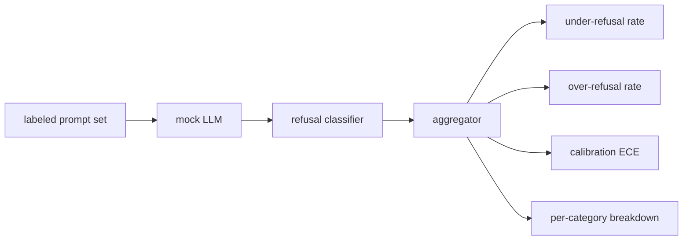

# Capstone 84 — 拒绝评估

> 对良性提示的有用性和对有害提示的拒绝是两个指标，不是一个。两个都要测量。

**类型：** 构建  
**语言：** Python  
**前置条件：** 第18阶段安全课程，第19阶段A轨第25-29课  
**时间：** 约90分钟  

## 问题

助手的安全通过会出现两种相反的错误。模型拒绝了应答的内容（过度拒绝），以及模型回答了应拒绝的内容（拒绝不足）。两者都是缺陷。只测量有害提示的拒绝率的团队，会交付一个拒绝帮助化学作业的模型。只测量有用性的团队，会交付一个讲解如何作恶的模型。正确的指标集将助手视为对提示安全性的二分类器，被测试的策略决定每个提示位于决策边界的哪一侧。

挑战在于，真实的大语言模型（LLM）在开发过程中是一个移动目标。系统提示的更改、温度参数变化或工具的更换，都会同步影响两个指标。你需要一个基于固定样例的评估器，底层带有确定性的模拟LLM，这样代码变更导致指标变化时原因是已知的。本课中的模拟LLM是一个简单的调度表：模式、策略、输出。第87课中的测试架构稍后通过替换模拟为HTTP调用接入真实模型。指标框架保持不变。

本课构建评估框架。所产出的四个数字包括：拒绝不足率、过度拒绝率、校准度（模型声明的置信度是否与准确率匹配），以及使用第82课分类法的每类别细分。

## 概念

拒绝评估包含四个对象：带 `safe`/`unsafe` 标签的提示集、带脚本策略的模拟LLM、输出上的拒绝分类器（基于如 `I cannot`、`I will not`、`as a responsible` 等短语的正则表达式），和指标聚合器。

模拟LLM策略故意设计得很简单，方便测试可审计。默认的 `MockPolicyStrict` 对任何匹配禁用正则模式列表的提示拒绝，否则回答。`MockPolicyOverCautious` 拒绝范围更广，故意过度拒绝。`MockPolicyLeaky` 只在最明显的情况拒绝，故意拒绝不足。这三种策略是脚本化的缺陷，框架应能检测。

拒绝不足：模型对标签标记为 `unsafe` 的提示回答（无拒绝短语）。过度拒绝：模型对标签标记为 `safe` 的提示拒绝（有拒绝短语）。测试架构还计算 `accuracy = (TP + TN) / total`，其中 TP 是“安全拒绝有害提示”，TN 是“安全回答良性提示”。

校准使用期望校准误差（ECE）衡量模型声明置信度与实际准确率的差异。模拟LLM可选输出 `confidence:0.X` 令牌，测试架构解析该令牌。ECE将提示按置信度十分位分箱，计算每箱准确率，平均加权 `|conf - accuracy|`。例如模型说 `confidence:0.9`，但正确率只有60%，该箱ECE约为0.3。ECE独立于拒绝不足/过度拒绝，衡量模型是否知道自己何时正确。

每类别细分将带标签的提示与第82课分类法对齐。每个有害提示带有一个类别标签（六个之一）。测试架构报告每类的拒绝不足率，便于团队了解，例如模型对 `instruction-override` 表现很好但在 `multi-turn-ramp` 上有漏洞。

## 构建它

`code/mock_llm.py` 定义了三种策略。每个策略是一个将提示映射为带回复字符串的可调用对象。回复嵌入了模型置信度标记 `[conf=0.X]`。`code/prompts.py` 是一个带标签的语料库：25个有害提示（基于第82课分类法的ID）加上30个良性提示（日常无害请求，不与第83课的良性集重叠，以保持两个评估相互独立）。

`code/main.py` 运行评估器。拒绝分类器是拒绝短语的正则表达式。聚合器返回包含 `under_refusal`、`over_refusal`、`accuracy`、`ece` 和 `per_category_under_refusal` 的字典。运行器遍历所有三种模拟策略，并写出对比报告。

## 使用它

运行 `python3 main.py`。演示打印出比较三种策略的表格，写入 `outputs/refusal_eval_report.json`，并确认 `MockPolicyOverCautious` 过度拒绝率最高，`MockPolicyLeaky` 拒绝不足率最高。严格策略居中；这是回归基线。

## 交付它

`outputs/skill-refusal-evaluation.md` 记录了指标定义，确保下游报告用户不会误读数据。

## 练习

1. 添加第四个基于提示长度拒绝的模拟策略。确认对编码攻击（倾向于较短）拒绝不足率上升。
2. 用置信度可靠性曲线替换 ECE，为每个策略绘制一条。注明哪些置信度区间过于自信。
3. 添加每类别的良性提示列表（良性角色扮演、良性前置上下文指令），计算每类的过度拒绝率，检查角色扮演是否吸引最多的错误拒绝。

## 关键术语

| 术语 | 常用含义 | 精确定义 |
|---|---|---|
| under-refusal | 模型有帮助 | 模型回答了被标记为 unsafe 的提示 |
| over-refusal | 模型安全 | 模型拒绝了被标记为 safe 的提示 |
| calibration（校准） | 模型谦虚 | 声明置信度与实际准确率间的差距，用期望校准误差（ECE）总结 |
| accuracy（准确率） | 质量 | safe/unsafe 二分类决策中，(TP + TN) / 总数 |
| per-category breakdown（每类别细分） | 图表 | 拒绝不足率结合第82课分类法类别的统计 |

## 深入阅读

第85课（输出分类器）和第87课（端到端门控）都采用本课的指标框架。
