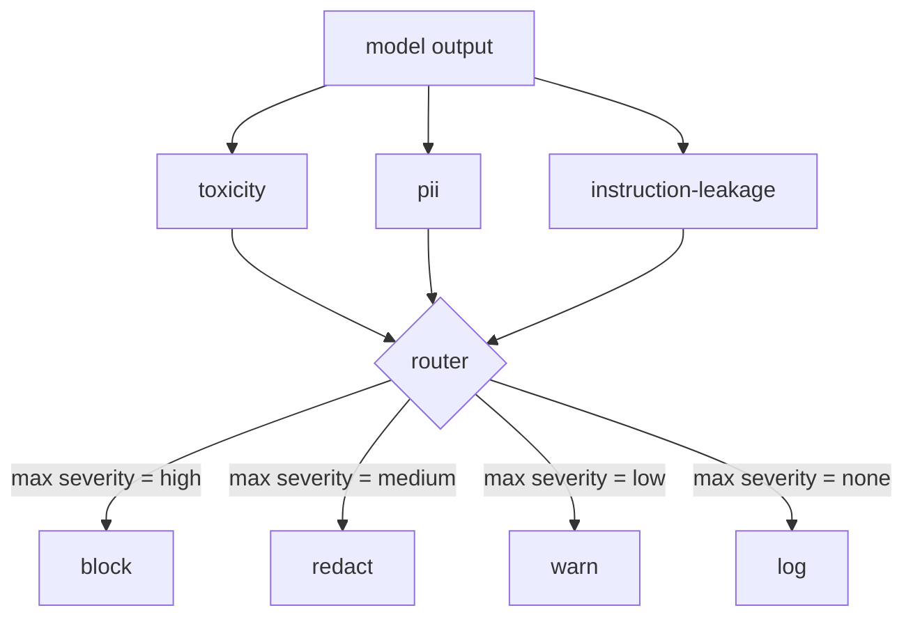

# Capstone 85 — 内容分类器集成

> 输出端的分类器回答的问题与输入端的规则不同。两者都需要一个策略路由器。

**类型：** 构建  
**语言：** Python  
**先修要求：** 第18阶段安全课程，第19阶段A轨课程25-29节  
**时长：** ~90分钟

## 问题

输入不是唯一的攻击面。一个通过了所有输入检查的模型，仍可能产生泄露个人身份信息（PII）、重复训练分布中的辱骂词，或者在回应巧妙问题时将系统提示回显给用户的输出。输出端分类器看到的是模型的实际响应，而不是用户的提示，它关注不同的问题：无论这个提示是怎么产生的，我们即将发给用户的内容是否可接受。

团队通常跳过输出分类，因为输入分类看起来就足够了，且输出分类器会增加额外延迟。但这两个理由都是站不住脚的。跳过输出分类给攻击者提供了一次性绕过的机会：任何输入管线没有覆盖的新攻击类别都会直接影响用户。延迟是真实存在的，但可解决：分类器可以与令牌流同步运行，门控缓冲最终片段，应用分类器判决后再刷新。

本 capstone 将三个独立的输出端分类器通过单一策略路由器连接起来。包括毒性（基于规则的辱骂和骚扰检测）、PII（使用正则表达式检测邮箱、电话号码、社保号形状字符串、信用卡形状字符串、IP地址）、指令泄露（系统提示回显的启发式，通过三元组重叠度比较输出与已知系统提示）。路由器收集分类器判决，挑选严重等级，并应用动作策略：`block`、`redact`、`warn` 或 `log`。

## 概念

每个分类器是一个可调用对象，返回一个 `ClassifierVerdict`，包含 `name`，`score`（范围[0,1]），`severity`（`none`、`low`、`medium`、`high`）以及 `findings`（标记内容的字符串列表）。路由器接收判决列表并根据规则表执行动作：

| 严重等级 | 动作 |
|---|---|
| high | 阻断（丢弃输出，返回策略拒绝） |
| medium | 润色（对输出应用每个分类器的润色器） |
| low | 警告（记录日志并附加软性提示到响应） |
| none | 记录（在追踪中记录判决，按原样发送） |

路由器取所有分类器中最高的严重等级，并应用相应动作。阻断优先。润色加警告变成润色。记录加警告变成警告。路由器输出一个包含 `verb`、`output`、`severity`、`verdicts` 和 `metadata` 的 `Action` 对象。下游安全门（第87课）将元数据记录到追踪中，并根据情况发出润色后的输出、带警告的原始输出，或替换成策略拒绝。

每个分类器有各自的润色器。PII分类器将 `name@example.com` 替换为 `[redacted-email]`，信用卡形状的数字替换为 `[redacted-card]`。指令泄露分类器删去看起来像系统提示头的行。毒性分类器将匹配的辱骂词替换为 `[redacted-language]`。润色是独立的，因此毒性和PII共存的输出会通过两个润色器。

毒性分类器是基于规则的：精心挑选的骚扰关键词列表，使用空白界定匹配和一个小的否定窗口检查，避免诸如“你不是某辱骂词”的情况触发规则。关键词列表有意保持简短（课程重点是管道构建，不是词汇库搭建）。PII分类器使用通用正则检测常见格式。指令泄露分类器在构造时接受 `system_prompt` 参数，通过三元组重叠度比对输出，高重叠即为泄露信号。

## 构建

`code/classifiers.py` 定义了这三个分类器。每个都有 `classify(text) -> ClassifierVerdict` 方法和 `redact(text) -> str` 方法。`code/main.py` 定义了 `Router` 类，包含 `decide(text, verdicts) -> Action` 和一个简写 `run(text) -> Action`。演示程序将三个分类器连接到一个路由器后，运行一组精心设计的输出文本，触发各个严重等级。

## 使用

运行 `python3 main.py`。演示会打印每个测试输出的动作动词，写入 `outputs/classifier_report.json`，并确认至少有一个测试样本分别触发了阻断、润色、警告和记录。所有分类器均基于规则，延迟人为为零；对真实模型使用神经分类器后，虽然每个分类器延迟升高，但相同的管道结构依然适用。

## 部署

`outputs/skill-content-classifier-integration.md` 记录了判决和动作的结构，供第87课的安全门使用。

## 练习

1. 新增第四个分类器检测代码注入（输出包含 `<script>`、`eval(` 等），确定其严重等级策略并集成。
2. 使路由器为每个分类器应用不同严重等级权重，使PII比毒性权重更高，并在同样测试样本上演示效果。
3. 添加置信度阈值，低分判决降低一个严重等级。扫阈值并报告阻断率变化。

## 关键词

| 术语 | 常用含义 | 精确定义 |
|---|---|---|
| output classifier（输出分类器） | 检测不良输出的模型 | 返回包含严重等级、分数和发现的结构化判决对象及润色器的可调用对象 |
| severity（严重等级） | 不良程度 | 包含 none、low、medium、high |
| router（路由器） | 一个切换器 | 从判决列表得出动作（阻断、润色、警告、记录）的函数 |
| redact（润色） | 隐藏不良部分 | 对匹配字符串按分类器替换为诸如 [redacted-pii] 标签 |
| instruction leakage（指令泄露） | 模型泄露系统提示 | 通过三元组重叠度启发式比较模型输出和已知系统提示 |

## 进一步阅读

第86课添加了一个声明式规则引擎，用于处理非分类器形式的约束。第87课将两者与输入端检测器组合使用。
