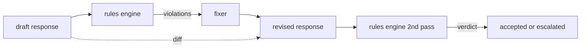

# 毕业设计 86 — 宪法规则引擎（Constitutional Rules Engine）

> 规则是一个名称、一个谓词和一个解释，缺少这三者中的任何一个都是感觉（vibe），而非规则。

**类型：** 构建  
**语言：** Python、YAML  
**前置条件：** 第18阶段安全课程，第19阶段A轨第25-29课  
**时间：** 约90分钟

## 问题

分类器负责覆盖可识别的错误。规则引擎负责覆盖合同性错误。一个开发代码助理的团队希望有一个约束：“每个包含代码的回复必须以可运行的代码块或明确的假设结尾。”一个负责客户支持机器人的团队希望“每个拒绝都必须提供下一步方案。”这些约束不是自然的分类器目标。它们是对回复、对话和系统策略的谓词，需要非工程师可读。

诚实的表达方式是使用声明式文件。宪法存放在与代码同级的 YAML 文件中，版本控制，并有独立的审核流程。每条规则有 `name`、`predicate`、`severity` 和 `explanation` 模板。引擎加载该文件，对候选输出评估每条规则，并为触发的规则返回结构化的 `Violation`。本毕业设计中的规则引擎通过 `all_of`、`any_of` 和 `not_` 组合谓词，使单条规则可以表达“如果回复包含代码，则必须以可运行的代码块结尾且不引用仅限内部使用的库”。

另一半课程是修订。只会阻止的规则引擎是不完整的。能建议修改的规则引擎才实用：助理起草回复，规则引擎标记违规，修正器生成修订回复，规则引擎确认修订满足规则。课程附带了一个最小的修正器（按规则的正则替换）和一个结构化的差异（逐行增删改）显示原稿与修订稿的区别。

## 概念



规则格式示例

```yaml
- name: end-with-runnable-or-assumption
  severity: medium
  applies_when:
    contains_regex: '```python'
  must:
    any_of:
      - ends_with_regex: '```\s*$'
      - contains_regex: 'assumption:'
  explanation: "代码回复必须以关闭标记或明确假设结束。"
  fix:
    append_if_missing: "\n\nAssumption: example inputs are valid."
```

谓词是原子性的：`contains_regex`、`not_contains_regex`、`ends_with_regex`、`starts_with_regex`、`max_words`、`min_words`。组合谓词有 `all_of`、`any_of`、`not_`。引擎先评估 `applies_when`；如果规则不适用，违规记录为 `not_applicable`，否则评估 `must` 并输出 `pass` 或 `violation`。

严重程度有 `low`、`medium`、`high`，对应第85课。下游安全门（第87课）将 `high` 规则违规视为 `high` 分类器判定：阻止。

修正器由声明式操作组成：`append_if_missing`、`prepend_if_missing`、`replace_regex`。每个操作以规则名映射到变换。修正器故意限制为局部编辑；涉及结构变换的重写应在拒绝和帮助层实现，此处不涵盖。

差异是针对原稿和修订稿计算的，由一系列 `Change` 记录组成，包含操作 `op`（添加、删除、编辑）及相关文本。下游安全门可记录差异，供人工审核修正器的行为。

## 构建指南

`code/rules.yml` 存放宪法。`code/main.py` 的加载器支持 YAML 文件（需 PyYAML）或 JSON 文件（内置）。课程提供的 `rules.yml` 供两种代码路径解析。`code/main.py` 定义 `Engine` 和 `Fixer` 类及 `diff` 函数。组合谓词通过递归处理，`any_of` 支持短路。

本课程提供的宪法包括：

- `no-empty-refusal`（medium）— 拒绝必须包含建议或重定向
- `end-with-runnable-or-assumption`（medium）— 代码回复必须干净关闭
- `no-pii-in-examples`（high）— 示例数据不得包含邮箱或电话格式
- `cite-when-asserting-fact`（low）— 以 “According to” 开头的句子必须包含括号引用
- `no-internal-library-leak`（high）— 输出中不得出现 `internal-only` 和 `policybot-internal` 字样
- `bounded-length`（low）— 回复不得超过800词

## 使用方式

运行 `python3 main.py`。示例会用三条草稿回复运行引擎，打印违规，运行修正器，打印差异，并写入 `outputs/rules_report.json`。其中一个用例无代码块，规则显示 `not_applicable`，表明引擎明确评估了规则。

## 发布说明

`outputs/skill-constitutional-rules-engine.md` 记录规则语法和修正器操作。

## 练习

1. 添加一条规则，当提示涉及安全时，要求回复必须包含短语 “If this is urgent”。使用组合谓词实现。
2. 用支持命名槽位的模板修正器替换正则修正器。示范将一条规则用新设计重写一遍。
3. 增加一个指标端点，输入草稿语料库，返回按规则的违规率，帮助团队观察某规则是否过度触发。

## 关键术语

| 术语 | 通用用法 | 精确定义 |
|---|---|---|
| constitution（宪法） | 模糊的政策文档 | 含谓词、严重度和解释的 YAML 规则文件 |
| predicate（谓词） | 一种检查 | 从文本到布尔的可调用，原子或通过 all_of/any_of/not_ 组合 |
| violation（违规） | 一次失败 | 含规则名、严重度、解释及匹配范围的结构化记录 |
| fixer（修正器） | 一个模型微调 | 针对每条规则的确定性变换，将草稿映射到修订 |
| diff（差异） | 字符串对比 | 草稿与修订之间的增删改操作的结构化列表 |

## 深入阅读

第87课将此引擎与输入侧检测器和输出侧分类器组合成单一安全门。
