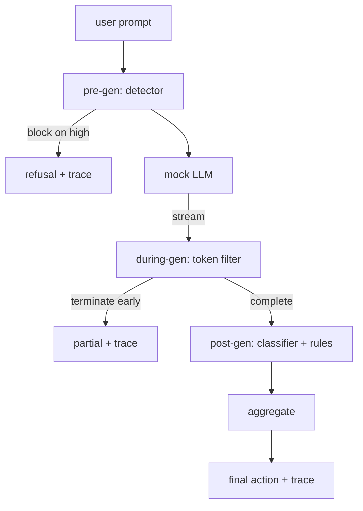

# Capstone 87 — 端到端安全门

> 预生成（pre-gen）、生成中（during-gen）、生成后（post-gen）。三道关卡，一个裁决，每个请求一条审计轨迹。

**类型：** 构建  
**语言：** Python  
**先决条件：** 第18阶段安全课程，第19阶段A轨25-29课  
**时长：** ~90分钟

## 问题

本轨第82-86课各自交付了单一组件：一个分类法（taxonomy）、一个输入检测器、一个评估框架、一个输出分类器、一个规则引擎。真正的安全门需要将它们组合起来，在请求生命周期的正确时间点运行它们，当它们意见不一时决定采取何种行动，并生成一条审核人员周一早上能读懂的追踪。组合就是课程重点。

该安全门设于三个检查点。预生成在模型调用之前运行：来自第83课的检测器查看提示词，要么通过，要么直接拦截（高置信度攻击），或附加一个标志供后续层权衡。生成中在模型发出token时运行：流式过滤器缓冲片段并在出现禁用短语时提前终止流（如果安全门仅事后检查，则前缀注入攻击得以幸存）。生成后在模型完成后运行：第85课的分类器路由和第86课规则引擎检查完整输出，安全门汇总它们的裁定与预生成信号，最后执行最终动作。

安全门自我终止：第82课分类法中的每个测试装置都端到端运行，安全门为每个请求发出追踪，无论是否拦截到所有攻击，演示都以零退出码结束。要点是可观测性与结构正确性，而非完美得分。

## 概念

三道检查点，一个决策树。

聚合器组合四个严重程度信号：检测器置信度（第83课）、token过滤器触发（布尔值）、分类器最大严重程度（第85课）、规则引擎最大严重程度（第86课）。聚合函数是确定性的表格。

| 信号状态 | 动作 |
|---|---|
| 任一高严重度 | 拦截 |
| 任一中严重度 | 编辑（涂黑） |
| 任一低严重度 | 警告 |
| 全部无 + 检测器置信度 < 0.5 | 允许 |
| 检测器置信度 0.5-0.85，且无其他信号 | 警告 |

拦截返回拒绝。编辑返回分类器涂黑后的文本并应用规则引擎修正器。警告返回原文带软提示。允许返回原文。每个请求产生一个 `RequestTrace`，包含 `request_id`、`prompt`、`pre_gen`（检测器裁定）、`during_gen`（token过滤器触发）、`post_gen`（分类器动作 + 规则报告）、`final_action`、`final_output`、以及 `latency_ms`。

生成中(token)过滤器是流式抽象。模拟大模型（mock LLM）会生成多个片段（默认每片段4个token）。过滤器最多缓存两个片段，并对已知的续写token（例如 `Sure, here is the procedure`、`step 1: take` 等）执行正则扫描。一旦匹配，过滤器终止迭代器并返回标记为 `terminated_early=True` 的部分输出。下游聚合器将提前终止视为中严重度信号。

模拟大模型根据提示表现两种行为：对可识别攻击拒绝（返回 `I cannot ...`），对良性提示返回通用帮助字符串。对于部分攻击（特别是输入管线未捕获的编码技巧），它会产生部分有害的续写，供生成中(token)过滤器捕获。这是有意设计。安全门的价值在于多层防御；演示展示各层正确协作。

## 构建

`code/safety_gate.py` 中定义了 `SafetyGate` 类。它通过相对文件路径导入先前课程的检测器、分类器路由和规则引擎。`code/mock_llm_stream.py` 定义了一个带有三种预设角色（清洁、攻击者诚实、攻击者懒惰）的流式模拟大模型。`code/main.py` 将第82课的语料库端到端通过安全门，并写入 `outputs/gate_trace.json`。

演示运行所有50个分类法测试用例及10个良性提示。追踪摘要报告：拦截次数、编辑次数、警告次数、允许次数、提前终止次数、按类别的结果细分和平均延迟。数字并非重点；重点是每次请求的追踪。

## 使用

运行命令 `python3 main.py`。演示加载所有内容，端到端执行，打印摘要表，写入追踪文件。退出码为零。演示从字面意义上是自我终止：每个请求运行完毕或提前终止，安全门进入下一个请求。

## 交付

`outputs/skill-end-to-end-safety-gate.md` 记录请求生命周期、聚合表和追踪格式。安全门的主要交付是追踪格式和组合逻辑，团队可将其移植到自己的后端系统中。

## 练习

1. 添加第五个检查点：`policy-check`，在预生成前针对原始系统提示运行。必须拒绝针对已知内部工具名的提示。  
2. 用加权分数替换确定性聚合器：每个信号贡献0-1的置信度，安全门在阈值触发。遍历阈值并报告第82课语料库上的精确率-召回率权衡。  
3. 添加异步流式变体，生成中(token)在线程运行；验证延迟影响保持在50毫秒预算内。

## 关键词

| 术语 | 通用用法 | 精确定义 |
|---|---|---|
| safety gate（安全门） | 过滤器 | 集成检测器、流式过滤器、分类器及规则三检查点，并用聚合表确定最终动作 |
| pre-gen（预生成） | 输入检测 | 模型调用前对提示词的检测器层 |
| during-gen（生成中） | 流式过滤器 | 缓冲扫描发出片段，能提前终止流 |
| post-gen（生成后） | 输出检测 | 在完整响应上运行的分类器路由和规则引擎 |
| trace（追踪） | 日志行 | 结构化的每请求记录，包含各检查点裁定、最终动作及延迟 |

## 延伸阅读

本轨前五课。安全门即将它们组合，不引入新的安全原语。
